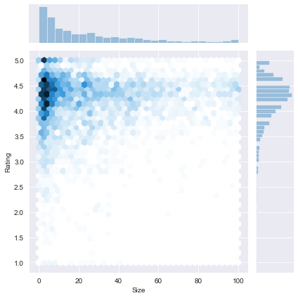
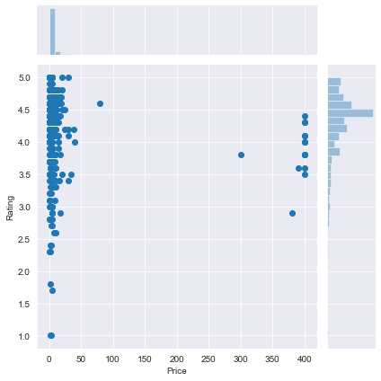
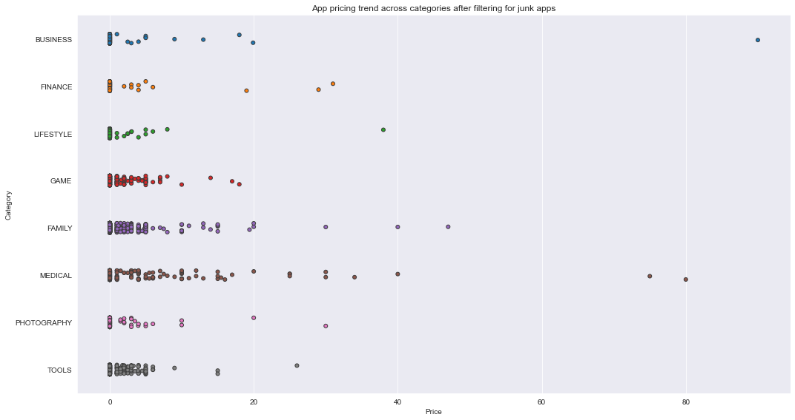
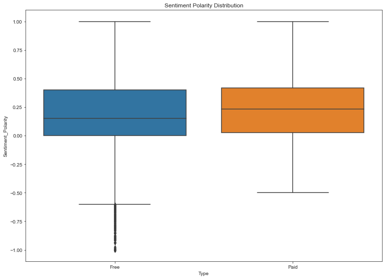

## 1. Google Play Store apps and reviews
<p>Mobile apps are everywhere. They are easy to create and can be lucrative. Because of these two factors, more and more apps are being developed. In this notebook, we will do a comprehensive analysis of the Android app market by comparing over ten thousand apps in Google Play across different categories. We'll look for insights in the data to devise strategies to drive growth and retention.</p>
<p></p>
<p>Let's take a look at the data, which consists of two files:</p>
<ul>
<li><code>apps.csv</code>: contains all the details of the applications on Google Play. There are 13 features that describe a given app.</li>
<li><code>user_reviews.csv</code>: contains 100 reviews for each app, <a href="https://www.androidpolice.com/2019/01/21/google-play-stores-redesigned-ratings-and-reviews-section-lets-you-easily-filter-by-star-rating/">most helpful first</a>. The text in each review has been pre-processed and attributed with three new features: Sentiment (Positive, Negative or Neutral), Sentiment Polarity and Sentiment Subjectivity.</li>
</ul>


```python
# Read in dataset
import pandas as pd
apps_with_duplicates = pd.read_csv('datasets/apps.csv')

# Drop duplicates
apps = apps_with_duplicates.drop_duplicates()

# Print the total number of apps
print('Total number of apps in the dataset = ', len(apps['App']))

# Print a concise summary of apps dataframe
print(apps.info())

# Have a look at a random sample of n rows
n = 5
apps.sample(n)
```

    Total number of apps in the dataset =  9659
    <class 'pandas.core.frame.DataFrame'>
    Int64Index: 9659 entries, 0 to 9658
    Data columns (total 14 columns):
    Unnamed: 0        9659 non-null int64
    App               9659 non-null object
    Category          9659 non-null object
    Rating            8196 non-null float64
    Reviews           9659 non-null int64
    Size              8432 non-null float64
    Installs          9659 non-null object
    Type              9659 non-null object
    Price             9659 non-null object
    Content Rating    9659 non-null object
    Genres            9659 non-null object
    Last Updated      9659 non-null object
    Current Ver       9651 non-null object
    Android Ver       9657 non-null object
    dtypes: float64(2), int64(2), object(10)
    memory usage: 1.1+ MB
    None


<div>
<style scoped>
    .dataframe tbody tr th:only-of-type {
        vertical-align: middle;
    }

    .dataframe tbody tr th {
        vertical-align: top;
    }

    .dataframe thead th {
        text-align: right;
    }
</style>
<table border="1" class="dataframe">
  <thead>
    <tr style="text-align: right;">
      <th></th>
      <th>Unnamed: 0</th>
      <th>App</th>
      <th>Category</th>
      <th>Rating</th>
      <th>Reviews</th>
      <th>Size</th>
      <th>Installs</th>
      <th>Type</th>
      <th>Price</th>
      <th>Content Rating</th>
      <th>Genres</th>
      <th>Last Updated</th>
      <th>Current Ver</th>
      <th>Android Ver</th>
    </tr>
  </thead>
  <tbody>
    <tr>
      <th>5793</th>
      <td>6824</td>
      <td>Pu - Cute giant panda bear, baby pet care game</td>
      <td>FAMILY</td>
      <td>4.5</td>
      <td>22167</td>
      <td>88.0</td>
      <td>1,000,000+</td>
      <td>Free</td>
      <td>0</td>
      <td>Everyone</td>
      <td>Educational</td>
      <td>June 12, 2018</td>
      <td>1.18</td>
      <td>4.1 and up</td>
    </tr>
    <tr>
      <th>1536</th>
      <td>1942</td>
      <td>DINO HUNTER: DEADLY SHORES</td>
      <td>GAME</td>
      <td>4.4</td>
      <td>1381820</td>
      <td>54.0</td>
      <td>10,000,000+</td>
      <td>Free</td>
      <td>0</td>
      <td>Teen</td>
      <td>Action</td>
      <td>March 14, 2017</td>
      <td>3.1.1</td>
      <td>3.0 and up</td>
    </tr>
    <tr>
      <th>3110</th>
      <td>3900</td>
      <td>The Tribez: Build a Village</td>
      <td>FAMILY</td>
      <td>4.4</td>
      <td>1852384</td>
      <td>NaN</td>
      <td>10,000,000+</td>
      <td>Free</td>
      <td>0</td>
      <td>Everyone</td>
      <td>Simulation</td>
      <td>July 13, 2018</td>
      <td>9.3.6</td>
      <td>4.0.3 and up</td>
    </tr>
    <tr>
      <th>842</th>
      <td>1053</td>
      <td>Mobile Bancomer</td>
      <td>FINANCE</td>
      <td>4.2</td>
      <td>278082</td>
      <td>70.0</td>
      <td>10,000,000+</td>
      <td>Free</td>
      <td>0</td>
      <td>Everyone</td>
      <td>Finance</td>
      <td>July 30, 2018</td>
      <td>10.78</td>
      <td>4.0.3 and up</td>
    </tr>
    <tr>
      <th>5274</th>
      <td>6274</td>
      <td>BI-LO Rx</td>
      <td>LIFESTYLE</td>
      <td>3.9</td>
      <td>77</td>
      <td>NaN</td>
      <td>10,000+</td>
      <td>Free</td>
      <td>0</td>
      <td>Everyone</td>
      <td>Lifestyle</td>
      <td>March 26, 2018</td>
      <td>Varies with device</td>
      <td>Varies with device</td>
    </tr>
  </tbody>
</table>
</div>


```python
%%nose

correct_apps_with_duplicates = pd.read_csv('datasets/apps.csv')

def test_pandas_loaded():
    assert ('pd' in globals()), "pandas is not imported and aliased as specified in the instructions."

def test_apps_with_duplicates_loaded():
#     correct_apps_with_duplicates = pd.read_csv('datasets/apps.csv')
    assert (correct_apps_with_duplicates.equals(apps_with_duplicates)), "The data was not correctly read into apps_with_duplicates."
    
def test_duplicates_dropped():
#     correct_apps_with_duplicates = pd.read_csv('datasets/apps.csv')
    correct_apps = correct_apps_with_duplicates.drop_duplicates()
    assert (correct_apps.equals(apps)), "The duplicates were not correctly dropped from apps_with_duplicates."
    
def test_total_apps():
    correct_total_apps = len(correct_apps_with_duplicates.drop_duplicates())
    assert (correct_total_apps == len(apps)), "The total number of apps is incorrect. It should equal 9659."
    
```


    4/4 tests passed


## 2. Data cleaning
<p>The four features that we will be working with most frequently henceforth are <code>Installs</code>, <code>Size</code>, <code>Rating</code> and <code>Price</code>. The <code>info()</code> function (from the previous task)  told us that <code>Installs</code> and <code>Price</code> columns are of type <code>object</code> and not <code>int64</code> or <code>float64</code> as we would expect. This is because the column contains some characters more than just [0,9] digits. Ideally, we would want these columns to be numeric as their name suggests. <br>
Hence, we now proceed to data cleaning and prepare our data to be consumed in our analyis later. Specifically, the presence of special characters (<code>, $ +</code>) in the <code>Installs</code> and <code>Price</code> columns make their conversion to a numerical data type difficult.</p>


```python
# List of characters to remove
chars_to_remove = ['+', ',', 'M', '$']
# List of column names to clean
cols_to_clean = ['Installs', 'Price']

# Loop for each column
for col in cols_to_clean:
    # Replace each character with an empty string
    for char in chars_to_remove:
        apps[col] = apps[col].astype(str).str.replace(char, '')
    # Convert col to numeric
    apps[col] = pd.to_numeric(apps[col])
```


```python
%%nose

import numpy as np

def test_installs_plus():
    assert '+' not in apps['Installs'], \
    'Some of the "+" characters still remain in the Installs column.' 
    
def test_installs_comma():
    assert ',' not in apps['Installs'], \
    'Some of the "," characters still remain in the Installs column.'
    
def test_installs_numeric():
    assert isinstance(apps['Installs'][0], np.int64), \
    'The Installs column is not of numeric data type (int).'
    
def test_price_dollar():
    assert '$' not in apps['Price'], \
    'Some of the "$" characters still remain in the Price column.'

def test_price_numeric():
    assert isinstance(apps['Price'][0], np.float64), \
    'The Price column is not of numeric data type (float).'
```


    5/5 tests passed


## 3. Exploring app categories
<p>With more than 1 billion active users in 190 countries around the world, Google Play continues to be an important distribution platform to build a global audience. For businesses to get their apps in front of users, it's important to make them more quickly and easily discoverable on Google Play. To improve the overall search experience, Google has introduced the concept of grouping apps into categories.</p>
<p>This brings us to the following questions:</p>
<ul>
<li>Which category has the highest share of (active) apps in the market? </li>
<li>Is any specific category dominating the market?</li>
<li>Which categories have the fewest number of apps?</li>
</ul>
<p>We will see that there are <code>33</code> unique app categories present in our dataset. <em>Family</em> and <em>Game</em> apps have the highest market prevalence. Interestingly, <em>Tools</em>, <em>Business</em> and <em>Medical</em> apps are also at the top.</p>


```python
import plotly
plotly.offline.init_notebook_mode(connected=True)
import plotly.graph_objs as go

# Print the total number of unique categories
num_categories = len(apps['Category'].unique())
print('Number of categories = ', num_categories)

# Count the number of apps in each 'Category' and sort them in descending order
num_apps_in_category = apps['Category'].value_counts().sort_values(ascending = False)

data = [go.Bar(
        x = num_apps_in_category.index, # index = category name
        y = num_apps_in_category.values, # value = count
)]

plotly.offline.iplot(data)
```


<script type="text/javascript">window.PlotlyConfig = {MathJaxConfig: 'local'};</script><script type="text/javascript">if (window.MathJax) {MathJax.Hub.Config({SVG: {font: "STIX-Web"}});}</script><script>requirejs.config({paths: { 'plotly': ['https://cdn.plot.ly/plotly-latest.min']},});if(!window._Plotly) {require(['plotly'],function(plotly) {window._Plotly=plotly;});}</script>


    Number of categories =  33


<div id="f11d099d-dc94-4afa-85fe-f3d241db46eb" style="height: 525px; width: 100%;" class="plotly-graph-div"></div><script type="text/javascript">require(["plotly"], function(Plotly) { window.PLOTLYENV=window.PLOTLYENV || {};window.PLOTLYENV.BASE_URL="https://plot.ly";Plotly.newPlot("f11d099d-dc94-4afa-85fe-f3d241db46eb", [{"x": ["FAMILY", "GAME", "TOOLS", "BUSINESS", "MEDICAL", "PERSONALIZATION", "PRODUCTIVITY", "LIFESTYLE", "FINANCE", "SPORTS", "COMMUNICATION", "HEALTH_AND_FITNESS", "PHOTOGRAPHY", "NEWS_AND_MAGAZINES", "SOCIAL", "BOOKS_AND_REFERENCE", "TRAVEL_AND_LOCAL", "SHOPPING", "DATING", "VIDEO_PLAYERS", "MAPS_AND_NAVIGATION", "EDUCATION", "FOOD_AND_DRINK", "ENTERTAINMENT", "AUTO_AND_VEHICLES", "LIBRARIES_AND_DEMO", "WEATHER", "HOUSE_AND_HOME", "EVENTS", "ART_AND_DESIGN", "PARENTING", "COMICS", "BEAUTY"], "y": [1832, 959, 827, 420, 395, 376, 374, 369, 345, 325, 315, 288, 281, 254, 239, 222, 219, 202, 171, 163, 131, 119, 112, 102, 85, 84, 79, 74, 64, 64, 60, 56, 53], "type": "bar", "uid": "20e12062-424d-4ab9-8cff-254b9dab9c49"}], {}, {"showLink": true, "linkText": "Export to plot.ly", "plotlyServerURL": "https://plot.ly"})});</script><script type="text/javascript">window.addEventListener("resize", function(){window._Plotly.Plots.resize(document.getElementById("f11d099d-dc94-4afa-85fe-f3d241db46eb"));});</script>


```python
%%nose

# last_value = _
# print(type(last_value))

def test_num_categories():
    assert num_categories == 33, "The number of app categories is incorrect. It should equal 33."
    
def test_num_apps_in_category():
    correct_num_apps_in_category = apps['Category'].value_counts().sort_values(ascending=False)
    assert (correct_num_apps_in_category == num_apps_in_category).all(), "num_apps_in_category is not what we expected. Please inspect the hint."
```


    2/2 tests passed


## 4. Distribution of app ratings
<p>After having witnessed the market share for each category of apps, let's see how all these apps perform on an average. App ratings (on a scale of 1 to 5) impact the discoverability, conversion of apps as well as the company's overall brand image. Ratings are a key performance indicator of an app.</p>
<p>From our research, we found that the average volume of ratings across all app categories is <code>4.17</code>. The histogram plot is skewed to the right indicating that the majority of the apps are highly rated with only a few exceptions in the low-rated apps.</p>


```python
# Average rating of apps
avg_app_rating = apps['Rating'].mean()
print('Average app rating = ', avg_app_rating)

# Distribution of apps according to their ratings
data = [go.Histogram(
        x = apps['Rating']
)]

# Vertical dashed line to indicate the average app rating
layout = {'shapes': [{
              'type' :'line',
              'x0': avg_app_rating,
              'y0': 0,
              'x1': avg_app_rating,
              'y1': 1000,
              'line': { 'dash': 'dashdot'}
          }]
          }

plotly.offline.iplot({'data': data, 'layout': layout})
```

    Average app rating =  4.173243045387994


<div id="a83cf15a-1cf7-497a-835f-ac2f526af2a1" style="height: 525px; width: 100%;" class="plotly-graph-div"></div><script type="text/javascript">require(["plotly"], function(Plotly) { window.PLOTLYENV=window.PLOTLYENV || {};window.PLOTLYENV.BASE_URL="https://plot.ly";Plotly.newPlot("a83cf15a-1cf7-497a-835f-ac2f526af2a1", [{"x": [4.1, 3.9, 4.7, 4.5, 4.3, 4.4, 3.8, 4.1, 4.4, 4.7, 4.4, 4.4, 4.2, 4.6, 4.4, 3.2, 4.7, 4.5, 4.3, 4.6, 4.0, 4.1, 4.7, null, 4.7, 4.8, 4.7, 4.1, 3.9, 4.1, 4.2, 4.1, 4.5, 4.2, 4.7, 3.8, 4.7, 4.1, 4.7, 4.0, 4.2, 4.5, 4.4, 3.8, 4.2, 4.7, 4.6, 4.2, 4.3, 4.2, 4.0, 3.8, 4.6, 3.9, 4.3, 4.9, 4.4, 4.2, 4.0, 3.9, 4.6, 4.9, 4.3, 4.6, 4.9, 3.9, 4.0, 4.3, 3.9, 4.2, 4.8, 3.6, 4.2, 4.8, 4.8, 4.6, 4.5, 4.3, 4.5, 4.9, 3.9, 4.4, 4.0, 4.3, 3.7, 4.4, 4.3, 3.2, 4.6, 4.6, 4.5, 3.7, 4.6, 4.6, 4.6, 4.0, 4.4, 4.0, 4.7, 4.9, 4.7, 3.9, 3.9, 4.2, 4.6, 4.3, 4.7, 4.7, 4.8, 4.2, 4.3, 4.5, 4.1, null, 4.2, 4.5, 4.4, 4.0, 4.1, 4.1, 4.4, 4.6, 4.5, null, 3.9, 4.4, null, 4.6, 3.8, null, null, 4.0, 4.3, 4.5, null, 4.1, 3.7, 4.7, 4.2, 4.6, 4.5, 4.6, 4.4, 4.2, 4.5, 4.5, 4.5, 4.5, 4.4, 4.5, 4.6, 4.8, 3.9, 4.6, 4.2, 4.1, 4.7, 4.2, 4.3, 3.3, 4.6, 4.8, 4.7, null, 4.1, 4.6, 4.1, 4.6, 4.7, 4.5, 3.9, 4.4, 4.3, 4.2, 4.5, 4.4, 3.4, 4.9, 4.6, 4.4, null, 4.4, 4.4, 4.4, 3.5, null, 4.4, 4.1, 4.3, 4.4, 4.3, 4.3, 4.1, 4.4, 4.3, 3.9, 4.8, 4.5, 4.4, 4.0, 4.3, 4.0, 4.2, 4.5, 4.2, 4.2, 4.6, 4.1, 4.6, 3.1, 3.9, 4.3, 4.1, 4.4, 4.1, 4.1, 4.5, 4.4, 4.4, 4.3, 4.4, 4.6, 4.2, 4.4, 4.7, 3.8, 3.9, null, 4.3, 4.4, 4.7, 4.5, 4.2, 4.7, 4.8, 4.2, 4.3, 4.4, 4.1, 3.8, 4.3, 3.8, 3.5, 4.1, 4.6, 4.3, 4.5, 4.1, 4.5, 4.6, 4.0, 4.2, 4.4, 4.0, 4.2, 4.2, 4.1, 3.8, 3.9, 3.9, 4.5, 4.5, 4.6, 4.7, 4.7, 4.8, 3.9, 4.1, 4.4, 4.6, 4.5, 4.7, 4.4, 4.5, 3.9, 3.2, 3.2, 4.1, 4.5, 4.2, 4.2, 3.7, 4.5, 4.6, 4.5, null, 4.7, 4.4, 3.5, 3.3, 4.5, 4.4, 4.2, 5.0, 4.4, 4.7, 4.4, 4.4, 4.6, 4.0, 4.4, 4.3, 4.3, 4.4, 4.3, 4.0, 4.3, 4.3, 4.4, 4.3, 4.3, 4.3, 4.3, 4.3, 4.0, 4.5, 4.3, 3.7, 4.5, 3.9, 4.4, 3.6, 4.4, 4.2, 4.4, 4.1, 4.4, 4.3, 4.2, 4.2, 4.4, 4.4, 3.9, 4.2, 4.4, 4.6, 4.3, 4.3, 4.4, 3.7, 4.3, 3.9, 4.5, 3.7, 4.3, 4.0, 4.1, 4.2, 4.2, 4.1, 4.4, 4.1, 4.3, 4.3, 4.5, 4.3, 4.2, 4.2, 4.5, 4.3, 4.3, 4.3, 4.2, 4.6, 4.2, 4.5, 4.1, 4.2, 4.1, 4.3, 4.1, 4.2, 4.0, 4.2, 4.2, 4.3, 4.4, 4.2, 4.4, 4.2, 4.8, 4.4, 4.4, 4.4, 4.0, 4.5, 4.4, 4.1, 4.2, 4.5, 4.3, 4.5, 4.0, 4.2, 4.5, 4.6, 4.1, 4.0, 4.2, 4.6, 4.1, 4.3, 4.2, 4.3, 4.1, 4.6, 4.2, 2.6, null, null, null, 3.5, 4.0, 4.1, 3.7, 4.1, 4.2, 4.5, 4.4, 4.2, 4.0, 4.1, 3.1, 4.4, 4.2, 4.1, 3.9, 4.3, 4.4, 3.5, 4.0, 3.3, 4.5, 4.4, 4.1, 3.9, 3.9, 3.6, 4.0, 3.6, 3.4, 4.2, 4.1, 3.4, 3.0, 4.6, 4.1, 3.9, 1.9, 3.5, 2.5, 3.9, 3.4, 3.5, 4.4, 3.8, 4.2, 2.5, 2.8, 4.1, 4.2, 3.5, 4.3, 3.3, 4.1, 4.2, 3.5, 4.2, 4.4, 4.1, 4.2, 4.3, 3.0, 4.0, 3.3, 4.1, 3.7, 4.0, 4.0, 4.1, 3.3, 4.4, 4.3, 3.4, 4.0, 3.6, 4.2, 3.5, 4.0, 4.1, 4.4, 4.2, 4.1, 4.2, 3.9, 4.1, 3.9, 4.0, 4.2, 4.5, 3.9, 3.6, 4.4, 3.5, 4.4, 4.8, 4.6, 4.7, 4.8, null, 2.7, 5.0, null, 4.8, 5.0, 4.8, null, 4.9, 3.0, null, null, 4.7, null, null, 1.0, null, null, null, null, null, null, null, 5.0, 4.7, null, 5.0, null, null, null, 5.0, null, null, null, null, 3.0, 4.1, null, null, null, null, null, null, null, 5.0, 3.7, 4.5, 4.2, null, null, null, 4.3, null, 4.4, 3.4, 4.7, 4.8, 4.7, 3.5, 4.7, 3.8, 2.9, null, 4.7, 4.6, 4.7, 4.6, 4.7, null, 4.5, 4.7, 4.8, 4.6, 4.6, 4.6, 4.2, 4.9, 3.8, 4.2, 4.4, 4.4, 4.3, 4.5, 4.4, 4.6, 3.9, 4.4, 4.3, 4.4, 4.2, 4.4, 4.0, 4.2, 3.8, 4.5, 4.7, 4.5, 4.3, 4.2, 4.3, 4.7, 4.7, 4.6, 4.5, 4.4, 4.6, 4.5, 4.5, 4.4, 4.4, 4.2, 4.5, 4.1, 4.0, 4.1, 4.3, 4.3, 4.3, 4.6, 4.1, 4.6, 4.7, 4.7, 4.3, 4.7, 4.6, 4.6, 4.6, 4.3, 4.2, 4.0, 4.5, 4.2, 4.1, 4.4, 4.0, 4.5, 4.4, 4.0, 4.2, 4.3, 4.2, 4.5, 4.2, 4.6, 4.2, 4.7, 4.4, 4.4, 4.0, 4.6, 4.4, 4.3, 4.1, 4.2, 4.3, 4.3, 4.3, 4.0, 4.2, 4.0, 4.0, 3.8, 4.1, 3.9, 4.1, 4.5, 4.4, 4.0, 4.4, 4.5, 4.3, 4.5, 4.2, 3.5, 4.8, 4.4, 4.1, 4.9, 4.7, 4.7, 4.7, 4.4, 4.0, 4.2, 4.3, 4.5, 3.5, 4.2, 3.1, 4.6, 4.2, 4.3, 4.3, 4.1, 3.8, 3.4, 4.3, 4.4, 4.4, 4.0, 3.7, 3.9, 4.5, 4.4, 4.3, 4.2, 4.2, 4.5, 4.7, 4.5, 4.5, 3.4, 4.2, 4.3, 4.2, 4.6, 4.1, 4.2, 4.2, 4.3, 4.4, 3.9, 4.1, 4.3, 4.6, 3.6, 4.3, 4.3, 4.1, 4.1, 4.2, 3.9, 4.2, 3.7, 4.5, 3.7, 3.8, 4.3, 3.0, 4.1, 4.2, 4.1, 3.9, 4.0, 4.4, 4.2, 4.0, 3.9, 4.0, 4.2, 4.0, 4.3, 3.9, 4.5, 4.1, 4.5, 3.6, 3.8, 3.7, 3.8, 3.7, 4.1, 3.7, 3.9, 3.9, 3.9, 4.1, 3.9, 4.2, 4.3, 4.6, 4.3, 4.6, 4.5, 4.6, 3.9, 4.2, 4.4, 4.2, 4.3, 4.6, 4.3, 4.5, 4.0, 4.0, 4.5, 4.5, 4.0, 4.0, 4.2, 4.4, 4.6, null, 4.6, 4.1, 4.6, 4.4, 4.6, 4.9, 4.5, 4.6, 4.7, 4.3, null, null, 4.2, 4.3, 5.0, 4.4, 5.0, 4.5, null, null, null, 4.5, 4.8, 4.4, 5.0, null, 3.7, null, 4.1, null, 4.8, null, null, 4.6, 4.4, 4.4, 3.6, 3.7, 3.8, 4.2, 4.2, 4.2, 3.3, 3.4, 4.3, 4.2, 4.7, 4.1, 4.7, 4.0, 3.6, 4.0, 3.6, 4.3, 4.2, 4.2, 4.1, 4.0, 4.1, 4.4, 4.7, 4.5, 4.3, 4.6, 4.3, 4.0, 4.5, 4.5, 3.6, 4.2, 4.1, 3.5, 4.4, 4.0, 4.5, 4.2, 4.6, 4.2, 4.8, 4.5, 4.2, 4.3, 4.4, 4.4, 4.6, 4.6, 4.6, 4.4, 4.3, 4.2, 4.2, 3.8, 4.5, 4.6, 4.6, 4.7, 4.6, 4.6, 3.8, 4.3, 4.3, 4.5, 4.6, 4.6, 4.7, 4.5, 4.4, 3.9, 4.5, 4.6, 4.1, 4.5, 4.4, 4.5, 4.6, 4.2, 4.4, 4.1, 3.9, 4.5, 3.7, 4.1, 4.4, 4.6, 4.3, 4.3, 4.4, 4.3, 4.4, 4.1, 4.4, 4.2, 4.3, 4.3, 3.9, 4.1, 4.1, 4.2, 4.5, 4.7, 4.4, 4.6, 4.6, 4.3, 4.0, 4.4, 4.6, 4.2, 4.1, 3.6, null, 4.1, 4.6, null, 4.7, 4.7, 4.7, 4.7, 4.1, 3.4, 3.8, 3.7, 4.2, 3.1, 3.5, 4.7, 4.5, 4.2, 4.3, 4.0, 4.5, 4.6, 4.7, 4.1, 4.3, 3.8, 4.4, 4.3, 4.2, 4.3, 3.8, 4.3, 3.7, 4.5, 3.6, 4.8, 3.3, 4.7, 4.6, 4.6, 3.4, 4.6, 4.0, 4.1, 4.5, 4.4, 4.5, 4.0, 4.1, 4.5, 4.6, 4.1, 4.5, 4.6, 4.5, 4.3, 3.6, 4.4, 4.6, 4.1, 4.3, 3.9, 4.1, 4.3, 4.7, 4.6, 4.4, 4.2, 4.5, 4.2, 4.5, 4.5, 4.3, 4.0, 4.8, 4.0, 4.9, 4.8, 4.9, 4.8, 4.4, 3.3, 4.7, 4.6, 4.8, 4.8, 4.8, 4.5, 4.4, 4.5, 4.5, 4.5, 4.8, 3.9, 4.6, 4.5, 4.5, 4.7, 4.7, 4.4, 4.2, 3.9, 4.2, 4.4, 4.6, 4.6, 4.2, 4.5, 4.7, 4.5, 4.5, 3.7, 4.5, 4.6, 4.6, 4.7, 4.5, 4.5, 4.6, 4.0, 4.3, 4.4, 4.5, 4.2, 4.6, 4.9, 4.5, 4.6, 4.5, 4.6, 4.6, 4.5, 4.5, 4.4, 3.9, 4.6, 4.4, 4.5, 4.5, 4.4, 4.4, 4.4, 4.2, 4.5, 4.5, 4.4, 4.3, 4.6, 4.6, 4.9, 4.4, 4.3, 4.1, 4.6, 4.8, 4.5, 4.7, 4.6, 4.3, 4.6, 4.3, 4.6, 4.6, 4.5, 4.6, 4.6, 4.5, 4.1, 4.5, 4.6, 4.5, 4.8, 4.8, 4.5, 4.1, 4.4, 4.2, 4.5, 4.3, 4.6, 4.0, 4.6, 4.6, 4.4, 4.7, 4.4, 4.4, 4.4, 4.5, 4.0, 4.6, 4.1, 4.0, 4.4, 4.4, 4.1, 3.5, 4.3, 4.5, 4.2, 4.5, 4.1, 4.5, 3.7, 4.3, 4.5, 4.6, 4.7, 4.6, 4.0, 4.4, 4.8, 4.2, 4.1, 4.4, 4.3, 4.5, 4.8, 4.2, 4.5, 4.1, 4.1, 4.0, 4.3, 4.5, null, 4.6, 3.7, 3.7, 4.2, 4.5, 4.3, 3.9, 4.6, 4.3, 4.4, 4.6, 4.5, 3.8, null, 4.4, 4.7, 3.4, 4.3, 4.3, 4.0, 4.0, 3.8, null, 4.3, 3.6, 3.8, 4.5, 4.6, null, 4.5, 4.7, 4.3, 3.7, null, 4.2, 3.4, 3.9, 4.0, 4.0, 4.0, 4.0, 4.1, 3.9, 4.4, 4.4, 4.3, 4.1, 3.9, 4.4, 4.6, null, 4.1, null, null, 3.8, 4.6, 3.5, 4.7, 4.3, 4.5, 4.4, 3.4, 4.3, null, 4.3, 4.6, 4.6, null, 4.2, null, null, 4.6, null, null, 4.4, 3.9, 4.5, 3.8, 4.3, 3.7, 5.0, 3.2, 4.5, 4.7, 4.0, null, 4.1, 3.8, 4.7, 4.5, null, 4.2, null, 4.1, 3.1, 4.1, 4.1, 4.3, 4.0, 4.6, 4.4, 4.4, 4.3, 4.6, 3.2, 4.5, 4.6, 4.6, 4.3, 3.0, 4.4, 4.4, 4.3, 3.5, 4.3, 4.5, 3.7, 4.5, 4.2, 4.3, 4.6, 4.5, 3.9, 4.3, 3.3, 4.7, 4.2, 3.2, 4.4, 3.5, 3.7, 3.8, 3.8, 3.7, 4.6, 4.0, 3.6, 3.8, 4.1, 4.7, 3.9, 4.1, 4.6, 4.2, 4.6, 4.2, 4.4, 4.6, 4.1, 3.9, 4.0, 4.1, 4.1, 4.1, 4.1, 4.4, 4.3, 4.4, 4.2, 4.4, 4.3, 4.1, 4.0, 4.2, 4.1, 3.9, 4.4, 4.6, 4.5, 4.5, 4.8, 4.4, 4.5, 4.5, 4.6, 4.5, 4.5, 4.5, 4.4, 4.7, 4.5, 4.2, 4.4, 4.6, 4.3, 4.3, 4.2, 4.6, 4.4, 4.4, 4.5, 4.4, 4.3, 4.6, 4.3, 4.2, 4.2, 4.5, 4.5, 4.5, 4.7, 4.7, 4.5, 4.4, 4.3, 3.8, 4.6, 4.6, 4.4, 4.3, 4.1, 4.3, 4.4, 4.6, 4.3, 4.4, 4.7, 4.5, 4.4, 4.6, 4.5, 4.4, 4.6, 4.5, 4.7, 4.6, 4.7, 4.5, 4.8, 4.5, 4.7, 4.5, 4.3, 4.5, 4.5, 4.6, 4.7, 4.6, 4.4, 4.5, 4.6, 4.5, 4.5, 4.4, 4.2, 4.5, 4.7, 4.1, 4.4, 4.2, 4.4, 4.7, 4.3, 4.7, 4.2, 4.3, 4.4, 4.1, 4.1, 4.2, 4.7, 4.6, 4.5, 3.1, 4.1, 3.4, 4.4, 4.3, 4.6, 4.4, 4.3, 4.6, 4.2, 4.5, 4.2, 4.5, 4.4, 4.6, 4.5, 4.3, 4.6, 4.4, 4.4, 4.5, 4.6, 4.6, 4.6, 4.1, 4.5, 4.6, 4.4, 4.7, 4.6, 4.3, 4.5, 4.6, 4.2, 4.5, 4.8, 4.1, 4.3, 4.4, 4.0, 4.2, 4.0, 4.2, 4.5, 4.7, 4.2, 4.4, 4.6, 4.9, 4.4, 4.5, 4.6, 4.2, 4.5, 4.6, 4.6, 4.6, 4.3, 4.6, 4.3, 4.3, 4.6, 4.5, 4.2, 4.7, 4.3, 4.0, 4.4, 4.3, 4.6, 4.7, 4.4, 4.4, 4.3, 4.2, 4.5, 4.5, 4.5, 4.6, 4.3, 4.5, 4.4, 4.6, 4.5, 4.5, 4.6, 4.6, 4.3, 4.5, 4.7, 4.5, 4.7, 4.7, 4.6, 4.4, 4.3, 4.5, 4.3, 4.4, 4.2, 4.4, 4.7, 4.2, 4.1, 4.5, 4.5, 4.5, 4.1, 4.3, 4.5, 4.4, 4.5, 4.6, 4.0, 4.3, 4.5, 4.6, 4.5, 4.5, 4.4, 4.7, 4.4, 4.4, 4.6, 4.2, 4.6, 4.6, 4.6, 4.3, 4.6, 4.4, 4.3, 4.7, 4.4, 4.4, 4.5, 4.6, 4.5, 4.3, 4.7, 4.5, 4.5, 4.4, 4.3, 4.6, 4.2, 4.5, 4.3, 4.5, 4.4, 4.4, 4.8, 4.4, 4.3, 4.6, 4.5, 4.5, 4.5, 4.0, 4.6, 4.5, 4.5, 4.4, 4.5, 4.5, 4.2, 4.3, 4.5, 4.2, 4.3, 4.4, 4.6, 4.5, 4.2, 4.5, 4.6, 4.6, 4.1, 4.5, 4.6, 4.6, 4.5, 4.3, 3.8, 4.5, 4.1, 4.8, 3.9, 4.5, 4.4, 4.3, 4.2, 3.0, 4.1, 4.5, 4.6, 4.3, 4.3, 4.5, 4.2, 4.2, 4.4, 4.5, 4.1, 4.2, 4.1, 4.7, 4.3, 4.4, 4.4, 4.3, 4.3, 4.2, 4.2, 4.3, 4.3, 4.1, 4.2, 4.5, 4.3, 4.5, 4.1, 4.2, 4.4, 4.0, 4.1, 4.4, 4.1, 4.0, 4.3, 4.6, 4.3, 4.7, 4.3, 4.4, 4.2, 4.7, 3.9, 4.1, 4.1, 4.1, 4.2, 4.4, 4.3, 4.5, 4.3, 4.3, 4.1, 4.1, 4.1, 4.6, 4.1, 4.4, 4.4, 4.3, 4.0, 4.8, 3.8, 4.7, 4.5, 4.8, 4.4, 4.8, 4.2, 4.2, 4.0, 4.7, 4.7, 3.9, 4.5, 4.1, 4.4, 3.9, 4.4, 3.6, 4.4, 4.1, 3.6, 4.6, 4.3, 4.5, 4.4, 4.1, 3.9, 4.1, 3.9, 4.2, 3.8, 4.3, 3.9, 4.0, 4.0, 4.0, 4.3, 4.3, 4.2, 4.3, 4.2, 4.6, 4.1, 4.5, 4.5, 4.3, 4.2, 4.4, 4.6, 4.5, 4.8, 4.5, 3.2, 4.6, 4.5, 4.1, 4.6, 4.5, 4.4, 4.4, 4.4, 3.8, 4.6, 2.5, 4.0, 5.0, 4.3, 3.4, null, 3.4, 4.3, 4.4, 4.4, 4.2, 5.0, 4.1, 3.9, 4.6, 4.2, 4.4, 4.2, 3.6, 4.5, null, 4.7, 4.6, 4.5, 4.2, 4.2, 4.3, 4.4, 4.1, 4.4, 4.6, 4.4, 4.2, 4.5, null, 2.6, 4.6, 4.8, 4.2, 4.7, 3.0, 3.5, 4.6, 4.8, 4.2, 4.6, 4.4, 4.8, 4.0, 3.7, 4.2, 4.8, 4.7, 3.5, 3.9, 4.2, 4.8, 2.7, 4.2, 4.7, 4.6, 4.5, 4.7, 4.7, 4.5, 4.7, 4.0, 3.4, 3.5, 3.0, 4.7, 4.6, 4.2, 4.8, 4.5, 4.2, 3.8, 3.0, 4.4, 4.5, 4.0, 3.6, 4.4, 4.7, 3.6, 4.5, 4.1, 4.6, 4.7, 4.7, 2.8, 4.3, 4.6, 4.3, 3.4, null, 4.0, 4.8, 4.2, 3.0, 4.5, 3.7, 4.5, 4.5, 3.6, 4.4, 4.4, 4.5, 4.1, 4.6, 4.3, 4.3, 4.7, 4.5, 4.2, 4.4, 3.9, 4.2, 4.1, null, 4.1, 3.5, 4.2, 4.0, 4.3, 4.3, 2.3, 4.5, 4.3, 3.1, 4.4, 2.9, 3.1, 3.7, 4.0, 3.8, 4.4, 4.3, null, null, null, null, 3.7, 5.0, 3.0, 3.7, null, null, null, null, null, null, null, null, null, null, null, null, null, null, 3.7, 5.0, null, null, 5.0, null, 5.0, null, 5.0, null, 5.0, 5.0, null, 5.0, 5.0, 5.0, null, null, null, 4.3, 4.9, null, null, null, null, null, null, null, 5.0, null, null, 4.9, 4.6, 5.0, null, null, null, null, 4.0, null, 5.0, null, 2.6, 4.3, 4.7, 2.5, 4.5, 4.3, 4.4, null, null, 4.5, 3.8, 4.0, 4.5, 3.7, 4.3, 4.4, 3.8, 4.3, 3.8, 5.0, 3.6, 4.0, 4.3, 4.7, 5.0, 4.7, 4.6, 3.1, 4.4, 5.0, 3.6, 2.8, 4.4, 4.6, 4.2, null, 3.8, 3.5, 4.1, 4.5, 4.3, 4.4, 4.4, 4.2, 4.0, 4.3, 4.6, 4.4, 4.2, 4.4, 4.4, 4.3, 4.6, 4.4, 4.5, 4.6, 4.6, 4.6, 4.4, 4.5, 4.5, 4.3, 4.4, 4.6, 4.3, 4.8, 4.2, 4.6, 4.0, 4.6, 4.3, 3.6, 4.0, 4.5, 4.4, 4.5, 4.2, 4.5, 4.3, 4.2, 4.2, 4.3, 4.3, 4.1, 4.5, 4.3, 4.2, 4.1, 4.3, 4.2, 4.1, 4.1, 3.7, 3.9, 3.7, 3.6, 4.1, 4.1, 4.1, 4.3, 4.3, 4.2, 4.5, 4.1, 3.8, 4.4, 4.0, 4.2, 4.0, 4.4, 4.0, 4.4, 4.1, 4.3, 4.0, 4.4, 4.2, 4.0, 4.5, 4.6, 4.3, 4.2, 4.3, 4.6, 4.4, 4.4, 4.5, 4.3, 4.2, 4.2, 4.4, 4.6, 4.2, 3.6, 4.5, 4.4, 3.8, 4.7, 3.6, 4.2, 3.6, 4.3, 4.4, 4.5, 4.1, 4.3, 4.3, 4.7, 4.3, 4.2, 4.2, 4.3, 4.2, 4.3, 4.6, 4.4, 4.3, 3.8, 4.6, 4.5, 4.1, 4.4, 4.3, 3.8, 4.0, 3.3, 4.1, 4.1, 4.2, 4.1, 4.4, 4.1, 4.2, 4.5, 4.3, 4.1, 4.5, 4.4, 4.6, 4.5, 4.6, 4.7, 4.3, 4.4, 4.4, 4.7, 4.1, 4.2, 4.5, 4.2, 4.3, 4.1, 4.6, 4.2, 4.2, 4.2, 4.2, 4.0, 4.4, 4.0, 4.5, 3.9, 4.5, 4.2, 4.3, 4.4, 4.5, 4.6, 4.3, 4.7, 4.4, 4.0, 4.5, 4.1, 4.4, 4.5, 4.4, 4.3, 3.8, 4.5, 4.1, 4.6, 4.8, 4.0, 4.7, 4.7, 4.1, 4.5, 3.6, 4.5, 4.7, 4.7, 4.5, 4.2, 4.5, 4.4, 4.5, 4.5, 4.4, 3.7, 4.3, 4.5, 4.4, 3.3, 4.3, 4.4, 4.5, 4.4, 4.2, 4.5, 4.7, 4.5, 4.6, 4.6, 4.4, 4.3, 4.3, 4.6, 4.4, 4.5, 4.5, 4.2, 4.0, 4.4, 4.7, 4.3, 4.6, 4.4, 4.5, 4.3, 4.3, 4.4, 4.4, 4.6, 4.3, 4.2, 4.3, 3.9, 4.3, 4.4, 4.2, 4.3, 4.3, 4.3, 4.1, 4.4, 4.3, 4.0, 4.0, 4.0, 4.4, 4.3, 4.1, 4.2, 3.9, 4.4, 4.4, 4.1, 4.0, 4.3, 4.2, 4.0, 4.1, 4.1, 4.0, 4.3, 4.5, 4.0, 4.4, 4.1, 4.3, 4.3, 4.2, 4.3, 4.4, 3.8, 4.4, 4.4, 4.6, 4.0, 4.2, 4.6, 4.1, 4.2, 4.6, 4.6, 4.4, 4.7, 4.4, 4.3, 4.5, 4.2, 3.8, 4.4, 4.6, 4.2, 4.5, 4.5, 4.2, 4.1, 4.3, 4.0, 4.3, 4.5, 4.2, 4.3, 4.4, 4.2, 4.1, 4.4, 4.7, 4.6, 4.2, 4.3, 4.3, 4.5, 4.6, 4.5, 4.4, 4.7, 4.2, 4.3, 4.2, 3.9, 3.9, 4.2, 4.3, 4.6, 4.3, 4.0, 4.0, 4.0, 4.6, 4.3, 4.2, 4.3, 4.4, 4.0, 4.6, 4.7, 4.3, 4.0, 4.5, 4.7, 4.4, 4.8, 3.3, 4.3, 3.9, 4.4, 3.9, 4.4, 4.4, 4.1, 4.0, 3.1, 2.9, 4.0, 4.5, 4.3, 4.1, 4.3, 4.5, 4.6, 4.4, 4.2, 4.3, 3.4, 4.6, 4.2, 4.0, 4.1, 4.0, 4.6, 4.5, 4.4, 3.5, 4.0, 4.8, 4.1, 4.6, 4.3, 4.6, 4.5, 4.3, 4.5, 4.0, 4.6, 4.1, 3.5, 4.5, 3.9, 4.6, 4.6, 4.5, 4.5, 4.4, 4.0, 4.2, 4.2, 4.5, 4.1, 4.2, 4.4, 4.4, 4.1, 4.3, 4.5, 4.5, 4.4, 4.5, 4.7, 4.4, 4.1, 4.4, 4.4, 4.3, 4.0, 4.7, 4.3, 4.6, 3.9, 3.6, 4.0, 4.1, 4.2, 3.9, 4.3, 3.1, 3.7, 3.4, 4.4, 3.6, 3.3, 3.7, 3.0, 3.6, 4.8, 3.9, 3.8, 4.3, 4.5, 3.4, 3.7, 4.4, 4.1, 4.5, 4.0, 3.9, 4.4, 4.8, 4.3, 3.7, 4.2, 3.5, 4.3, 4.7, 4.3, 4.1, 3.1, 4.3, 4.1, 4.2, 4.3, 4.3, 4.3, 4.6, 4.4, 4.2, 4.2, 4.4, 4.4, 4.4, 4.4, 4.4, 3.7, 4.4, 3.6, 4.4, 4.0, 4.1, 4.4, 4.4, 4.3, 4.2, 4.3, 4.3, 4.2, 4.4, 4.1, 4.6, 4.4, 4.1, 4.5, 4.5, 4.2, 4.2, 4.2, 4.5, 4.7, 4.0, 4.2, 4.1, 4.4, 4.4, 4.2, 4.2, 4.1, 4.5, 4.6, 4.1, 4.2, 4.1, 4.0, 4.6, 3.1, 4.6, 4.5, 3.2, 4.3, null, 4.6, 4.4, 4.6, 4.5, 4.6, null, 4.4, 4.2, 4.4, 3.1, 3.6, 4.1, 4.2, 3.5, 3.9, 3.0, 3.9, 4.5, 3.4, 4.4, 3.4, 4.3, 3.7, 3.5, 3.8, 3.6, 3.1, 3.8, 4.2, 4.0, 4.3, 4.3, 4.5, 4.5, 4.5, 4.4, 4.4, 4.3, 4.2, 4.7, 4.4, 4.3, 4.4, 4.3, 4.5, 4.7, 4.5, 4.6, 4.7, 4.6, 4.8, 3.9, 4.5, 4.6, 4.5, 4.4, 4.5, 4.0, 4.3, 4.0, 4.4, 4.1, 4.3, 4.1, 4.3, 4.2, 4.2, 4.2, 4.2, 4.3, 4.5, 4.4, 4.5, 4.1, 4.4, 4.5, 4.3, 4.4, 4.1, 4.4, 4.2, 4.1, 4.6, 4.5, 4.3, 4.1, 4.1, 4.2, 4.1, 4.6, 4.5, 4.0, 3.5, 4.4, 4.4, 4.4, 4.1, 4.2, 4.6, 4.4, 4.6, 4.6, 4.5, 4.7, 4.4, 4.5, 4.6, 4.6, 4.0, 4.6, 4.5, 4.7, 4.7, 4.4, 4.3, 4.7, 4.1, 4.7, 4.4, 4.6, 4.5, 4.4, 4.4, 4.3, 4.3, 4.6, 4.7, 4.3, 4.5, 4.6, 4.4, 4.5, 4.7, 4.3, 3.7, 4.7, 4.5, 4.4, 4.3, 4.8, 4.6, 4.1, 4.7, 4.1, 4.2, 4.3, 4.2, 4.0, 4.2, 3.9, 4.3, 4.1, 4.2, 4.4, 4.3, 4.3, 4.4, 4.3, 4.1, 4.2, 4.1, 4.1, 4.2, 4.1, 4.4, 4.1, 4.3, 4.6, 4.1, 4.6, 4.2, 4.1, 4.2, 4.5, 4.3, 4.2, 4.0, 4.2, 4.2, 4.4, 4.4, 4.3, 4.3, 4.6, 4.5, 4.1, 4.3, 4.4, 4.2, 4.2, 4.1, 4.5, 4.7, 4.3, 4.4, 4.4, 3.8, 4.4, 4.3, 4.2, 4.5, 3.2, 4.5, 4.2, 4.4, 4.7, 4.4, 4.0, 4.4, 4.0, 4.6, 4.5, 4.2, 4.0, 4.4, 4.5, 3.9, 4.2, 4.3, 4.2, 4.2, 4.4, 4.7, 4.6, 3.1, 4.4, 4.1, 4.5, 4.6, 4.3, 3.9, 4.5, 4.3, 3.7, 4.5, 4.4, 4.0, 4.0, 4.4, 4.7, 4.6, 4.2, 4.5, 4.6, 4.0, 4.5, 4.4, 4.3, 4.5, 4.5, 4.4, 4.6, 4.3, 4.5, 4.3, 4.1, 4.2, 4.2, 4.6, 4.2, 4.3, 4.3, 4.5, 4.2, 4.6, 4.4, 4.3, 4.6, 4.2, 4.2, 4.2, 4.0, 4.3, 4.6, 4.3, 4.0, 4.2, 4.2, 4.5, 4.2, 4.4, 4.6, 4.3, 4.6, 4.4, 4.6, 4.6, 4.1, 4.4, 4.1, 4.3, 4.1, 4.1, 4.5, 3.9, null, 3.8, null, null, 4.6, 4.7, null, 4.0, null, 4.7, 4.1, 3.7, null, 4.1, 3.7, 4.6, 4.4, 4.6, 4.1, 4.4, 4.7, 4.4, null, 4.8, 4.0, 4.9, null, 4.8, 4.4, 4.7, 4.2, 4.6, 4.6, 4.5, 4.6, 4.1, 3.8, 4.8, 4.8, null, 4.5, 4.0, 4.4, 4.7, null, 3.9, 4.4, 4.4, 4.5, 4.4, 4.8, 4.4, 4.8, 4.5, 4.7, 4.5, 3.5, 4.4, 4.3, 4.4, 4.2, 4.6, 4.4, 4.4, 3.9, 4.3, 4.5, 4.2, 3.7, 4.2, 3.9, 3.6, 4.5, 4.3, 4.3, 4.2, 4.6, 4.5, 4.5, 4.2, 3.9, 4.8, 3.8, 4.5, 4.5, 4.2, 4.0, 4.2, 4.3, 4.3, 4.2, 4.3, 3.6, 3.9, 4.8, 3.9, 3.7, 4.6, 4.4, 4.4, 4.2, 4.1, 3.8, 4.4, 4.5, 4.6, 4.7, 4.3, 4.5, 4.3, 3.7, 3.9, 3.6, 4.5, 4.4, 3.8, 4.6, 4.2, 4.3, 3.8, 4.4, 3.1, 4.6, 4.1, 4.5, 4.0, 4.5, 4.3, null, 3.7, 3.9, 3.5, 3.3, 4.3, 4.4, 4.4, 4.5, 4.4, 4.3, 4.5, 4.3, 4.6, 4.1, 4.2, 3.5, 4.0, 3.8, 4.3, 4.3, 4.1, 4.3, 4.5, 4.4, 4.0, 4.1, 4.6, 4.3, 3.9, 4.5, 4.7, 4.3, 4.5, 3.1, 4.7, 3.8, 4.0, 4.2, 4.0, 4.2, 3.4, 4.6, 4.5, 4.0, 4.4, 4.2, 4.1, 4.4, 4.0, 3.7, 4.6, 4.5, 4.6, 4.5, 3.9, 4.3, 4.4, 4.3, 4.4, 3.6, 4.5, 3.6, 4.1, 4.4, 4.1, 4.2, 4.7, 3.9, 3.9, 4.4, 4.6, 4.0, 4.3, 4.2, 4.3, 4.0, 4.1, 4.6, 4.5, 4.2, 4.3, 4.2, 4.2, 4.0, 4.2, 4.3, 3.9, 4.0, 4.5, 4.1, 4.5, 4.6, 4.2, 4.1, 4.4, 4.4, 4.2, 4.5, 4.2, 4.4, 4.4, 4.0, 4.3, 4.4, 4.2, 4.3, 4.1, 4.4, 4.3, 4.4, 4.2, 4.7, 4.3, 4.5, 3.7, 4.3, 4.2, 4.1, 4.5, 4.8, 4.3, 4.7, 4.3, 4.2, 3.7, 4.6, 4.5, 4.3, 4.5, 4.2, 4.2, 4.3, 4.3, 4.4, 3.7, 4.4, 4.4, 4.2, 3.5, 4.2, 4.2, 4.2, 3.9, 4.3, 3.7, 4.3, 4.3, 4.6, 4.6, 3.9, 4.6, 4.1, 4.8, 4.3, 4.4, 3.3, 4.2, 3.8, 3.7, 4.5, 4.1, 4.4, 3.7, 4.8, 4.3, 4.1, 4.5, 4.4, 4.3, 3.8, 4.5, 3.7, 4.5, 4.6, 4.3, 4.4, 4.3, 4.3, 4.4, 4.2, 4.9, 4.6, 4.6, 3.4, 3.8, 4.7, 4.6, 3.8, 4.4, 3.9, 4.1, 4.5, 3.7, 4.4, 3.8, 3.1, 5.0, 4.4, null, 4.3, 2.9, 3.1, 3.3, 4.1, 4.4, 4.5, 4.3, 4.3, 2.2, 4.2, 4.5, 3.9, 4.1, 3.3, 4.5, 4.1, 4.8, 4.1, 4.5, null, 4.5, 4.3, 4.4, 4.7, 4.4, 4.2, 4.2, 4.5, 4.6, 4.7, 4.8, 4.7, 4.7, 1.7, 4.5, 4.0, 3.6, 2.0, 4.7, 4.1, 4.3, 4.3, 4.5, 4.4, 4.6, 3.7, 4.5, 4.0, 4.8, 4.0, 4.7, 4.8, 4.6, 4.3, 4.2, 4.8, 4.2, 4.2, 4.5, 4.6, 4.5, 4.3, 4.8, 4.2, 4.4, 4.5, 4.2, 4.6, 4.6, 4.5, 4.5, 4.5, 4.4, 4.1, 4.6, 4.5, 4.5, 4.3, 4.3, 3.3, 3.7, 4.5, 4.4, 3.1, 4.0, 3.9, 4.4, 4.8, 3.6, 3.4, 4.7, 4.4, 4.4, 4.5, 4.3, 4.5, 4.0, 4.3, 4.5, 4.0, 4.2, 4.3, 4.6, 4.4, 4.3, 4.2, 4.3, 4.3, 4.6, 3.6, 4.2, 4.2, 4.4, 4.3, 4.9, 4.5, 4.2, 3.8, 4.2, 1.0, 4.4, 4.0, null, 4.4, 4.4, 4.5, null, 3.4, 3.8, null, 3.7, null, 4.1, 4.4, 4.2, 4.5, 4.3, 4.2, 3.6, 4.4, 4.6, 4.5, 4.4, 4.2, 4.3, 1.8, 3.8, 4.4, 3.0, 3.4, 4.6, 3.7, 3.0, 4.6, 3.1, 4.3, 4.3, 3.8, 4.5, 3.6, null, 4.2, 4.5, 4.2, 3.3, 4.3, 4.2, 3.8, 2.9, 4.5, 4.3, 4.9, 4.4, 4.4, 4.4, 2.9, 4.2, 4.0, 4.3, 4.3, 3.9, null, 4.0, 4.6, 3.7, 4.0, 4.6, 4.4, 4.5, 3.0, 3.1, 4.5, 4.5, 4.5, 4.1, 4.6, 4.2, null, 3.9, 3.9, 3.9, 4.2, 3.7, 2.8, 4.1, 4.4, 2.7, 4.7, 4.2, 4.4, 4.0, 4.0, 4.7, 4.3, 4.4, 4.0, 4.3, 4.2, 4.6, 3.3, 2.3, 4.2, 4.1, null, 3.2, 3.5, 4.6, 4.1, 4.1, 4.1, null, 4.7, 3.5, 3.9, null, null, 4.1, 4.7, null, 4.6, 4.5, 4.7, 4.9, null, 4.3, 4.1, 4.4, 4.2, 4.1, 4.6, 4.3, 4.4, 4.5, 4.6, 4.8, 4.3, 4.8, 4.8, 3.7, 4.1, 3.7, 4.2, 4.5, 4.6, null, 4.9, 4.4, 4.6, null, null, 4.0, 4.8, 4.3, 4.4, 4.2, 4.6, null, 4.8, 4.0, 4.3, 4.7, 4.3, 4.0, 4.0, 4.0, 4.1, 4.6, 3.1, 4.9, 4.5, 4.0, 4.0, 3.6, 4.5, 4.2, 4.3, 3.9, 4.3, 4.3, 4.4, 4.3, 4.4, 4.3, 4.4, 3.5, 4.4, 4.4, 4.5, 4.4, 4.4, 3.9, 3.9, 4.3, 4.9, 3.7, 3.3, 3.8, 3.5, 4.2, 3.5, 3.6, 3.9, 4.2, 4.2, 4.0, 3.2, 2.4, 4.5, 4.1, 4.2, 3.7, 4.3, 4.2, 4.1, 3.9, 3.8, 4.4, 3.4, 4.0, 4.4, 3.3, 4.8, 4.5, 3.4, 4.3, 4.3, 4.1, 4.0, 4.4, 3.8, 4.4, 3.8, 4.2, 3.8, 4.8, 4.7, 4.3, 3.5, 3.9, 4.2, 4.6, 4.7, 4.5, 3.8, 4.5, 3.7, 3.5, 4.1, 3.9, 4.1, 4.6, 4.4, 4.6, 4.0, 4.4, 4.4, 4.4, 4.0, 3.8, 3.9, null, 3.7, 4.2, 4.1, 4.3, 4.3, 4.1, 4.4, 3.8, 4.3, 3.8, 4.5, 3.8, 3.9, 4.0, 4.3, 4.4, 4.6, null, 5.0, 4.4, 4.4, 4.2, 4.0, null, 4.2, null, 4.6, 4.1, null, 3.9, 4.6, null, 4.4, 3.9, 4.6, 4.5, 3.0, null, 3.6, 4.4, 4.6, null, 4.3, 5.0, 4.5, 4.1, 4.1, 4.5, null, 4.8, 4.5, null, 4.0, 4.8, 3.7, null, 4.5, 4.7, 2.7, 2.9, 4.2, 4.4, 4.2, 3.4, 2.6, 4.1, 4.3, 4.2, 4.4, null, 4.0, 4.4, 4.1, 4.8, 2.2, 3.8, 3.1, 3.1, 3.8, 3.8, 4.3, 3.6, 4.0, 4.4, 4.6, null, 4.5, 1.8, 4.7, 3.9, 4.4, 3.6, 4.4, 3.9, 3.9, 3.8, null, 4.2, 4.1, 4.4, 4.4, null, null, 5.0, 4.1, 4.5, 4.3, null, 3.9, 3.5, null, 3.2, null, null, null, null, 3.3, 4.8, 4.5, 3.7, 4.8, 4.7, 4.3, 3.8, 4.1, 4.7, null, 4.2, null, null, 4.2, 4.6, 4.6, 4.2, 4.1, 3.5, 4.1, 4.4, 4.5, 4.1, 4.5, 4.3, 4.4, 4.3, 4.3, 3.8, 3.9, 4.1, 4.8, 4.0, 4.3, 4.0, 3.7, 3.3, 4.1, 3.0, 4.1, 3.0, 3.8, 4.0, 4.6, 4.1, 3.6, 4.7, 3.5, 3.1, 3.9, 4.2, 4.4, 4.4, 3.3, 4.8, 4.2, 4.5, 3.8, 4.1, 4.2, 4.2, 4.0, 4.2, 3.8, 4.5, 3.7, 4.3, 4.5, 4.1, 4.2, 4.5, 4.0, 4.3, 4.7, 4.1, 3.2, 3.9, 4.1, 3.4, 3.0, 4.6, 4.6, 4.1, 3.1, 3.4, 4.2, 4.2, 3.0, 2.4, 4.1, 2.9, 4.0, 4.0, 3.8, 2.4, 4.4, 3.7, 4.3, 4.6, 4.2, 4.8, 3.6, 3.2, 4.0, 3.5, 4.4, 2.5, 3.9, 4.4, 4.2, 4.2, 4.3, 4.1, 4.2, 4.2, 3.9, 3.9, 3.8, 4.5, 4.2, 3.7, 4.3, 4.6, 3.3, 3.6, 4.1, 3.8, 3.3, 4.5, 4.8, 4.6, null, 4.3, 4.5, 4.2, 3.8, 4.7, 4.2, 4.3, 4.7, 4.7, 3.6, 4.2, 4.0, 4.3, 4.7, 4.6, 4.8, 3.8, 4.2, 3.2, 4.3, 4.3, 4.4, 1.9, 2.5, 4.2, 4.3, 4.0, 4.5, 4.8, 4.2, 4.7, 4.4, 4.4, 4.4, 4.6, 4.6, 4.2, 4.0, 4.2, 4.5, 4.7, 4.2, 4.4, 3.2, 4.1, 4.0, 4.7, 4.6, 4.6, 4.7, 4.8, 4.6, 4.2, 4.3, 3.3, 4.7, 4.5, 4.0, 4.5, 4.2, 4.6, 4.2, 4.7, 4.7, 4.2, 4.3, 4.3, null, 4.5, 4.4, 4.5, 4.6, 4.3, 3.8, 4.5, 4.5, 3.9, 4.0, 2.7, 4.5, 4.0, 2.9, 4.6, 4.4, 4.6, 4.4, 4.4, 4.2, 4.8, 4.3, 4.6, 4.6, 4.1, 4.4, 4.5, 4.4, 4.2, 4.5, 4.6, 4.5, 4.6, 4.0, 4.5, 4.2, 3.9, 4.7, 4.5, 4.3, 4.2, 3.9, 4.1, 2.2, 4.2, 4.2, 2.8, 3.9, 4.3, 4.8, 4.3, 4.1, 4.2, 4.4, 4.1, 4.6, 4.3, 4.3, 3.8, 4.8, null, 3.8, 3.9, null, 4.3, 4.3, 4.3, 4.1, 4.2, 4.5, 4.6, 3.8, 4.7, 4.5, 4.7, 4.5, 4.8, 4.6, 4.3, 4.8, 3.4, 4.6, 4.5, 4.4, 4.4, 4.6, 4.2, 4.3, 4.3, 3.8, 3.9, 4.3, 4.8, 4.2, 4.5, 4.8, null, 4.6, 4.2, 4.2, 4.0, null, 4.3, 4.8, 4.1, 4.7, null, 4.8, 4.0, 3.5, 3.8, 3.5, 3.3, 3.7, 3.3, 3.4, 1.8, 1.6, 1.9, 3.6, 3.4, 3.2, 2.5, 4.7, 2.6, 2.8, 3.9, 4.2, 3.9, 4.0, 3.5, 3.1, 3.7, 3.6, 3.4, 4.0, 3.7, 1.7, 2.4, 4.3, 3.3, 4.1, 4.1, 3.4, 3.0, 3.0, 2.2, 3.7, 3.7, 4.8, 3.7, 3.6, 3.7, 4.4, 3.8, 3.7, 3.7, 4.8, 4.2, 4.1, 4.1, 4.3, 3.9, 3.8, 4.0, 4.5, 4.6, 4.1, 4.4, 3.7, 3.9, 3.9, 4.5, 4.5, 4.4, 4.3, 4.5, 4.7, 4.7, 4.1, 3.3, 4.2, 4.1, 3.4, 4.3, 4.9, 4.5, 4.1, 4.4, 4.4, 3.4, 4.1, 4.1, 3.5, 3.8, 4.6, 5.0, 4.2, 3.9, 3.7, 4.3, 1.9, 4.2, 4.2, 4.0, 4.4, 4.2, 4.5, 4.3, 4.4, 4.0, 4.2, 4.3, 4.0, 4.3, 3.9, 4.0, 3.7, 4.1, 3.9, 4.2, 4.4, 4.5, 3.9, 3.9, 4.2, 4.5, 4.1, 4.7, null, 4.4, 4.7, 4.7, 4.0, 3.9, null, 3.8, 3.9, 4.4, 4.5, null, 3.8, 3.5, 4.2, 4.7, 2.0, 4.3, 2.8, 3.9, 3.4, 4.5, 4.7, 2.0, 4.4, null, null, null, 4.7, 3.3, 4.1, null, 4.2, 4.4, null, 3.7, null, 3.9, 5.0, 4.1, 4.8, 4.0, null, 4.1, 3.8, 4.6, null, 4.3, 4.1, 4.1, 4.4, 4.2, 4.1, 4.3, 4.3, 4.0, 4.5, 4.1, 3.8, null, 4.5, null, 4.1, null, 3.9, 3.7, null, 4.5, 4.4, null, 3.4, null, null, null, null, 2.3, 4.7, 3.4, 4.7, null, null, 5.0, null, null, null, null, null, null, null, null, 3.6, 5.0, null, null, 4.3, null, null, null, 5.0, null, null, 4.1, 4.1, 4.5, null, null, 3.4, null, null, null, 2.9, 4.6, 5.0, null, null, null, 3.9, 3.9, 5.0, 4.1, 5.0, 3.0, 4.0, 1.0, null, 4.0, null, null, 4.0, null, 3.8, null, null, null, null, null, null, null, null, 3.5, null, null, null, null, null, 2.6, null, 3.4, null, null, 4.5, 3.4, 3.8, 3.0, 4.4, 4.0, 3.9, 4.6, 3.8, 3.8, 4.0, 3.6, 4.4, 3.1, 4.2, 4.6, 4.0, 5.0, 3.3, 4.1, 3.6, 3.2, 4.4, 4.0, 4.4, 4.5, 4.3, 4.7, 4.4, null, 4.4, 4.4, 3.7, 3.3, null, 3.7, 3.0, 2.6, null, null, 3.5, 3.9, 4.6, 3.8, 4.4, 4.5, 4.5, 4.7, 4.4, null, 5.0, null, null, 2.8, null, 4.6, 2.8, 5.0, 5.0, 2.8, null, 3.8, 4.1, null, 4.8, 5.0, 5.0, null, 4.4, null, null, 5.0, 4.1, null, 4.8, null, null, 4.8, 4.0, null, 5.0, 4.6, null, 5.0, null, null, null, 4.5, 5.0, null, null, null, 4.4, 4.0, null, 3.9, 4.1, 4.8, 4.3, 3.9, 4.5, null, 3.7, 4.3, 4.2, 3.7, 3.8, 4.6, null, null, null, 3.3, 3.0, 3.9, 3.9, null, 4.1, null, 4.6, null, null, null, null, 4.4, 3.8, 4.4, null, 4.9, 3.6, 4.3, 3.6, 4.1, 3.4, 4.5, 4.7, 4.5, 4.4, 4.3, 4.6, 4.2, 4.8, 4.6, 4.8, 4.6, 4.6, 4.6, 4.1, 4.7, 4.7, 4.8, 3.6, 4.7, 4.6, 4.5, 4.7, 4.5, 4.3, 4.5, 4.8, 4.7, 4.7, 4.7, 4.7, 4.7, 4.7, 4.7, 4.6, 4.7, 4.7, 4.6, 3.8, 3.9, 4.0, 3.8, 4.1, 2.9, 3.8, 3.5, 4.2, 4.6, 4.4, 4.4, 4.1, 3.9, 3.6, 4.0, 3.8, 4.3, 4.6, 3.6, 3.9, 4.0, 4.2, 4.2, 4.2, 4.5, 4.7, 3.5, 4.5, 4.6, 4.2, 4.1, 4.5, 4.2, 4.5, 4.4, 3.7, 4.4, 4.3, 4.3, 4.5, 3.8, 4.5, 4.5, 4.4, 4.7, 3.5, 4.9, 4.0, 4.1, 4.2, null, 4.4, 4.1, 4.6, 4.6, 4.7, 4.5, null, 4.4, 4.4, 4.2, 4.4, 4.0, 4.2, 4.2, 4.2, 4.8, 3.7, 3.4, 4.3, 4.3, 4.6, 4.2, 4.6, 4.1, 4.6, 4.3, 4.4, 4.7, 4.2, 3.8, 4.3, 3.7, 4.3, 2.9, 4.3, 4.3, 4.0, 3.3, 4.1, 5.0, 3.9, 4.6, 4.0, 3.6, 4.0, 4.5, null, 2.9, 4.2, 4.5, null, 4.6, 4.7, 4.2, 4.7, 4.7, 3.9, 4.7, 3.7, 4.8, 4.0, 4.6, 4.4, 4.7, 3.6, 4.4, 4.6, 2.9, null, 4.5, 5.0, 3.7, null, 3.7, null, 4.2, 3.0, 5.0, 4.4, 4.7, 4.3, 3.9, null, 4.4, 4.3, null, null, null, null, 4.6, 4.5, 3.9, 4.7, 5.0, 5.0, null, 5.0, null, null, null, 2.7, 4.6, 4.4, 4.1, 3.8, 4.4, 4.6, 4.1, 4.5, 4.2, 4.7, 4.3, 4.3, 4.2, 3.8, 4.0, 4.6, 4.3, 4.3, 4.3, 4.7, 4.4, 3.8, 4.6, 4.6, 4.5, 4.5, 3.8, 4.3, 4.3, 3.7, 3.2, 4.0, 3.8, 4.4, 3.8, 3.4, 2.9, 4.5, 3.7, 3.8, 4.1, 4.1, 3.7, 3.6, null, 3.0, 4.1, 3.8, 4.2, 4.4, 4.5, 3.6, 3.6, 3.7, 3.9, null, 4.2, 4.1, 4.5, 2.8, 2.6, 4.3, 4.4, 4.1, 4.0, 4.3, 3.9, 3.5, 3.7, 4.3, 4.3, 4.1, 4.2, 4.3, 4.3, 4.1, 4.4, 4.4, 4.4, 4.3, 2.4, 4.5, 4.5, 4.5, 4.4, 4.6, 3.4, 3.9, 4.3, 4.4, 4.5, 4.4, 4.0, 4.3, 4.2, 4.0, 4.4, 4.6, 4.0, 4.4, 3.5, 4.6, 4.0, 4.0, 4.1, 4.1, 3.3, 3.9, 4.1, 4.2, 4.0, 4.5, 3.8, 3.5, 4.3, 4.6, 4.7, 3.8, 4.7, 4.8, 3.2, 4.5, 3.9, 3.6, 3.7, 4.4, 4.1, 4.0, 3.1, 4.0, 2.8, 3.7, 2.7, 3.9, 3.6, 4.5, 3.5, 4.0, null, 3.8, 3.6, 4.2, 4.4, 4.0, 4.7, null, null, 4.1, 4.0, null, 4.7, null, null, 3.8, 5.0, 4.4, null, null, 4.0, null, 3.8, 4.1, 4.3, null, 4.5, 4.4, 3.4, 4.1, 4.1, 3.8, 4.3, 4.4, 4.4, 3.3, 3.3, 4.4, 3.7, 3.4, 2.3, 3.3, 2.7, null, 4.6, 3.5, 3.4, 4.3, 4.1, 4.7, 4.4, 3.8, 3.0, 4.4, 4.2, 4.5, 3.5, 4.5, 4.5, null, 4.5, 4.0, 4.8, null, 4.3, 1.7, 4.3, 4.2, null, 4.2, 4.3, null, 4.0, 4.2, 4.6, 4.1, 4.6, 4.1, 4.0, null, 3.3, 4.1, null, null, 4.0, null, null, 4.4, 4.2, 3.8, 3.1, null, 5.0, 4.2, 4.7, 4.4, 4.6, 4.4, 2.9, 2.7, null, 4.6, 4.0, 4.8, 5.0, 3.9, 4.2, 4.1, 4.7, 4.2, 4.2, 3.7, 4.1, 4.1, 3.8, 4.6, null, 4.4, 4.2, 4.4, null, null, 4.6, 5.0, null, 4.5, null, 3.5, null, 3.9, 4.4, 3.0, null, 3.1, 4.4, null, 3.0, null, null, 3.7, null, 3.7, 3.9, 4.8, null, null, 4.6, 4.6, 4.5, 4.3, 5.0, 4.3, null, 4.7, 4.0, 3.8, 5.0, 4.8, 4.5, 4.3, null, null, null, null, 3.7, null, null, null, null, null, 4.3, null, 3.8, null, null, 4.5, 4.6, 4.1, 4.2, null, 5.0, null, null, null, null, 3.3, 3.6, 4.0, 4.0, 4.0, 4.2, 4.3, 4.2, 4.5, 4.3, 4.6, 4.4, 4.2, 4.2, 4.2, 3.4, 3.2, 4.0, 4.6, 3.2, 4.4, 4.0, 4.7, null, 3.7, 3.9, 4.2, 4.1, 3.5, 4.8, 4.3, 3.9, null, 3.5, 4.3, 4.4, 4.8, 3.9, 3.8, 4.2, 4.0, 4.0, 4.4, 4.7, 4.5, 4.3, 4.3, 4.1, 2.1, 3.7, 4.4, 4.2, 2.1, 2.4, 4.1, 3.1, 5.0, null, 3.5, 4.2, null, 4.7, null, null, null, 4.8, null, 4.5, 4.6, 4.6, 4.9, 4.8, 4.0, 3.9, 4.1, 4.1, 4.5, 4.2, 4.0, 4.4, 1.9, null, null, 3.7, null, 4.2, 4.0, 4.3, 2.5, 4.4, null, 4.7, 4.6, 4.4, 4.3, 4.4, 3.6, 3.8, 4.4, 4.4, 3.0, 3.7, 5.0, null, 4.2, 4.8, 4.4, 4.1, 4.7, 4.7, 3.3, 4.0, null, null, 1.0, 4.4, 4.2, 4.4, 4.6, 4.3, 4.4, null, 3.7, 2.9, 4.0, 3.3, null, null, 4.2, 4.5, 2.3, 5.0, 3.6, null, 3.9, 4.4, 4.2, 4.8, 4.3, 4.2, 4.4, 4.3, 4.0, 1.4, 3.3, 4.3, null, 4.6, 4.7, 4.2, 3.9, 3.4, 4.3, 4.8, 4.8, 4.5, 3.3, 4.2, 4.9, 4.2, 4.6, 4.1, 4.6, 4.0, 4.2, 5.0, 4.1, 3.7, 4.1, 3.8, 4.7, 3.5, 4.0, 4.2, 3.3, 3.7, 3.4, 3.7, 5.0, 4.4, 5.0, 4.8, 4.4, 4.9, 4.0, 4.4, 4.5, 4.9, 4.4, 5.0, 4.8, 4.6, 4.3, 3.8, 4.3, 4.3, 4.1, 4.5, 4.2, 3.8, 4.3, 4.4, 4.2, 4.2, 3.8, 4.2, 4.0, 4.2, 4.3, 4.3, 4.4, 4.1, 4.5, 4.2, 4.3, 4.4, 4.5, 4.3, null, 4.0, 3.4, 4.4, 3.8, 3.0, 4.1, 4.4, 4.1, 4.1, 4.1, 4.5, 4.1, 2.2, 3.9, 4.0, 4.3, 3.9, 4.0, 4.2, 4.2, 3.6, 4.3, null, null, 4.4, 2.6, 4.1, null, 3.5, 4.2, null, null, 3.7, 4.5, 2.4, null, 2.9, 4.2, 4.2, 4.0, 2.6, 4.4, 4.8, 4.7, 4.4, 4.6, 2.7, 3.8, 1.7, 4.6, 3.3, null, null, 4.6, 2.3, 4.5, null, 4.8, null, 5.0, null, 4.1, null, null, null, null, null, null, 4.9, 3.0, null, null, 4.8, 4.5, 3.4, null, null, null, null, 4.0, 3.7, 2.2, 4.8, null, 5.0, null, null, null, 4.5, null, 4.3, 3.8, null, 4.5, 4.5, null, 4.8, 4.5, 4.4, null, 3.9, 4.3, 4.3, null, 4.0, null, 4.1, 3.7, 3.4, 4.5, 4.4, null, 4.4, 2.4, 4.1, 4.6, 4.3, 4.3, 4.7, null, 4.2, 4.3, 4.3, 4.7, 4.2, 4.1, 4.6, 4.7, 4.3, 4.5, 4.6, 2.9, 4.0, 3.0, 3.9, null, 4.8, 3.9, 4.0, null, null, null, 5.0, null, null, null, 4.0, null, 5.0, null, null, 4.5, 4.8, null, 4.6, 4.2, null, 3.4, 2.6, 2.4, null, 4.6, 3.3, 4.1, 4.6, 3.9, null, null, null, null, null, 4.0, 3.4, 4.5, 4.0, 5.0, 3.6, 3.5, 4.6, 4.9, 3.7, 5.0, 4.0, 3.9, 5.0, 4.0, null, null, 4.9, 4.4, 3.6, 4.7, 4.3, 3.9, 4.5, 4.6, 4.3, 4.6, null, null, 4.5, 4.2, 4.5, 4.0, 4.2, 4.7, 4.4, 4.2, 4.0, 2.3, 4.5, 3.6, 4.4, 3.9, 3.9, 4.8, 4.2, 3.7, 4.0, null, 1.0, null, 4.4, 4.2, 4.7, 3.6, null, 4.1, 3.3, null, null, 5.0, 4.3, 4.7, null, null, null, null, null, 4.0, null, 4.4, 4.6, 5.0, 4.3, 4.3, null, 3.8, 4.1, 4.6, 4.0, 4.7, 3.6, 4.5, 4.0, 4.1, 4.0, 3.8, null, 4.5, 2.8, null, 4.2, 4.8, 5.0, 5.0, null, null, null, 4.3, 4.3, 4.5, 4.5, 5.0, 3.8, 4.4, 5.0, 4.7, null, 4.7, 2.2, 4.6, 4.6, 4.7, 4.6, 4.4, 3.8, 3.6, 4.9, 4.8, null, 4.4, 5.0, 4.8, null, null, 4.6, 5.0, 4.6, 5.0, null, 4.0, 4.3, 4.5, 4.0, 3.2, 4.6, 4.2, 4.8, 3.0, 4.3, 3.9, 3.9, 4.8, 3.5, 4.4, 4.1, 4.2, 4.7, 4.0, 4.4, 4.2, 5.0, 3.5, 3.8, null, 4.5, 4.1, null, 4.3, null, 4.3, 4.4, null, null, null, null, null, 4.0, 4.3, 4.0, 4.9, 4.7, null, null, null, 4.3, 4.2, 4.1, 3.2, 3.9, 4.2, 4.1, 4.9, null, 3.7, 3.5, 4.9, null, 3.3, 4.9, 3.4, null, 4.5, 4.3, 5.0, 3.5, null, null, 4.4, 3.7, null, 4.8, null, 4.3, 4.9, null, null, null, null, null, null, 5.0, 4.3, 4.3, null, null, 4.4, 1.0, 4.5, null, 4.0, 5.0, 4.9, 4.7, 3.9, null, 3.2, 3.5, null, 3.7, 3.0, 4.2, 4.0, 4.1, null, 4.0, 3.1, 4.4, 3.2, 3.9, 4.2, 4.7, 4.0, null, null, 4.0, 3.7, 4.1, 4.4, 4.0, 3.9, 3.6, null, null, 4.6, null, 4.4, 1.9, 4.3, 4.5, 4.1, 3.8, 4.1, 4.6, 3.7, 3.9, 4.4, null, 4.5, null, null, 4.4, 3.5, 4.3, 4.5, 4.5, 4.4, 4.2, 4.3, null, 3.6, 4.0, 3.8, null, null, 4.4, 3.9, 4.1, 4.3, 3.5, null, 4.3, null, 4.7, 4.5, 3.8, 4.5, 4.2, 4.3, 4.1, 4.6, 4.5, 3.0, 2.6, 3.4, 4.0, 3.4, 3.7, 4.5, 3.9, null, 4.0, 4.5, 4.0, 4.4, 1.8, 4.3, 5.0, 5.0, null, 3.2, 4.2, 4.6, 3.8, 3.9, 4.2, null, 4.0, 3.8, 4.1, 3.9, 4.4, 2.1, 1.8, 4.2, 2.0, null, null, 3.4, 3.6, 3.7, 4.7, 4.5, 4.6, 3.6, null, null, 4.4, 4.6, null, null, null, 2.3, null, null, null, 3.0, 5.0, 4.5, 4.4, 4.5, 4.8, 4.3, null, 3.7, 4.5, null, 4.3, null, 4.4, 3.4, 4.5, 1.6, null, null, 4.5, null, null, null, null, null, null, 3.8, 4.3, 4.3, 3.0, 4.0, 4.8, 4.0, 4.5, null, 4.7, 1.9, 4.9, 4.4, 4.7, null, 4.9, 4.8, null, null, 4.5, null, null, 4.6, 4.5, null, 5.0, null, 3.9, null, null, 4.3, null, 4.8, 4.3, 4.6, null, null, 4.1, 4.5, 4.3, 3.8, 2.4, 4.3, 2.8, 4.5, 4.6, 4.1, 4.2, 4.6, 4.3, 4.6, 5.0, 5.0, 3.9, 4.2, 3.9, 4.2, null, null, null, 3.5, null, 4.0, null, 3.7, 3.8, 4.3, null, null, 4.5, 4.6, null, 4.5, 4.3, 4.4, null, null, 4.6, null, 3.9, null, 3.9, 3.1, 3.9, 4.4, 4.4, 4.4, 4.6, 3.9, 4.6, 2.5, 4.6, 2.8, 4.0, 3.4, 3.8, 4.5, 4.8, 3.3, 3.9, 3.5, 4.5, 4.0, null, 3.6, null, 4.7, 3.9, 5.0, 4.6, 3.9, 4.9, 3.6, 3.7, 3.9, 2.7, 3.8, 2.8, 3.5, 4.1, null, 4.7, 4.3, 4.5, 4.1, null, null, 4.8, null, null, null, 3.4, 5.0, null, null, 4.3, 4.4, 1.8, 4.2, 3.3, null, 5.0, null, null, null, 4.8, null, 4.5, 5.0, 4.5, 4.7, null, 4.6, null, null, 4.5, null, null, 3.5, null, null, 3.5, 2.9, null, null, 5.0, null, null, null, null, null, 4.8, 4.7, 4.3, 4.1, 5.0, 5.0, null, null, null, 4.0, null, 4.3, null, 4.1, 5.0, null, 5.0, null, null, null, 4.0, null, null, 3.5, null, null, null, 4.1, null, null, 4.6, null, null, null, 4.1, 4.2, 2.2, 4.3, 4.7, 3.8, null, 4.1, null, 3.1, 4.2, null, 3.0, 4.8, 3.7, 3.1, 4.6, 2.9, 4.2, 4.7, 4.5, 2.8, null, 4.4, 4.4, 4.1, 4.6, 3.0, 4.1, null, 4.4, null, null, null, null, 4.5, 4.5, 3.6, 2.0, 4.0, 4.5, 4.0, 4.3, null, 4.5, 4.8, 4.5, null, null, 4.2, 4.5, 4.6, null, null, 3.9, null, null, 4.3, 3.9, 4.3, 3.7, 4.7, 4.3, 1.7, 4.5, null, 4.7, null, 5.0, null, null, null, 4.6, 2.9, null, 4.8, 2.3, null, 3.8, 4.2, null, 4.4, null, 4.0, 4.1, 3.4, 4.3, 4.0, 4.2, 4.1, 4.7, 4.2, 3.9, 3.8, 4.1, 4.2, 3.8, 4.7, 3.7, 4.3, 4.0, 4.2, 4.6, 4.7, 4.3, 4.2, 3.5, 4.7, 4.7, 4.5, 4.5, 4.7, 4.6, 4.6, 4.9, 4.2, 4.3, 4.4, 4.5, 4.3, 4.4, 4.4, 3.0, 4.8, 4.7, 4.6, 4.0, 3.7, 3.5, 2.7, 4.7, 4.1, 4.5, 4.6, 4.5, 4.4, 4.3, 4.4, 4.5, 4.6, 4.6, 3.1, 4.7, 4.6, 4.7, null, 4.4, 4.8, null, 4.1, null, 4.3, 4.4, 4.7, 4.0, 3.4, 4.6, null, 2.8, null, 3.1, null, 3.9, null, 4.2, null, 4.1, null, 4.2, null, null, 3.3, 4.4, null, 4.4, 4.6, 4.4, 4.5, 4.1, 2.2, 4.2, 4.8, null, null, 3.2, 4.3, 4.6, 4.4, 4.5, null, 3.4, null, null, 3.3, 4.2, null, 2.4, 3.2, 3.1, 3.8, null, 4.8, 3.7, 4.2, 3.7, 3.0, 3.9, 4.0, 5.0, null, 4.0, 2.7, 3.1, 4.1, 4.0, 3.8, 3.8, 4.3, 3.5, 4.5, 3.9, null, 4.5, null, null, 3.3, 4.1, null, null, 5.0, null, 3.7, 4.8, 1.5, 5.0, 4.6, null, null, 5.0, 4.7, null, 4.7, null, 5.0, 4.5, null, 5.0, null, null, 5.0, 4.2, 1.0, 4.5, 4.2, 5.0, 4.2, 4.4, 3.9, 4.6, 3.8, null, null, 4.0, null, null, null, 4.6, null, null, 3.4, null, 5.0, 4.6, null, null, null, null, 5.0, null, null, null, null, 3.0, null, 3.8, 4.2, 4.3, null, null, null, null, null, null, 4.4, 3.2, null, null, null, 3.5, 4.4, 4.5, 3.7, 5.0, 4.5, 4.5, 4.1, null, 3.4, 4.1, null, null, 5.0, 4.2, 4.1, 4.1, null, 4.2, 4.3, null, 5.0, 4.4, null, 4.3, 4.5, null, 4.8, 4.4, null, null, null, 4.4, null, null, null, null, null, 4.7, null, null, null, null, null, 4.3, 4.4, 4.6, 2.8, 5.0, 4.4, 2.0, 5.0, 4.4, 5.0, null, 3.4, 4.4, null, 3.4, null, null, 3.3, 1.5, null, null, null, 5.0, null, 4.3, 4.3, null, null, null, null, 2.2, 4.6, null, null, 5.0, null, null, 4.7, null, null, null, null, null, null, 4.7, 3.5, 4.3, 3.6, 4.3, 3.6, 2.6, 4.7, 4.5, 4.0, 4.6, 5.0, 4.2, null, null, 4.2, null, 4.7, 4.5, 3.6, 3.8, 4.2, 3.8, 3.5, 4.1, null, null, 5.0, null, 4.2, 4.1, null, null, 3.6, 4.3, 4.1, 4.4, null, null, 4.0, 5.0, 5.0, null, 3.8, 4.3, 4.7, 4.5, 4.4, 4.7, 3.7, 4.3, null, 4.0, 3.9, null, 4.9, 3.5, 3.5, null, 4.4, 4.2, null, null, null, 4.3, null, 4.7, 4.5, 4.4, 4.2, 4.4, 3.3, 4.9, 4.5, 4.7, 4.7, 3.9, 4.7, 4.7, null, 4.4, 4.8, 4.8, 4.0, 3.7, 5.0, 3.0, 3.9, null, null, 4.6, 4.6, 4.3, 4.2, null, 5.0, null, 4.5, null, 4.2, null, 1.0, null, 4.6, null, null, null, null, null, null, 4.1, 4.7, null, null, null, 4.4, 4.8, 4.2, null, null, 5.0, 4.6, 4.5, 5.0, 2.9, null, 4.4, null, null, 3.0, 4.5, 2.4, 4.3, 3.9, 1.9, 4.4, 5.0, 4.0, 4.7, 3.9, 5.0, 4.2, 4.2, 2.8, 4.2, 1.0, 3.9, 4.1, 4.1, 3.2, null, 5.0, null, 5.0, 4.3, 4.1, 3.8, 4.0, null, 4.2, 5.0, 4.1, 5.0, null, null, null, 4.1, 3.5, 3.9, 4.2, 3.8, 3.7, 2.8, 4.7, 4.3, 4.1, null, 4.7, 4.2, 4.0, 3.2, 4.6, 5.0, 4.4, 4.5, 4.0, 4.6, 4.7, null, 4.1, 4.5, 4.3, null, 5.0, 5.0, 4.2, 4.0, null, 5.0, 2.7, 4.1, null, null, 4.4, null, 4.3, 4.1, 4.7, 4.4, null, null, 3.6, 4.0, 4.1, 4.0, 4.1, 4.0, null, null, null, null, 5.0, 3.6, 4.1, 4.3, 4.1, 2.6, 2.7, 3.8, 5.0, 4.2, null, 5.0, 2.6, 4.4, 4.3, null, null, 4.7, 2.8, 4.1, null, 3.6, null, null, 4.0, null, null, 5.0, 5.0, 4.7, 4.7, 4.7, 4.6, 4.6, 4.6, 4.6, 3.8, 4.1, 3.4, 4.5, 4.5, 4.5, 4.0, 4.7, 4.4, 4.4, 4.7, 4.7, 4.2, 4.2, 4.0, 3.6, 4.7, 4.4, 4.3, 4.4, 4.4, 4.4, 4.3, 3.3, 3.6, 4.5, 4.3, 3.6, 4.3, 4.4, 4.1, 4.2, 4.8, 4.2, null, 3.7, 4.5, 4.1, 4.6, 4.5, 4.7, 4.3, 4.3, 4.6, 4.1, 4.2, 4.3, 4.2, 4.3, 3.6, 4.2, 4.2, 4.0, 4.6, 4.3, 4.4, 4.5, 4.3, 4.2, 4.7, 4.6, 4.5, 4.1, 4.5, 3.4, 4.2, 3.9, 4.4, 4.1, 4.3, 3.9, 4.0, null, 5.0, 4.2, 4.3, 4.5, 4.5, null, 4.5, 3.5, 3.6, 1.9, 4.3, 3.2, 1.6, 4.2, 4.9, 4.4, 3.6, 3.4, null, 4.7, 2.9, 4.3, 4.4, 4.3, 4.6, 4.6, 4.2, 3.5, null, 2.9, 4.4, 4.7, 4.5, 4.4, 2.0, 4.7, 4.4, 4.4, 4.4, null, 4.5, 3.5, 4.2, 3.7, 4.4, 3.4, 4.3, 3.6, 4.6, 4.6, 4.2, 4.3, 3.8, 1.4, 4.4, null, 4.0, null, 4.6, 3.9, 3.8, 4.7, 4.2, 4.3, 4.1, 4.3, 4.2, null, 3.6, 4.6, null, 4.3, 5.0, 5.0, 5.0, 4.5, 3.8, 3.9, null, null, 4.8, 4.1, 4.0, 4.8, 4.8, 4.4, null, 4.1, null, null, null, 4.4, 4.3, 3.7, 4.3, null, null, 4.3, 2.7, 4.4, null, 4.5, null, 4.2, null, 3.7, null, 5.0, null, 4.2, 3.9, null, 4.5, null, 3.5, 4.7, 4.2, 4.4, 4.7, 4.6, 4.0, null, 2.5, null, null, 3.8, 4.7, 4.5, 4.6, 4.6, 5.0, 3.9, 5.0, null, 2.3, null, 3.6, 4.0, 3.7, 4.2, 4.1, 4.4, 4.6, 4.2, 4.4, 4.3, 4.0, 4.5, 3.9, 3.7, 4.6, null, 3.8, 4.7, null, 3.4, 4.5, 4.1, 4.3, 4.6, 4.3, 4.3, 4.0, null, 3.5, 2.3, null, 3.9, 4.1, 4.5, 4.6, 4.4, 3.1, 4.3, 3.3, 5.0, null, 4.2, 3.8, 3.3, null, 5.0, 1.0, 4.5, 4.6, 4.3, 4.4, 4.1, 4.5, 4.2, 3.7, 4.1, 3.9, 4.5, 3.6, 3.2, 3.5, 3.7, 4.6, 4.8, 4.1, 4.4, 4.3, null, 4.0, 3.1, 4.2, 4.1, null, 3.5, 4.3, 3.8, 4.3, 4.8, 2.3, 4.3, 4.4, 3.6, 5.0, null, 4.3, 4.2, 4.3, 4.7, 3.9, 4.4, 4.4, 4.3, 2.6, 4.3, null, 3.8, 4.2, 4.2, 4.1, 4.0, 4.4, 4.7, null, 2.6, 4.3, 5.0, 3.7, 4.3, 4.1, 4.3, 3.8, 4.5, 5.0, null, null, 3.9, 3.8, 4.6, null, 4.6, 4.7, 5.0, null, 4.5, null, 3.5, 3.3, null, 4.8, 3.9, null, 4.5, null, 3.4, 5.0, 5.0, null, null, 4.8, 3.6, null, 4.3, 4.0, 4.5, 4.6, 4.7, 3.8, 3.4, 4.7, 4.0, 4.6, 2.0, 4.3, 2.0, 3.6, 4.7, 3.5, 4.0, 3.5, 4.3, 4.1, 4.6, 3.8, 4.3, 3.8, 1.0, 3.8, 3.3, 4.8, 3.0, 4.0, 3.6, 3.8, 4.3, 3.9, 4.2, 4.0, 4.6, 4.6, 4.5, 3.7, 4.4, 4.6, 3.9, 4.4, 4.5, 4.5, 4.3, 3.7, 3.9, 3.9, 4.3, 4.1, 4.1, 4.4, 4.4, 4.2, 4.5, 4.6, 4.4, 4.4, 4.4, 3.8, 2.6, 4.2, 4.4, 4.2, 4.0, 4.2, 4.0, 4.4, 4.5, 3.2, 4.3, 3.4, 2.3, 4.4, 4.3, null, 4.3, 3.6, 4.6, 4.2, 4.0, 3.2, 1.7, 2.2, 3.8, 4.8, null, 4.4, 4.5, 4.8, 4.6, 3.7, 4.4, 3.5, 3.8, 3.8, 4.3, null, 4.6, null, 4.5, null, 3.7, null, 4.8, 4.3, 5.0, 3.9, 3.0, null, 5.0, null, 4.4, 4.6, 3.9, 3.3, 4.1, 3.0, 4.2, 4.2, 4.2, 4.0, 3.2, 4.6, 3.2, 4.1, 3.3, 4.4, 4.0, 4.2, 4.1, 4.3, 3.3, 4.7, 4.4, 3.1, 3.1, 3.3, 3.9, 3.4, 3.9, 4.4, 3.9, 3.7, 4.5, 4.7, null, 4.6, null, 5.0, 3.0, null, 3.9, null, 5.0, 3.9, null, null, null, null, null, null, 3.8, null, 3.6, 3.9, 3.8, null, 4.8, null, null, null, null, 4.5, 4.0, 4.7, 4.8, 4.7, 4.7, 4.5, 4.0, null, 3.2, null, null, 4.7, 4.5, null, 4.5, 4.9, 4.2, 5.0, 5.0, null, 5.0, null, null, 4.2, 4.7, null, null, 4.5, null, null, null, 4.5, 4.5, 3.8, 4.5, null, 4.3, 3.9, 3.9, 4.2, 4.5, 4.1, 4.1, 4.6, 3.3, 4.5, 2.2, 4.4, 3.9, 4.5, 2.8, 3.3, null, null, null, 3.1, 3.2, 4.4, 4.1, null, 5.0, null, null, 3.8, null, null, 4.3, 4.6, null, null, 3.7, 4.9, 4.3, 5.0, null, null, 2.9, 4.4, 4.4, null, 4.6, 4.5, 4.0, null, 3.5, 4.8, 4.8, 3.5, 4.6, 4.4, 4.3, 4.7, 4.4, 4.0, 3.5, 4.6, 3.9, 3.5, 4.6, 4.2, 4.6, 4.0, 4.2, 3.8, 4.1, 4.1, 4.2, 4.0, 3.6, 3.3, 4.7, 4.5, 3.9, 4.3, null, 3.9, 4.3, null, null, 3.1, 4.4, 3.7, 4.6, 4.6, 2.7, null, null, 4.1, 4.2, 1.9, 4.6, null, 4.2, null, 4.4, 4.2, 3.9, 2.4, 5.0, 3.9, null, 3.7, 5.0, 4.0, 3.0, 4.1, 4.8, 4.5, 3.5, null, null, null, 4.5, 4.5, 4.3, 4.4, 4.4, 4.2, 4.5, 4.3, 4.3, 4.2, 4.9, 4.1, 1.4, 4.0, 5.0, null, 4.2, 4.3, 3.8, 4.1, 4.2, 4.1, 4.3, 3.6, 4.3, 4.6, 4.4, 5.0, 4.4, 4.5, null, 4.7, null, 5.0, null, null, 3.4, 3.1, 4.5, 5.0, 4.3, 4.4, 4.3, 4.0, 4.5, 4.0, 4.1, 3.8, 4.6, 4.1, 4.3, 4.3, 4.2, 4.3, 4.4, 3.9, 4.5, 3.5, 4.2, 4.1, 4.1, 4.7, 4.5, 3.3, 4.2, null, null, 4.6, null, 4.3, 4.3, 4.0, 4.7, 5.0, null, null, null, null, null, null, null, 5.0, 4.9, null, null, null, null, null, null, 4.3, null, null, null, null, null, 4.5, null, 4.1, 4.3, null, null, null, 4.5, null, null, 3.9, 3.7, 4.2, 3.6, 3.6, 2.1, 4.7, 3.2, 3.0, 4.3, 3.0, 4.3, 3.9, 3.3, 4.3, 4.0, 3.7, 2.8, 4.4, 5.0, 3.9, 4.2, 4.8, 4.0, null, 3.0, 4.5, 2.6, 5.0, null, null, 5.0, 4.1, null, 4.5, 5.0, 4.7, 4.5, 4.4, 4.4, 4.3, 4.2, 3.0, 4.1, 4.2, 4.2, 4.0, 4.3, 4.1, 3.6, 4.3, 5.0, 3.9, null, 4.1, 3.8, 5.0, 3.7, 4.3, 4.2, 4.3, 2.5, 4.3, null, 4.3, 4.2, 4.6, 4.0, 2.9, null, 4.5, 3.8, null, 4.7, 3.9, 4.5, 4.2, 4.4, 4.8, 4.2, 4.5, 4.5, 4.6, 4.1, 4.3, 4.7, 4.4, 4.2, 4.3, 4.5, 4.8, 4.5, 4.6, 4.7, 4.4, 4.1, 4.3, 4.2, 4.2, 3.6, 2.8, 3.9, 3.8, 4.4, 3.7, 2.7, 3.8, 3.2, 3.9, 2.3, 4.1, 4.3, 3.1, 4.6, 4.1, 4.4, 3.2, 4.5, 3.7, null, null, null, 4.4, 4.5, 5.0, 4.8, null, 4.6, 4.0, 4.1, null, 4.1, null, null, 4.8, null, null, null, 4.3, 2.8, null, null, 4.7, 4.5, 4.2, 4.3, 3.8, 3.8, 4.2, 3.8, 4.0, 4.0, 4.6, 4.0, 4.3, 4.3, 3.9, 5.0, 4.0, 4.1, 3.9, 4.2, 4.3, 4.5, 4.4, 4.1, 4.5, 4.6, 4.1, 3.9, 4.7, 3.9, 4.3, 2.9, 4.4, 3.7, 4.4, 4.1, null, 2.8, 4.9, 3.4, 2.8, 2.5, 4.7, 3.1, null, 3.2, 4.3, 3.9, 3.6, 3.2, null, 3.5, 3.3, null, null, null, null, 2.4, 4.4, 2.8, 5.0, null, 4.4, null, null, null, null, null, null, null, 5.0, null, 3.3, 2.9, 4.1, 4.6, null, 2.2, 4.3, 5.0, 2.5, null, 3.0, 3.7, 5.0, null, null, null, null, 5.0, null, null, 4.1, null, null, null, 4.1, 2.6, 4.6, 4.5, null, 4.5, null, 3.3, null, 4.4, 4.7, 4.7, 4.0, 4.5, 4.3, 4.6, 4.7, 4.4, 4.0, 4.2, 4.1, 4.3, 4.7, 4.1, 3.1, 4.0, 4.4, 4.4, 4.6, 4.0, 4.6, 4.3, 4.3, 3.9, 4.5, 4.7, 4.3, 4.6, 4.2, 4.3, 4.2, 4.1, 4.6, 4.4, 3.7, 4.4, 3.9, 4.3, 4.3, 4.5, 4.5, 4.5, 4.7, 4.3, 4.4, 4.5, 4.3, 4.3, 4.2, 4.2, 4.3, 4.2, 4.7, 4.1, 4.3, 4.1, 3.8, 4.5, 4.1, null, 4.3, 4.5, 4.1, 4.4, 4.3, 4.4, 4.3, null, 4.1, 4.6, 4.7, 4.2, 3.7, 4.7, 4.4, 4.7, 4.2, 4.6, 4.5, 4.8, 3.7, 4.3, 4.2, 4.1, 2.3, 4.3, 4.6, 4.5, 4.0, 4.2, 4.6, 4.2, 4.5, 4.4, 4.0, null, 2.8, 3.8, 4.1, 3.8, 3.4, 4.5, 4.3, 3.1, 4.6, 3.3, 3.9, 4.2, 4.9, 3.9, 3.7, 4.6, 4.4, 4.0, null, 4.2, 4.6, 4.4, 4.6, 4.5, 3.7, 4.1, 4.2, 4.0, 4.5, 4.6, 4.5, 4.4, 3.3, 4.2, 4.2, 4.0, 4.0, 4.0, 3.5, 4.5, 3.9, 3.9, 4.1, 4.4, 4.2, 4.4, 4.3, 4.1, 4.0, 4.3, 4.5, 4.6, 3.7, 3.8, 3.4, 4.3, 3.8, 4.7, 4.4, 4.4, 4.1, 4.4, 4.0, 3.9, 4.3, 4.2, 3.3, 4.0, 4.6, 4.1, 4.1, 3.4, 3.4, 4.1, 4.0, 3.4, 3.2, 3.8, 3.8, 3.9, 3.6, 3.8, 3.9, 3.2, 1.0, 4.6, null, 3.6, 4.9, null, 2.6, 3.9, null, 3.5, 3.2, null, 3.3, null, null, 3.8, 3.9, 4.6, 1.8, null, 4.3, 3.9, null, 4.8, 3.7, 4.0, 4.1, 4.6, 4.0, null, 4.8, null, 4.0, 3.5, null, 3.0, 4.6, 1.6, 3.8, 1.7, 4.6, 5.0, 4.6, 4.4, 4.5, 3.8, 4.0, 4.1, null, 5.0, null, null, null, null, 5.0, 1.0, null, null, 4.4, 4.7, 4.6, 2.4, null, 4.5, null, null, 4.4, 4.3, 5.0, 4.1, 3.8, 3.9, 3.1, 4.7, 3.5, 4.5, 4.6, 4.5, 4.5, 4.4, 4.4, 4.2, 4.6, 4.5, 3.8, 4.3, 4.6, 4.3, 3.6, 4.2, 4.7, 4.3, 4.7, 4.8, 3.1, 4.5, 4.4, 4.5, 4.5, null, 4.7, 4.1, 4.4, 4.3, 4.6, 3.4, null, 4.7, 3.6, 3.7, 2.1, 2.0, 3.5, 4.3, 2.4, 4.5, 2.8, null, 4.5, null, 2.8, 3.9, 3.2, 3.1, 2.4, 4.6, 2.9, 4.0, 3.7, 2.3, 2.9, 4.6, 4.3, 5.0, 4.2, 4.6, 4.5, 4.2, 4.8, 3.5, 4.6, 3.5, 3.6, null, 5.0, 3.0, null, null, 2.9, 3.7, 4.6, null, 4.2, 3.2, 2.5, 4.4, 4.3, 2.7, 4.0, 4.5, 3.4, 4.3, 4.3, null, 4.3, null, null, 4.0, 4.9, 3.4, 4.9, 4.3, 4.7, 4.8, 4.3, 4.3, 4.0, null, 3.5, null, 5.0, 4.7, null, 4.2, 4.4, 4.2, 5.0, null, 5.0, 2.0, null, 3.7, null, null, null, 3.9, 4.5, null, null, null, 3.1, 4.5, 4.7, null, 4.4, 3.8, 4.2, 4.5, null, 4.5, 4.6, 4.2, 4.5, 4.2, 4.2, 4.1, 4.3, 5.0, 4.6, 4.0, 4.4, null, 4.5, 3.6, 4.6, null, 4.0, 4.6, 4.5, 4.5, null, null, null, 4.8, 5.0, 4.4, null, 4.0, 3.5, 5.0, 4.0, 4.2, 4.0, 3.9, 4.5, 3.6, 4.2, 3.0, 3.0, 4.0, 3.4, 4.9, null, null, null, null, 4.0, 4.4, 4.1, 4.4, 4.0, null, 4.5, 4.2, 3.9, null, 3.6, 5.0, 4.4, 3.6, 4.7, 4.2, 4.5, 4.7, null, null, 4.3, 4.2, 4.4, null, 4.7, 4.4, null, 4.1, 4.5, 4.1, 4.0, null, null, 4.3, 4.2, null, 4.2, null, 4.1, 4.2, null, 5.0, 4.0, 4.0, 4.5, null, 4.1, null, 4.7, 4.4, 4.9, 3.6, 4.2, null, 4.4, null, 4.5, 4.2, null, null, 4.2, null, 4.5, 4.4, 4.4, 4.5, 3.9, 4.3, 4.4, null, 4.5, 4.0, 4.5, 4.0, 4.4, 4.3, 2.5, 4.4, 3.8, 4.4, 4.2, 4.1, 4.2, 3.9, 4.5, 4.1, 4.4, 4.3, 4.5, 3.4, 3.4, 4.4, 4.2, 4.4, 3.5, 4.1, 4.6, 1.7, 3.3, 5.0, 4.8, null, 4.6, 3.3, null, 4.2, null, 3.5, 3.7, 5.0, null, null, 4.6, 4.1, 3.5, 5.0, null, 3.7, 4.0, null, null, 4.2, null, 4.5, 3.8, 2.5, 4.0, null, 4.0, 4.1, null, null, 3.4, 3.6, 3.4, 3.9, 4.6, 4.3, 4.7, 5.0, 3.9, 3.9, 4.2, 4.3, 3.5, null, 4.1, 4.2, 4.4, 4.5, 3.8, 3.4, null, 3.9, 4.5, null, null, 3.0, null, 4.1, 4.6, null, 3.9, 4.7, 4.5, 3.4, 5.0, 5.0, 5.0, 4.0, null, null, 4.0, null, 4.9, 5.0, null, 4.6, null, 4.8, 4.1, 4.1, null, null, 4.7, null, 5.0, 4.4, 3.3, 4.0, 3.5, 2.8, null, 3.6, 3.2, 3.6, 3.7, 3.3, 3.1, 4.1, 3.1, 3.5, 3.6, 5.0, 2.3, null, 3.1, 2.9, 3.0, 2.9, 3.9, 5.0, null, 3.4, 5.0, null, 4.8, null, 4.2, null, null, null, 5.0, null, 4.3, 4.6, 4.7, null, 4.4, 4.8, null, null, 4.1, null, 4.6, 4.6, 4.0, 2.9, 4.1, null, null, null, null, 4.2, null, 4.3, 4.4, 2.4, 4.2, null, null, null, 3.1, null, 3.0, 4.7, 3.4, null, 4.7, 4.7, 4.2, 5.0, 4.5, 3.3, 4.4, null, 4.2, 4.2, 4.7, 4.3, 4.8, 4.2, 4.0, 4.2, 4.1, 4.6, 4.6, 3.8, 4.4, 4.0, 3.9, 3.5, 5.0, 4.6, null, 3.6, 4.2, null, null, 3.8, null, 3.4, 3.8, 4.2, 4.2, 3.7, 4.0, 4.4, 4.5, 3.7, 4.2, 3.9, 4.0, 3.7, 4.2, 4.0, 3.9, 4.1, 4.3, 4.5, 4.5, 3.3, 4.4, 4.2, 4.2, 4.1, 4.1, 4.4, 4.1, 3.9, 3.9, 4.4, 3.8, 3.0, 3.4, 4.3, null, null, 5.0, null, 4.1, null, 2.4, 3.9, null, null, null, 4.0, null, 3.0, null, 4.4, 3.4, 2.9, 5.0, 4.5, 3.7, 3.0, null, 4.0, 3.2, 3.6, 3.2, 3.7, 4.7, 4.4, 3.9, 4.3, 4.9, 2.6, 5.0, 4.1, 4.0, 4.1, null, 3.3, 4.2, 4.0, 4.3, null, 4.4, 5.0, 4.3, 4.4, null, null, null, 3.9, 4.3, 4.0, 3.8, 4.5, null, 3.8, 4.4, 4.3, 4.7, 3.9, 4.2, 3.8, 4.3, 3.8, 4.2, 4.5, 4.2, 3.6, 4.0, null, 3.5, 4.4, 3.5, 4.1, 4.8, 4.4, 4.3, 4.0, 4.2, 4.4, 3.5, 4.3, 4.7, 5.0, 3.8, 5.0, 4.8, 4.9, 4.3, null, 5.0, null, 4.9, 4.9, 4.9, 4.5, null, 4.5, 5.0, 5.0, 3.0, null, null, 4.9, 5.0, 5.0, null, 4.1, null, 4.1, 4.3, 4.3, 4.1, 4.7, null, 4.9, 5.0, 5.0, null, 4.6, 4.2, 3.7, 5.0, 4.3, 4.0, 4.3, 4.0, 4.0, 3.1, 3.4, 4.2, 4.2, 4.1, 3.4, null, 4.0, null, 3.9, 4.8, 4.1, 4.3, 4.3, 4.4, null, 4.4, 4.5, 4.5, 4.8, 4.4, 4.5, 4.6, 4.6, 4.5, null, 4.7, 4.5, 4.2, 4.2, 4.7, 4.1, 4.1, 4.6, 4.4, 4.5, 3.8, 3.9, 3.5, 3.8, 4.2, 4.6, 3.7, 3.6, 3.4, 4.0, 4.3, 4.5, 4.4, 4.5, 4.1, 4.4, 4.3, 4.5, 4.5, 4.5, 4.3, 4.1, 4.6, 4.3, 4.0, 4.4, 4.4, null, 4.6, 4.6, 4.3, 4.3, 4.2, 4.5, 4.0, 4.6, 3.8, 4.3, 4.3, 4.9, 4.0, 4.5, 4.5, 4.2, 4.4, 4.4, 4.0, 4.3, 4.4, 4.4, 4.0, 4.7, 4.2, 4.4, 4.1, 4.3, 3.5, 4.7, null, 2.6, 4.2, null, null, null, null, null, null, null, null, 5.0, null, 4.3, null, null, null, null, null, 4.4, 4.3, null, null, null, 4.3, 4.5, null, 4.6, 4.6, 4.7, null, 4.2, 4.5, 4.3, 4.5, 3.5, 4.3, 4.6, 4.5, 4.4, null, null, null, 3.4, 4.3, 3.8, 4.5, null, null, null, 5.0, 4.9, null, null, 5.0, null, null, 4.2, 4.3, 4.4, 2.3, 4.7, null, null, null, 4.4, 4.3, 4.4, null, 4.0, 3.6, null, 4.1, 4.6, 3.9, 4.4, null, 3.7, 3.9, null, 4.3, 4.1, 3.6, 3.5, 3.9, 3.9, 3.8, 4.0, null, 4.5, 3.6, 3.9, 4.3, 4.0, 4.2, 3.7, 3.9, 4.2, 3.5, 4.0, 3.8, 4.1, 4.2, 4.1, 4.4, 3.7, null, 4.7, 3.8, 4.0, 4.2, 3.8, 3.9, 4.0, 3.1, 5.0, 3.5, 4.1, 4.5, 4.7, 4.1, null, 3.9, 4.0, 4.3, 3.1, null, 4.2, 4.4, 3.2, null, 3.3, 4.3, 4.7, 4.3, 4.2, 4.7, 4.3, 4.2, 4.2, 4.2, 4.1, 4.2, 4.3, 4.4, 4.3, 3.5, 4.3, 1.8, 4.2, 4.2, 4.6, 4.0, 4.3, 5.0, 3.8, 4.3, 3.0, 5.0, 4.7, 4.6, 4.4, 4.7, 5.0, 4.8, 3.0, 4.6, 4.6, null, 4.6, 4.5, 4.3, 4.2, 4.7, 4.9, 4.3, 4.4, 3.6, 4.6, 4.5, null, 3.9, 4.3, 4.8, 3.7, 4.5, 4.3, 4.4, 4.0, 4.7, 4.3, 4.5, 4.2, 4.2, 4.5, 4.2, 4.1, 4.2, 4.6, 4.5, 3.9, 3.6, 4.6, null, 3.4, 4.2, 3.4, 3.6, 4.2, 3.5, 4.3, null, 3.9, 4.3, 3.6, null, 3.9, 4.3, 3.7, null, 3.8, null, 4.1, 4.1, 4.7, 4.1, null, 1.9, 3.6, 3.8, null, 4.5, 2.7, null, 4.5, null, 5.0, 4.0, 4.2, null, null, 4.4, null, 4.0, null, 3.1, null, null, 5.0, null, null, null, null, null, null, null, null, null, 4.7, 3.7, 3.9, null, null, 3.0, null, null, null, null, null, 4.2, 3.0, null, null, null, null, 4.2, 3.7, 4.6, 4.5, 4.6, 4.7, 4.3, 2.3, 2.8, 2.8, 3.6, 3.0, 3.2, 3.5, 3.8, 3.5, 4.2, null, 4.5, 3.4, 3.0, 4.4, 4.0, null, 4.3, null, 4.1, 3.6, 3.7, 4.2, 3.7, 4.3, null, null, 3.3, 4.4, 3.5, 4.0, 4.9, 4.0, null, 4.6, 3.6, 3.9, 3.9, 4.0, 4.2, 4.4, null, null, 4.3, null, null, null, null, 3.7, null, 4.3, null, null, 3.4, null, 3.5, null, 4.2, 4.2, null, 3.6, null, 3.9, 3.8, 3.8, 4.0, 4.5, 3.8, 4.9, 3.8, 3.5, 3.0, 4.5, 4.7, 3.8, 3.3, 4.0, 3.7, 3.9, 3.5, 4.4, 4.0, 4.0, 4.6, 4.4, 4.5, 4.3, 4.4, 4.3, 4.1, 4.2, 2.7, 4.2, 2.3, 3.9, 4.1, 2.9, 3.3, 4.2, 2.9, 3.5, 2.8, null, 4.3, 3.5, 4.6, 4.2, 4.2, 3.7, 4.7, 3.9, 4.3, 4.4, 4.0, 4.4, 3.7, 4.3, 3.5, null, 4.3, 4.0, 4.5, 4.2, 4.3, 4.1, 2.5, 2.7, null, null, null, null, 1.2, null, null, null, 4.7, 4.9, 4.7, null, null, 4.4, 4.7, 4.0, null, 4.7, 4.3, null, 4.7, null, 4.4, null, null, null, null, null, null, 4.6, null, null, null, 4.4, 4.4, 4.4, 4.6, 3.1, 4.3, 3.7, null, 4.1, 4.2, 4.4, 4.1, 3.6, 4.4, 3.8, 4.0, 3.2, 2.8, 3.1, 2.9, 4.1, 3.3, 3.5, 4.2, 2.8, 2.1, 4.4, 4.4, 4.2, 4.1, 3.3, 3.5, 4.7, 3.1, 4.3, 4.1, 4.2, 2.5, 3.9, 3.0, 3.2, 4.3, 4.3, 4.2, 4.3, 2.2, 3.9, 2.8, 4.4, 4.6, 4.4, 3.9, 2.9, 4.1, 5.0, 4.6, 3.7, null, 4.4, 3.9, 3.6, 3.4, null, 4.3, 4.4, null, 4.3, 4.3, null, null, null, null, 4.5, 4.3, 4.1, 4.4, 3.5, 4.1, 3.8, 4.2, 4.3, 4.5, 4.0, 4.3, 3.4, 4.0, 4.3, 4.7, 4.5, 4.3, 4.1, 4.1, 4.4, null, 3.8, 3.9, 4.2, 4.2, 3.7, 4.3, 4.2, 3.6, 4.3, 4.3, 4.3, 4.5, 4.3, 4.7, 3.8, 4.0, 4.1, null, 3.9, 4.3, 3.4, null, 4.2, 4.5, 4.4, 4.2, 4.7, 4.6, 4.4, 4.4, 4.8, 4.6, 4.3, 4.4, 4.4, 3.3, 4.5, 4.6, 4.3, 4.9, 4.3, null, 4.5, 4.9, 3.7, 4.5, 4.6, 4.5, 4.1, 4.8, null, 5.0, 3.4, 4.5, 4.5, 4.5, 4.5, 4.5, 4.5, 4.1, 4.1, 3.6, 4.7, 4.6, 4.9, 4.6, 4.1, 4.5, 3.9, 3.9, 4.6, 3.8, 4.7, 3.9, 4.1, 3.9, 4.0, 4.3, 4.0, 4.4, 4.1, 5.0, 4.8, null, 4.6, 5.0, 4.2, 4.7, 4.0, 4.4, 4.9, 3.5, 4.1, 4.2, 4.4, null, 4.5, 3.1, null, 4.5, 4.6, 4.3, 4.4, 4.6, 4.3, 4.8, 2.8, 4.1, 1.0, 3.0, 5.0, null, null, null, null, null, null, null, 5.0, 4.1, null, null, null, 4.4, 3.0, null, 3.8, null, 3.9, null, null, null, 5.0, null, null, null, 4.5, null, null, null, 5.0, null, null, 3.3, null, 4.5, 4.9, null, null, null, null, null, null, 4.3, 4.5, 4.1, 4.8, 3.8, 4.1, 3.9, null, 4.2, 4.2, 4.8, 4.1, 4.1, 4.0, 3.9, 4.1, 4.1, 4.2, 3.7, 3.9, 3.9, 3.6, 3.7, 3.6, 4.3, 3.9, 4.5, 2.6, 4.4, null, 1.0, null, null, null, null, 4.2, 4.8, 5.0, 4.3, 4.4, 4.5, null, 4.9, null, null, null, 5.0, null, null, 4.2, 4.2, null, null, 4.0, 2.1, null, 4.2, null, 2.5, 4.4, 4.4, 4.6, null, null, 4.4, 4.2, 4.5, 3.3, 3.9, null, 4.5, 4.1, 4.8, 4.6, 4.4, 3.8, 3.7, 4.2, 3.7, 4.3, 4.5, 3.5, 4.0, 4.5, 2.9, 3.9, 3.6, 4.6, 2.1, 4.7, 4.5, 4.1, 4.5, 3.7, 2.9, 4.0, 4.2, 3.7, 3.6, 3.9, 3.4, 3.5, 3.4, 3.9, 3.0, 3.6, 3.2, 4.1, 4.1, 4.2, 4.2, null, 4.7, null, 4.6, 4.5, null, 4.3, 4.5, 4.5, 4.4, 4.3, null, null, null, null, 4.2, null, 3.7, null, 4.3, 4.0, 3.5, 4.2, 4.4, 4.2, 4.4, null, 3.8, 3.9, 4.0, 3.8, 3.6, 4.2, null, 3.8, null, 3.7, 4.0, 4.2, 4.4, null, null, 4.4, 4.9, null, 5.0, null, 4.8, null, null, null, null, null, null, null, null, 4.0, null, null, null, null, null, null, null, null, 4.0, null, null, 4.9, null, 3.8, null, 4.9, null, null, null, null, null, 1.5, null, 5.0, null, 4.8, null, 3.9, 3.7, 4.6, 4.7, 4.6, 4.3, 4.2, 4.6, 4.7, 4.6, 2.0, 3.6, 3.2, 3.8, 4.0, 3.8, 3.8, 4.4, 4.4, 4.4, 3.8, 4.3, 4.6, 1.0, 3.2, 4.7, 4.3, 4.5, 4.1, 4.9, 4.1, 4.2, 3.5, 4.2, 5.0, 3.8, 4.7, null, null, 4.5, null, 5.0, 3.3, 5.0, null, 4.0, 4.5, 3.2, 4.5, 4.2, null, 3.7, 3.8, 5.0, null, 4.1, 2.9, null, null, null, 4.7, 5.0, 3.2, null, 3.8, 3.8, 4.6, 4.6, 4.4, 4.8, 4.2, 3.3, 3.9, 4.5, 3.9, 4.3, 4.4, 3.9, 3.4, 4.6, null, null, 4.2, null, null, 4.8, 5.0, null, null, 5.0, null, null, null, 3.8, null, 2.9, 4.6, 3.8, null, null, null, 4.1, null, 4.5, null, 4.2, null, 2.5, 3.5, 4.6, 4.4, 4.6, 4.3, 4.2, 4.2, 4.1, 4.2, 4.3, 4.5, 4.4, 5.0, 4.6, null, null, null, null, null, 5.0, null, null, null, null, null, 3.4, null, null, 4.6, 4.5, null, null, 3.8, 4.1, 4.4, 4.4, 4.4, 4.2, 4.2, 3.9, 4.2, 5.0, 4.0, 4.3, 4.6, 3.6, 4.4, 4.1, 4.2, 4.3, 3.9, 4.3, 3.5, null, null, null, 4.0, 3.8, 3.6, 4.3, 4.2, 5.0, 3.4, null, null, null, 3.5, null, 3.7, 4.2, null, 3.6, 4.2, 4.3, 4.4, 2.7, 4.1, null, 4.4, null, null, 4.5, null, 3.4, 2.9, 4.8, null, 4.0, 3.9, null, null, null, null, 5.0, 3.9, 4.0, 3.6, 4.1, 4.3, 3.8, 4.2, 4.3, 4.2, 4.2, 4.1, null, 4.0, 4.1, 4.0, 4.2, 4.4, null, 4.2, 4.7, 4.6, null, 4.7, 4.1, 4.9, 4.0, 4.3, 4.2, 4.3, null, null, null, 4.7, 4.8, null, 4.1, null, 4.0, 4.2, null, 4.0, null, 3.3, 5.0, null, null, null, null, null, 4.0, 4.2, 3.4, 4.6, 3.8, null, 3.8, 4.8, 4.0, null, 4.5, 5.0, null, 4.5, 4.5], "type": "histogram", "uid": "c997805a-3ee7-4581-824a-84e8cc1ecf60"}], {"shapes": [{"line": {"dash": "dashdot"}, "type": "line", "x0": 4.173243045387994, "x1": 4.173243045387994, "y0": 0, "y1": 1000}]}, {"showLink": true, "linkText": "Export to plot.ly", "plotlyServerURL": "https://plot.ly"})});</script><script type="text/javascript">window.addEventListener("resize", function(){window._Plotly.Plots.resize(document.getElementById("a83cf15a-1cf7-497a-835f-ac2f526af2a1"));});</script>


```python
%%nose

def test_app_avg_rating():
    assert round(avg_app_rating, 5) == 4.17324, \
    "The average app rating rounded to five digits should be 4.17324."
    
# def test_x_histogram():
#     correct_x_histogram = apps['Rating']
#     assert correct_x_histogram.all() == data[0]['x'].all(), \
#     'x should equal Rating column'
```


    1/1 tests passed


## 5. Size and price of an app
<p>Let's now examine app size and app price. For size, if the mobile app is too large, it may be difficult and/or expensive for users to download. Lengthy download times could turn users off before they even experience your mobile app. Plus, each user's device has a finite amount of disk space. For price, some users expect their apps to be free or inexpensive. These problems compound if the developing world is part of your target market; especially due to internet speeds, earning power and exchange rates.</p>
<p>How can we effectively come up with strategies to size and price our app?</p>
<ul>
<li>Does the size of an app affect its rating? </li>
<li>Do users really care about system-heavy apps or do they prefer light-weighted apps? </li>
<li>Does the price of an app affect its rating? </li>
<li>Do users always prefer free apps over paid apps?</li>
</ul>
<p>We find that the majority of top rated apps (rating over 4) range from 2 MB to 20 MB. We also find that the vast majority of apps price themselves under \$10.</p>


```python
%matplotlib inline
import seaborn as sns
sns.set_style("darkgrid")
import warnings
warnings.filterwarnings("ignore")

# Filter rows where both Rating and Size values are not null
apps_with_size_and_rating_present = apps[(~apps['Rating'].isnull()) & (~apps['Size'].isnull())]

# Subset for categories with at least 250 apps
large_categories = apps_with_size_and_rating_present.groupby('Category').filter(lambda x: len(x) >= 250).reset_index()

# Plot size vs. rating
plt1 = sns.jointplot(x = large_categories['Size'], y = large_categories['Rating'], kind = 'hex')

# Subset apps whose 'Type' is 'Paid'
paid_apps = apps_with_size_and_rating_present[apps_with_size_and_rating_present['Type'] == 'Paid']

# Plot price vs. rating
plt2 = sns.jointplot(x = paid_apps['Price'], y = paid_apps['Rating'])
```








```python
%%nose

correct_apps_with_size_and_rating_present = apps[(~apps['Rating'].isnull()) & (~apps['Size'].isnull())]
 
def test_apps_with_size_and_rating_present():
    global correct_apps_with_size_and_rating_present
    assert correct_apps_with_size_and_rating_present.equals(apps_with_size_and_rating_present)
    "The correct_apps_with_size_and_rating_present is not what we expected. Please review the instructions and check the hint if necessary."
    
def test_large_categories():
    global correct_apps_with_size_and_rating_present
    correct_large_categories = correct_apps_with_size_and_rating_present.groupby('Category').filter(lambda x: len(x) >= 250).reset_index()
    assert correct_large_categories.equals(large_categories), \
    "The large_categories DataFrame is not what we expected. Please review the instructions and check the hint if necessary."

def test_size_vs_rating():
    global correct_apps_with_size_and_rating_present
    correct_large_categories = correct_apps_with_size_and_rating_present.groupby('Category').filter(lambda x: len(x) >= 250).reset_index()
#     correct_large_categories = correct_large_categories[correct_large_categories['Size'].notnull()]
#     correct_large_categories = correct_large_categories[correct_large_categories['Rating'].notnull()]
    assert plt1.x.tolist() == large_categories['Size'].values.tolist() and plt1.y.tolist() == large_categories['Rating'].values.tolist(), \
    "The size vs. rating jointplot is not what we expected. Please review the instructions and check the hint if necessary."
    
def test_paid_apps():
    global correct_apps_with_size_and_rating_present
    correct_paid_apps = correct_apps_with_size_and_rating_present[correct_apps_with_size_and_rating_present['Type'] == 'Paid']
    assert correct_paid_apps.equals(paid_apps), \
    "The paid_apps DataFrame is not what we expected. Please review the instructions and check the hint if necessary."
    
def test_price_vs_rating():
    global correct_apps_with_size_and_rating_present
    correct_paid_apps = correct_apps_with_size_and_rating_present[correct_apps_with_size_and_rating_present['Type'] == 'Paid']
#     correct_paid_apps = correct_paid_apps[correct_paid_apps['Price'].notnull()]
#     correct_paid_apps = correct_paid_apps[correct_paid_apps['Rating'].notnull()]
    assert plt2.x.tolist() == correct_paid_apps['Price'].values.tolist() and plt2.y.tolist() == correct_paid_apps['Rating'].values.tolist(), \
    "The price vs. rating jointplot is not what we expected. Please review the instructions and check the hint if necessary."


```


    5/5 tests passed


## 6. Relation between app category and app price
<p>So now comes the hard part. How are companies and developers supposed to make ends meet? What monetization strategies can companies use to maximize profit? The costs of apps are largely based on features, complexity, and platform.</p>
<p>There are many factors to consider when selecting the right pricing strategy for your mobile app. It is important to consider the willingness of your customer to pay for your app. A wrong price could break the deal before the download even happens. Potential customers could be turned off by what they perceive to be a shocking cost, or they might delete an app they’ve downloaded after receiving too many ads or simply not getting their money's worth.</p>
<p>Different categories demand different price ranges. Some apps that are simple and used daily, like the calculator app, should probably be kept free. However, it would make sense to charge for a highly-specialized medical app that diagnoses diabetic patients. Below, we see that <em>Medical and Family</em> apps are the most expensive. Some medical apps extend even up to \$80! All game apps are reasonably priced below \$20.</p>


```python
import matplotlib.pyplot as plt
fig, ax = plt.subplots()
fig.set_size_inches(15, 8)

# Select a few popular app categories
popular_app_cats = apps[apps.Category.isin(['GAME', 'FAMILY', 'PHOTOGRAPHY',
                                            'MEDICAL', 'TOOLS', 'FINANCE',
                                            'LIFESTYLE','BUSINESS'])]

# Examine the price trend by plotting Price vs Category
ax = sns.stripplot(x = popular_app_cats['Price'], y = popular_app_cats['Category'], jitter=True, linewidth=1)
ax.set_title('App pricing trend across categories')

# Apps whose Price is greater than 200
apps_above_200 = popular_app_cats[['Category', 'App', 'Price']][popular_app_cats['Price'] > 200]
apps_above_200
```


<div>
<style scoped>
    .dataframe tbody tr th:only-of-type {
        vertical-align: middle;
    }

    .dataframe tbody tr th {
        vertical-align: top;
    }

    .dataframe thead th {
        text-align: right;
    }
</style>
<table border="1" class="dataframe">
  <thead>
    <tr style="text-align: right;">
      <th></th>
      <th>Category</th>
      <th>App</th>
      <th>Price</th>
    </tr>
  </thead>
  <tbody>
    <tr>
      <th>3327</th>
      <td>FAMILY</td>
      <td>most expensive app (H)</td>
      <td>399.99</td>
    </tr>
    <tr>
      <th>3465</th>
      <td>LIFESTYLE</td>
      <td>💎 I'm rich</td>
      <td>399.99</td>
    </tr>
    <tr>
      <th>3469</th>
      <td>LIFESTYLE</td>
      <td>I'm Rich - Trump Edition</td>
      <td>400.00</td>
    </tr>
    <tr>
      <th>4396</th>
      <td>LIFESTYLE</td>
      <td>I am rich</td>
      <td>399.99</td>
    </tr>
    <tr>
      <th>4398</th>
      <td>FAMILY</td>
      <td>I am Rich Plus</td>
      <td>399.99</td>
    </tr>
    <tr>
      <th>4399</th>
      <td>LIFESTYLE</td>
      <td>I am rich VIP</td>
      <td>299.99</td>
    </tr>
    <tr>
      <th>4400</th>
      <td>FINANCE</td>
      <td>I Am Rich Premium</td>
      <td>399.99</td>
    </tr>
    <tr>
      <th>4401</th>
      <td>LIFESTYLE</td>
      <td>I am extremely Rich</td>
      <td>379.99</td>
    </tr>
    <tr>
      <th>4402</th>
      <td>FINANCE</td>
      <td>I am Rich!</td>
      <td>399.99</td>
    </tr>
    <tr>
      <th>4403</th>
      <td>FINANCE</td>
      <td>I am rich(premium)</td>
      <td>399.99</td>
    </tr>
    <tr>
      <th>4406</th>
      <td>FAMILY</td>
      <td>I Am Rich Pro</td>
      <td>399.99</td>
    </tr>
    <tr>
      <th>4408</th>
      <td>FINANCE</td>
      <td>I am rich (Most expensive app)</td>
      <td>399.99</td>
    </tr>
    <tr>
      <th>4410</th>
      <td>FAMILY</td>
      <td>I Am Rich</td>
      <td>389.99</td>
    </tr>
    <tr>
      <th>4413</th>
      <td>FINANCE</td>
      <td>I am Rich</td>
      <td>399.99</td>
    </tr>
    <tr>
      <th>4417</th>
      <td>FINANCE</td>
      <td>I AM RICH PRO PLUS</td>
      <td>399.99</td>
    </tr>
    <tr>
      <th>8763</th>
      <td>FINANCE</td>
      <td>Eu Sou Rico</td>
      <td>394.99</td>
    </tr>
    <tr>
      <th>8780</th>
      <td>LIFESTYLE</td>
      <td>I'm Rich/Eu sou Rico/أنا غني/我很有錢</td>
      <td>399.99</td>
    </tr>
  </tbody>
</table>
</div>


```python
%%nose

last_output = _

def test_apps_above_200():
    assert len(apps_above_200) == 17, "There should be 17 apps priced above 200 in apps_above_200."
```


    1/1 tests passed


## 7. Filter out "junk" apps
<p>It looks like a bunch of the really expensive apps are "junk" apps. That is, apps that don't really have a purpose. Some app developer may create an app called <em>I Am Rich Premium</em> or <em>most expensive app (H)</em> just for a joke or to test their app development skills. Some developers even do this with malicious intent and try to make money by hoping people accidentally click purchase on their app in the store.</p>
<p>Let's filter out these junk apps and re-do our visualization. The distribution of apps under \$20 becomes clearer.</p>


```python
# Select apps priced below $100
apps_under_100 = popular_app_cats[popular_app_cats['Price'] < 100]

fig, ax = plt.subplots()
fig.set_size_inches(15, 8)

# Examine price vs category with the authentic apps
ax = sns.stripplot(x = apps_under_100['Price'], y = apps_under_100['Category'], jitter=True, linewidth=1)
ax.set_title('App pricing trend across categories after filtering for junk apps')
```


    Text(0.5, 1.0, 'App pricing trend across categories after filtering for junk apps')





```python
%%nose

def test_apps_under_100():
    correct_apps_under_100 = popular_app_cats[popular_app_cats['Price'] < 100]
    assert correct_apps_under_100.equals(apps_under_100), \
    "The apps_under_100 DataFrame is not what we expected. Please review the instructions and check the hint if necessary."
```


    1/1 tests passed


## 8. Popularity of paid apps vs free apps
<p>For apps in the Play Store today, there are five types of pricing strategies: free, freemium, paid, paymium, and subscription. Let's focus on free and paid apps only. Some characteristics of free apps are:</p>
<ul>
<li>Free to download.</li>
<li>Main source of income often comes from advertisements.</li>
<li>Often created by companies that have other products and the app serves as an extension of those products.</li>
<li>Can serve as a tool for customer retention, communication, and customer service.</li>
</ul>
<p>Some characteristics of paid apps are:</p>
<ul>
<li>Users are asked to pay once for the app to download and use it.</li>
<li>The user can't really get a feel for the app before buying it.</li>
</ul>
<p>Are paid apps installed as much as free apps? It turns out that paid apps have a relatively lower number of installs than free apps, though the difference is not as stark as I would have expected!</p>


```python
trace0 = go.Box(
    # Data for paid apps
    y=apps[apps['Type'] == 'Paid']['Installs'],
    name = 'Paid'
)

trace1 = go.Box(
    # Data for free apps
    y=apps[apps['Type'] == 'Free']['Installs'],
    name = 'Free'
)

layout = go.Layout(
    title = "Number of downloads of paid apps vs. free apps",
    yaxis = dict(
        type = 'log',
        autorange = True
    )
)

# Add trace0 and trace1 to a list for plotting
data = [trace0, trace1]
plotly.offline.iplot({'data': data, 'layout': layout})
```


<div id="2a1948a2-c9c8-4b0c-9597-8387ff944bb5" style="height: 525px; width: 100%;" class="plotly-graph-div"></div><script type="text/javascript">require(["plotly"], function(Plotly) { window.PLOTLYENV=window.PLOTLYENV || {};window.PLOTLYENV.BASE_URL="https://plot.ly";Plotly.newPlot("2a1948a2-c9c8-4b0c-9597-8387ff944bb5", [{"name": "Paid", "y": [100000, 100000, 100000, 10000, 1000, 50, 100, 100, 100, 1000, 1000, 500000, 100000, 100000, 100000, 10000, 50000, 100000, 10000, 100000, 100000, 100000, 100000, 100000, 100000, 100000, 100000, 100000, 100000, 5000, 5000, 1000, 500, 100000, 10000, 10000, 1000, 1000, 1000, 100, 100, 1000, 5000, 5000, 1000, 10000, 10000, 5000, 1000, 10000, 10000, 50000, 10000000, 1000000, 100000, 10000, 10000, 10000, 10000, 10000, 5000, 5000, 100000, 50000, 1000, 10000, 50000, 1000, 1000, 10000, 1000, 1000, 1000, 100, 5000, 5000, 500, 1000, 10000, 1000, 100, 1000, 500, 5000, 1000, 500, 1000, 5000, 10000, 1000, 10000, 100, 1000, 5000, 10000, 1000, 1000, 100, 50000, 1000, 1000, 5000, 5000, 1000, 10000, 50, 1000, 10000, 1000, 1000, 500, 500, 1000, 5000, 1000, 100, 1, 50, 10, 1, 1000000, 100000, 100000, 50000, 1000000, 1000000, 10000, 10000, 100000, 100000, 100000, 100, 100, 5000, 1000, 100, 1000, 500, 50000, 10000, 10000, 10000000, 100000, 100000, 100000, 10000, 10, 100000, 500000, 5, 10, 10, 500, 5000, 1000, 1000, 100, 100, 5000, 5000, 500, 5000, 10, 500, 100, 5000, 500, 100, 10000, 50000, 1, 1000000, 10, 10000, 500, 1000, 100, 1000, 10000, 10000, 100000, 1000, 5000, 100000, 10000, 1000, 10000, 1000, 10000, 100000, 1000, 5000, 10000, 10000, 10000, 10000, 100, 100, 5000, 100, 5, 100, 1000, 100, 10, 500, 1, 100, 10000, 10, 0, 100, 100, 1, 100, 5000, 500, 10, 5000, 100, 50, 1000, 50000, 100000, 100000, 50000, 100, 1000, 1000, 100, 10000, 100000, 10000, 5000, 5000, 10000, 1000, 10000, 5000, 10000, 100000, 50, 50000, 50000, 10000, 500, 1000, 10000, 5000, 10000, 1000, 10000, 5000, 50, 10000, 1000, 100000, 10000, 50000, 1000, 1000000, 10000, 100, 10, 50000, 10000, 500000, 1000, 10000, 10000, 50000, 10000, 10000, 100000, 1000, 10000, 5000, 100, 1000, 10000, 1000, 10, 100000, 1000, 5000, 100, 500, 5000, 1, 100, 5000, 1000, 100, 500, 50000, 100, 10, 100, 50, 10, 50, 10, 10, 0, 10000, 100000, 10000, 10000, 50000, 1000, 1000, 5000, 1000, 10000, 5000, 1000, 10000, 10000, 5000, 5000, 1000, 100000, 100000, 1000, 1000, 10, 100, 500, 100, 5, 10, 0, 10, 1000000, 1, 1000, 1000000, 50000, 500000, 1000000, 100000, 100000, 100000, 10000, 1000, 5000, 100, 1000, 100, 10000, 100000, 1000, 10, 1, 1, 10, 1, 1000, 1000, 1000, 500, 1000, 1, 5, 100, 10, 0, 5000, 1000, 1000, 100, 50, 50000, 10, 50, 100000, 100000, 1000, 1000, 1000, 5000, 50000, 500, 5000, 10, 100000, 50000, 10000, 100, 100000, 50000, 100000, 50000, 1, 10, 500, 100, 100, 10000, 50, 5, 10, 100, 50, 100, 500, 10000, 500, 1000, 500, 1000, 1000, 10, 5000, 1000, 100000, 1000, 1000, 100, 10, 1000, 1000, 100, 1000, 50, 1000, 1, 1000000, 100000, 5000, 0, 50000, 10, 50, 1000, 1000, 10000, 10, 5, 500, 100000, 1000, 1000, 100000, 1000, 500000, 10000, 100, 1000, 1000, 1000, 100, 100, 100, 500, 500, 10000, 100, 1000, 10000, 10000, 100, 50, 1000, 1, 1000, 1000, 1000, 10, 5000, 500, 50000, 5, 1000, 50, 10, 10, 1000, 1000000, 100000, 10000, 10000, 50000, 1000, 10000, 10, 10, 5, 1000000, 100, 10, 10, 10, 100000, 10000, 10000, 100, 10000, 100000, 100000, 100000, 10000, 10000, 50000, 10000, 10000, 5000, 100, 100, 1000, 10, 100, 10, 500, 100, 100, 100, 500000, 100, 10, 10, 100, 100, 1000, 50, 100, 100, 50000, 1000, 1000, 100, 100, 5000, 100, 100, 10000, 5000, 5000, 100, 10, 10, 1, 1000, 500, 10000, 1000, 100000, 10, 10, 10, 1000, 10, 1000, 1, 5, 10, 100000, 100000, 10000, 10000, 500, 50, 500, 10, 10, 1, 50000, 50, 5000, 10, 10000, 10, 10, 10, 100, 100, 10000, 50, 1000, 100, 10, 500000, 1000, 1, 50000, 10, 1000, 5, 50, 5000, 10000, 10, 5000, 1000, 50000, 50000, 10000, 10000, 100000, 10000, 100000, 100000, 100000, 1000, 10000, 500, 50000, 100000, 100, 1000, 10000, 50000, 100000, 50000, 1000000, 100, 50, 10000, 10, 50, 1000000, 100000, 1000, 10000, 100000, 5000, 10000, 1000, 100, 10000, 5000, 100000, 100, 10, 500, 50, 50, 50, 10, 100, 50, 500, 10000, 10000, 10, 1, 1, 1000000, 500000, 1000000, 1000000, 5, 1000, 1000, 500, 100, 10000, 1000, 50, 0, 50000, 50, 10000, 1000, 500000, 1000, 100000, 10000, 1000, 10000, 1000, 5000, 1000, 100000, 10000, 1000, 100, 100, 1000000, 500, 50000, 1000, 50, 100, 100000, 50, 500, 0, 100000, 10, 500000, 500, 50000, 1000, 10000, 0, 10, 0, 100, 10000, 0, 1000000, 10000, 100000, 100000, 500000, 10000, 50000, 5000, 5000, 1000, 5000, 5000, 5000, 5000, 50, 100, 500, 100000, 100, 50000, 100, 10000, 10000, 10000, 1000, 1000, 1000, 100, 5000, 100, 100000, 10000, 1000, 1000, 5000, 5000, 100000, 10, 10, 10, 10, 10, 10, 5, 10, 50, 100000, 1000000, 100, 1, 100, 1000, 10000, 10000, 50], "type": "box", "uid": "4f18f6c8-feca-4eb8-809b-404307951345"}, {"name": "Free", "y": [10000, 500000, 5000000, 50000000, 100000, 50000, 50000, 1000000, 1000000, 10000, 1000000, 1000000, 10000000, 100000, 100000, 5000, 500000, 10000, 5000000, 10000000, 100000, 100000, 500000, 100000, 50000, 10000, 500000, 100000, 10000, 100000, 100000, 50000, 100000, 100000, 10000, 100000, 500000, 5000000, 10000, 500000, 10000, 100000, 10000000, 100000, 10000, 10000000, 100000, 100000, 100000, 100000, 1000000, 100000, 1000000, 100000, 100000, 100000, 50000, 100000, 100000, 100000, 10000, 100000, 1000000, 100000, 100000, 10000, 50000, 5000000, 100000, 5000000, 5000000, 500000, 10000000, 100000, 500000, 50000, 100000, 1000000, 100000, 1000000, 50000, 1000000, 500000, 100000, 1000000, 1000000, 100000, 100000, 1000000, 100000, 100000, 1000000, 1000000, 1000000, 1000000, 500000, 500000, 100000, 500000, 1000000, 100000, 500000, 1000000, 500000, 100000, 1000000, 50000, 1000000, 10000, 1000000, 100000, 10000, 50000, 100000, 10000, 10000, 10000, 10000000, 500000, 1000000, 50000, 10000, 1000000, 50000, 500000, 500000, 100000, 10000, 5000, 10000, 10000, 100000, 5000, 100000, 10000, 10000, 1000000, 50000, 10000, 100000000, 50000, 100000, 10000000, 100000000, 10000000, 10000000, 10000000, 100000, 1000000, 10000000, 500000, 1000000, 1000000000, 5000000, 100000, 10000000, 500000, 10000000, 1000000, 1000000, 500000, 1000000, 500000, 10000, 5000000, 100000, 5000000, 500000, 1000000, 500000, 500000, 1000000, 5000000, 10000000, 100000, 100000, 100000, 50000, 500000, 10000000, 50000, 1000000, 1000000, 1000000, 500000, 100000, 10000000, 10000000, 50000000, 10000000, 5000000, 1000000, 50000000, 5000000, 100000000, 1000000, 1000000, 500000, 10000000, 5000000, 1000000, 50000000, 10000000, 1000000, 10000000, 5000000, 5000000, 5000000, 5000000, 100000, 1000000, 1000000, 1000000, 10000000, 5000000, 1000000, 5000000, 100000, 10000000, 1000000, 1000000, 100000, 5000000, 1000000, 100000, 50000000, 5000000, 100000, 1000000, 1000000, 10000000, 10000000, 1000000, 50000, 5000000, 5000000, 100000, 100000, 1000000, 500000, 100000, 500000, 500000, 1000000, 1000000, 1000000, 100000, 100000, 1000000, 1000000, 10000000, 100000, 100000, 5000000, 50000, 1000000, 500000, 10000000, 10000, 10000000, 500000, 1000000, 500000, 50000, 50000, 50000, 1000000, 10000, 10000, 10000, 10000, 10000, 100000, 5000000, 100000, 1000000, 100000, 1000000, 1000000, 1000000, 1000000, 100000, 5000000, 50000, 100000, 10000, 10000, 5000, 500000, 1000000, 5000, 1000, 5000000, 10000, 50000, 1000000, 100000, 1000000000, 1000000000, 10000000, 1000000000, 100000000, 1000000000, 1000000000, 500000000, 5000000, 100000000, 100000000, 100000000, 500000000, 50000000, 5000000, 5000000, 100000000, 10000000, 10000000, 10000000, 10000000, 100000000, 1000000, 1000000, 10000000, 5000000, 10000000, 10000000, 100000000, 5000000, 100000000, 100000000, 10000000, 1000000, 100000000, 100000000, 500000000, 10000000, 1000000, 100000, 10000000, 10000000, 10000000, 500000000, 5000000, 5000000, 10000000, 10000000, 5000000, 50000000, 1000000000, 100000000, 1000000, 10000000, 10000000, 10000000, 10000000, 10000000, 500000000, 10000000, 1000000, 100000000, 100000000, 1000000, 50000000, 1000000, 50000000, 1000000, 1000000, 1000000, 10000000, 500000, 500000, 10000000, 10000000, 1000000, 1000000, 5000000, 10000000, 10000000, 1000000, 1000000, 10000000, 10000000, 5000000, 10000000, 5000000, 1000000, 1000000, 5000000, 1000000, 100000000, 1000000, 5000000, 10000000, 1000000, 1000000, 1000000, 10000000, 50000000, 10000, 5000000, 1000000, 500000, 1000000, 5000000, 10000000, 10000000, 10000000, 100000, 500000, 5000000, 1000000, 10000000, 1000000, 10000000, 5000000, 5000000, 100000, 500000, 1000000, 1000000, 10000, 1000000, 1000000, 100000, 10000000, 1000000, 100000, 500000, 5000, 500000, 5000000, 1000000, 100000, 1000000, 1000000, 100000, 100000, 500000, 500000, 500000, 100000, 500000, 500000, 100000, 50000, 1000000, 1000000, 100000, 100000, 100000, 10000, 100000, 1000000, 100000, 10000000, 500000, 100000, 1000000, 50000, 5000000, 500000, 100000, 100000, 500000, 100000, 10000, 100000, 1000000, 50000, 10000, 1000000, 100000, 10000, 10000, 500000, 500000, 500000, 10000, 100000, 100000, 500000, 1000000, 10000, 10000000, 10000, 100000, 10000, 1000000, 50000, 10000, 500000, 5000000, 1000000, 1000, 5000, 1000, 500, 5000, 10000, 100, 10000, 1000, 100, 1000, 1000, 1000, 100, 500, 500, 5000, 100, 100, 50, 5000, 50, 500, 10, 500, 500, 100, 1000, 10, 100, 10, 500, 500, 10, 100, 100, 10, 10, 100, 50, 100, 100, 10, 500, 1000, 500, 50, 1, 10, 1000, 1, 50, 100, 10000, 500, 1000, 10, 5, 10, 100, 1000, 500000, 500, 10000, 50000, 10000, 5000, 10000, 1000, 10000, 5000, 100000000, 10000000, 100000, 5000000, 10000000, 100000, 5000000, 1000000, 500000, 500000, 1000000, 1000000, 5000000, 1000000, 500000, 5000000, 500000, 1000000, 10000000, 10000000, 1000000, 5000000, 50000, 1000000, 1000000, 1000000, 1000000, 1000000, 500000, 1000000, 5000000, 1000000, 500000, 500000, 100000, 10000000, 100000, 5000000, 10000000, 10000000, 1000000, 5000000, 1000000, 5000000, 5000000, 10000000, 1000000, 1000000, 1000000, 1000000, 10000, 50000, 1000000, 1000000, 1000000, 1000000, 1000000, 1000000, 1000000, 1000000, 1000000, 1000000, 100000, 1000000, 100000, 10000, 10000, 50000, 500000, 100000, 100000, 100000, 10000, 100000, 100000, 50000, 50000, 100000, 100000, 5000000, 10000000, 1000000, 1000000, 5000000, 5000000, 1000000, 500000, 1000000, 1000000, 10000000, 1000000, 500000, 1000000, 1000000, 50000, 1000000, 100000, 100000, 100000, 100000, 10000000, 100000, 10000, 10000000, 10000000, 500000, 5000000, 500000, 1000000, 1000000, 1000000, 100000, 1000000, 100000, 1000000, 100000000, 1000000, 1000000, 10000000, 50000000, 10000000, 5000000, 5000000, 10000000, 5000000, 1000000000, 100000000, 5000000, 1000000, 5000000, 5000000, 1000000, 1000000, 10000000, 100000000, 5000000, 10000000, 1000000, 10000000, 50000000, 5000000, 10000000, 1000000, 10000000, 1000000, 10000000, 50000000, 1000000, 100000000, 50000000, 1000000, 5000000, 50000000, 100000000, 1000000, 100000, 1000000, 1000000, 10000000, 100000, 100000, 1000000, 500000, 100000, 100000, 1000000, 1000000, 10000000, 1000000, 10000000, 10000000, 10000000, 50000, 1000000, 10000000, 1000000, 5000000, 1000000, 5000000, 1000000, 10000000, 10000000, 1000000, 1000000, 1000000, 1000000, 1000000, 500000, 5000000, 10000000, 500000, 1000000, 1000000, 10000000, 1000000, 10000000, 10000000, 1000000, 10000000, 1000000, 10000000, 100000, 1000000, 10000, 100000, 100000, 5000000, 100000, 1000000, 1000000, 1000000, 1000000, 10000000, 10000000, 10000000, 100000, 5000000, 500000, 50000, 5000000, 1000000, 10000, 1000000, 100000, 10000, 1000000, 100000, 100000, 100000, 50000, 1000, 1000000, 10000, 500, 50000, 100, 100, 100000, 100000, 500, 100000, 100, 100000, 100, 1000, 5000, 100000, 1000, 100000, 100, 1000, 50000, 5000, 100000, 100, 1000, 1000, 100, 500, 10000000, 1000000, 5000000, 5000000, 5000000, 10000000, 500000, 5000000, 10000000, 1000000, 1000000, 10000000, 5000000, 1000000, 1000000, 10000000, 1000000, 5000000, 1000000, 1000000, 5000000, 1000000, 5000000, 1000000, 1000000, 10000000, 10000000, 1000000, 50000000, 10000000, 1000000, 1000000, 1000000, 10000000, 1000000, 100000000, 5000000, 1000000, 5000000, 1000000, 10000000, 10000, 1000000, 100000, 100000, 100000, 1000000, 1000000, 1000000, 1000000, 5000000, 500000, 1000000, 100000, 500000, 1000000, 1000000, 100000, 100000, 1000000, 1000000, 50000, 1000000, 100000, 100000, 1000000, 5000000, 1000000, 100000, 1000000, 100000, 1000000, 1000000, 50000, 1000000, 5000000, 500000, 1000000, 1000000, 1000000, 5000000, 1000000, 100000, 500000, 1000000, 1000000, 500000, 1000000, 5000000, 500000, 1000000, 5000000, 5000000, 50000, 100000, 1000000, 500000, 1000000, 500000, 1000000, 100000, 100000, 1000000, 1000000, 5000000, 50000, 10000000, 10000, 5000000, 1000000, 5000000, 1000000, 10000000, 10000000, 1000000, 10000000, 50000, 10000000, 1000000, 10000, 100000, 1000000, 10000000, 1000000, 500000, 10000000, 500000, 50000, 1000000, 1000000, 1000000, 500000, 5000000, 1000000, 5000000, 1000000, 10000000, 100000, 10000000, 5000000, 5000000, 1000000, 10000000, 5000000, 1000000, 1000000, 1000000, 1000000, 100000, 100000, 1000000, 50000, 500000, 500000, 100000, 1000000, 1000000, 100000, 100000, 5000000, 500000, 100000, 1000000, 10000, 50000, 5000000, 1000000, 1000000, 10000000, 1000000, 1000000, 1000000, 5000000, 10000000, 10000000, 50000, 100000, 1000000, 1000000, 100000, 10000000, 100000, 1000000, 10000000, 1000000, 5000000, 5000000, 10000000, 10000000, 500000, 5000000, 1000000, 10000000, 10000000, 10000000, 10000000, 10000000, 10000000, 1000000, 10000000, 1000000, 100000, 500000, 100000, 500000, 5000000, 1000000, 10000000, 50000, 10000000, 500000, 100000, 1000000, 10000000, 500000, 10000000, 5000000, 1000000, 50000000, 100000, 5000000, 10000000, 1000000, 100000, 10000000, 1000000, 500000, 100000, 10000000, 1000000, 5000000, 1000000, 500000, 1000000, 1000000, 1000000, 10000000, 10000000, 5000000, 1000000, 10000000, 500000, 10000000, 10000000, 1000000, 5000000, 1000000, 10000000, 10000000, 5000000, 1000000, 5000000, 1000000, 5000000, 1000000, 100000, 1000000, 500000, 500000, 100000, 1000000, 500000, 100000, 100000, 1000000, 5000000, 5000000, 500000, 10000000, 100000, 1000000, 1000000, 1000000, 1000000, 5000000, 1000000, 1000000, 1000000, 500000, 10000000, 500000, 1000000, 100000000, 10000000, 5000000, 5000000, 500000, 1000000, 1000000, 1000000, 10000000, 50000, 50000, 5000000, 5000000, 1000000, 1000000, 10000000, 10000000, 1000000, 500000, 1000000, 1000000, 100000, 10000000, 1000000, 100000, 50000, 500000, 1000000, 100000, 5000000, 100000, 500000, 100000, 1000000, 500000, 100000, 500000, 1000000, 500000, 500000, 1000000, 500000, 5000000, 1000000, 1000000, 10000000, 100000, 1000000, 10000000, 5000000, 1000000, 1000000, 1000000, 10000000, 10000, 10000000, 500000, 100000, 1000000, 1000000, 1000000, 1000000, 1000000, 100000, 5000000, 1000000, 1000000, 1000000, 5000, 5000000, 10000, 100000, 500000, 1000000, 100000, 1000000, 100000, 100000, 1000000, 500000, 500000, 5000000, 500000, 5000, 100000, 10000, 50000, 100000, 10000, 100000, 1000000, 100000, 500000, 1000000, 50000, 1000000, 500000, 1000000, 1000000, 500000, 500000, 50000, 50000, 10000, 100000, 1000, 100000, 10000, 100000, 5000000, 50000, 10000000, 1000, 100000, 50000, 100000, 50000, 100000, 10000, 50000, 50000, 100000, 100000, 10000000, 10000, 100000, 10000, 10000, 5000, 500000, 5000000, 100000, 1000000, 10000, 1000000, 1000, 500000, 1000000, 100000, 1000000, 10000, 1000000, 500000, 500000, 100000, 50000, 500000, 500000, 1000000, 100000, 5000000, 10000000, 100000, 10000000, 5000000, 1000000, 5000000, 1000000, 10000000, 1000000, 1000000, 5000000, 10000000, 500000, 5000000, 10000000, 1000000, 1000000, 10000000, 5000000, 1000000, 10000000, 50000000, 1000000, 500000, 500000, 1000000, 5000000, 1000000, 1000000, 100000, 1000000, 1000000, 10000000, 1000000, 1000000, 10000000, 500000, 10000000, 1000000, 1000000, 100000, 100000, 10000000, 500000, 1000000, 1000000, 1000000, 100000, 1000000, 1000000, 10000000, 100000, 500000, 10000, 100000, 5000000, 500000, 500000, 10000, 1000000, 10000000, 100000, 50000, 5000, 100000, 1000000, 100000, 50000, 1000000, 100000, 1000000, 5000000, 500000, 500000, 1000000, 500000, 1000000, 100000, 1000000, 100000, 100000000, 1000000000, 500000000, 10000000, 10000000, 50000000, 100000000, 100000000, 500000000, 500000000, 100000000, 5000000, 100000000, 100000000, 100000000, 100000000, 1000000, 100000000, 50000000, 5000000, 100000000, 1000000, 100000000, 50000000, 50000000, 10000000, 50000000, 100000000, 100000000, 10000000, 10000000, 10000000, 100000000, 5000000, 10000000, 50000000, 100000000, 50000000, 10000000, 10000000, 10000000, 100000000, 100000000, 10000000, 100000000, 100000000, 100000000, 100000000, 10000000, 100000000, 50000000, 10000000, 10000000, 100000000, 50000000, 500000000, 5000000, 10000000, 100000000, 100000000, 10000000, 100000000, 10000000, 100000000, 100000000, 10000000, 50000000, 1000000, 50000000, 100000000, 100000000, 100000000, 10000000, 50000000, 10000000, 1000000, 10000000, 5000000, 5000000, 100000000, 1000000, 1000000, 10000000, 10000000, 500000, 1000000, 100000000, 5000000, 5000000, 10000000, 50000000, 50000000, 10000000, 10000000, 10000000, 50000000, 10000000, 5000000, 10000000, 1000000, 1000000, 10000000, 10000000, 5000000, 10000000, 10000000, 1000000, 5000000, 5000000, 5000000, 10000000, 5000000, 5000000, 1000000, 5000000, 10000000, 1000000, 1000000, 5000000, 1000000, 10000000, 10000000, 10000000, 1000000, 1000000, 5000000, 10000000, 5000000, 10000000, 100000, 1000000, 1000000, 100000, 100000000, 10000000, 10000000, 10000000, 50000000, 5000000, 10000000, 10000000, 10000000, 10000000, 500000, 1000000, 5000000, 50000000, 5000000, 10000000, 500000, 50000000, 5000000, 1000000, 100000000, 1000000, 10000000, 5000000, 50000000, 100000000, 50000000, 50000000, 50000000, 10000000, 100000000, 10000000, 10000000, 50000000, 10000000, 50000000, 50000000, 10000000, 10000000, 10000000, 10000000, 100000, 10000000, 10000000, 100000000, 1000000, 1000000, 5000000, 10000000, 10000000, 10000000, 10000000, 100000000, 5000000, 5000000, 10000000, 100000, 50000000, 5000000, 50000000, 10000000, 10000000, 5000000, 10000000, 10000000, 10000000, 10000000, 5000000, 10000000, 1000000, 10000000, 10000000, 10000000, 5000000, 10000000, 100000000, 50000000, 10000000, 1000000, 5000000, 5000000, 1000000, 1000000, 5000000, 1000000, 1000000, 500000, 500000, 5000000, 1000000, 10000000, 500000, 1000000, 50000000, 10000000, 1000000, 10000000, 1000000, 5000000, 500000, 1000000, 1000000, 10000000, 10000000, 10000000, 10000000, 1000000, 1000000, 10000000, 100000, 5000000, 100000, 10000, 5000000, 100000, 1000000, 5000000, 1000000, 1000000, 1000000, 1000000, 5000000, 500000, 500000, 1000000, 1000000, 50000, 1000000, 1000000, 10000000, 100000, 100000, 500000, 500000, 1000000, 100000, 1000000, 5000000, 500000, 10000000, 1000000, 1000000, 100000, 50000, 50000000, 500000, 10000000, 500000, 1000000, 10000000, 1000000, 5000000, 1000000, 1000000, 10000000, 10000000, 50000000, 10000000, 5000000, 100000, 10000000, 10000000, 1000000, 1000000, 10000000, 1000000, 10000000, 10000000, 5000000, 1000000, 50000000, 1000000, 10000000, 500000, 500000, 500000, 100000, 100000, 1000000, 10000, 10000000, 500000, 10000000, 5000000, 1000000, 1000000, 1000000, 100000, 100000, 50000, 500000, 100000, 5000000, 1000, 100000, 50000, 10000000, 1000000, 1000000, 1000000, 100000, 100000, 5000000, 100000, 10000000, 5000000, 5000000, 10000000, 5000000, 5000000, 10000000, 1000000, 10000000, 5000000, 1000000, 5000000, 1000000, 1000000, 1000000, 1000000, 5000000, 5000000, 10000000, 1000000, 1000000, 1000000, 1000000, 1000000, 500000, 50000, 5000000, 1000000, 1000000, 100000, 500000, 10000, 1000000, 500000, 500000, 5000000, 50000, 500000, 1000000, 500000, 100000, 100000, 100000, 100000, 500000, 100000, 1000000, 1000000, 50000, 1000000, 100000, 100000, 100000, 100000, 1000000, 50000, 100000, 100000, 1000, 500000, 10000, 1000000, 1000, 100000, 500000, 100000, 50000, 500000, 10000, 1000000, 100000, 5000, 100000, 100000, 100000, 5000, 100000, 100000, 100000, 50000, 5000, 10000, 10000, 50000, 10000, 100000, 100000, 50000, 10000, 50000, 10000, 10000, 50000, 100000, 5000, 1000, 100000, 100000, 100000, 5000, 10000, 1000, 5000, 10000, 5000, 1000, 10000, 10000, 5000, 50000, 1000, 100000, 500, 100, 500, 1000, 50, 100, 100, 10, 10, 100, 100, 10, 100, 50, 10, 100, 1000, 10, 100, 10, 500, 50, 100, 10, 5, 10, 50, 10, 1, 50, 100, 10, 10, 5, 10, 10, 1, 100, 5000, 5, 10, 10, 10, 5, 50, 1, 10, 50, 5, 100, 100, 10, 5, 100, 10, 100, 10, 5, 5, 10, 100000, 10000, 1000, 10000, 1000, 100000, 10000, 500, 10000, 50000, 1000, 100000, 5000, 1000000, 10000, 5000, 10000, 10000, 10000, 100, 5000, 10000, 10000, 50000, 1000, 1000, 1000, 50000, 50000, 100, 1000, 50000, 10000, 1000, 10000, 500, 100000, 5000, 1000000000, 1000000000, 500000000, 10000000, 100000000, 1000000, 500000000, 100000, 100000000, 10000000, 1000000000, 1000000, 1000000, 1000000, 5000000, 100000, 1000000, 5000000, 5000000, 1000000, 5000000, 10000000, 5000000, 1000000, 500000, 5000000, 50000, 10000000, 1000000, 5000000, 1000000, 1000000, 10000000, 10000000, 10000000, 10000000, 10000000, 1000000, 100000000, 1000000, 10000000, 5000000, 5000000, 100000000, 10000000, 10000000, 10000000, 100000000, 50000000, 10000000, 50000000, 10000000, 5000000, 10000000, 5000000, 500000, 100000, 1000000, 500000, 10000000, 500000, 5000000, 50000000, 1000000, 10000000, 5000000, 1000000, 10000000, 1000000, 50000000, 10000000, 10000000, 100000, 50000000, 10000000, 10000000, 100000, 10000000, 10000000, 10000000, 100000000, 10000000, 10000000, 10000000, 5000000, 100000000, 10000000, 100000000, 50000000, 100000000, 50000000, 50000000, 1000000, 10000000, 5000000, 5000000, 1000000, 1000000, 10000000, 50000000, 10000000, 10000000, 1000000, 5000000, 10000000, 1000000, 10000000, 1000000, 10000000, 50000000, 10000000, 10000000, 10000000, 10000000, 10000000, 10000000, 10000000, 10000000, 50000000, 10000000, 10000000, 10000000, 10000000, 100000000, 5000000, 1000000, 5000000, 1000000, 1000000, 1000000, 1000000, 10000000, 500000, 500000, 1000000, 10000000, 10000000, 1000000, 10000000, 10000000, 50000000, 5000000, 10000000, 1000000, 10000000, 10000000, 50000, 1000000, 5000000, 1000000, 1000000, 1000000, 100000, 500000, 500000, 500000, 5000000, 100000, 1000000, 5000000, 5000000, 1000000, 1000000, 1000000, 5000000, 500000, 10000000, 10000000, 1000000, 1000000, 10000000, 10000000, 1000000, 500000, 1000000, 10000000, 100000, 1000000, 100000, 5000000, 1000000, 500000, 1000000, 5000000, 1000000, 500000, 50000, 1000000, 1000000, 1000000000, 50000000, 5000000, 10000000, 10000000, 10000000, 50000000, 1000000, 100000000, 1000000, 100000, 5000000, 1000000, 5000000, 1000000, 1000000, 5000000, 50000000, 500000, 10000000, 10000000, 50000000, 500000, 1000000, 1000000, 100000000, 1000000, 100000000, 50000000, 10000000, 1000000, 1000000, 5000000, 10000000, 1000000, 1000000, 5000000, 10000000, 10000000, 100000000, 10000000, 100000000, 10000000, 1000000, 5000000, 5000000, 10000000, 10000000, 10000000, 50000000, 10000000, 5000000, 100000000, 10000000, 1000000, 100000000, 50000000, 1000000, 100000000, 1000000, 1000000, 1000000, 1000000, 5000000, 100000000, 10000000, 1000000, 10000000, 5000000, 5000000, 10000000, 10000000, 10000000, 5000000, 1000000, 10000000, 10000000, 100000000, 10000000, 1000000, 50000000, 5000000, 10000000, 10000000, 100000000, 50000000, 50000000, 50000000, 10000000, 5000000, 10000000, 1000000, 10000000, 1000000, 10000000, 50000000, 50000000, 50000000, 50000000, 10000000, 100000000, 100000000, 10000000, 100000000, 100000000, 5000000, 10000000, 50000000, 10000000, 1000000, 10000000, 5000000, 10000000, 10000000, 10000000, 100000, 10000000, 5000000, 50000000, 10000000, 10000000, 500000, 10000000, 1000000, 5000000, 5000000, 5000000, 10000000, 1000000, 10000000, 5000000, 5000000, 5000000, 5000000, 5000000, 1000000, 1000000, 10000000, 5000000, 10000000, 10000000, 5000000, 100000, 1000000, 1000000, 1000000, 5000000, 100000, 500000, 500000, 500000, 1000000, 10000000, 100000, 5000000, 100000, 100000, 500000, 10000000, 100000, 1000000, 500000, 100000, 10000000, 1000000, 5000000, 100000, 1000000, 1000000, 100000, 1000000, 100000, 1000000, 1000000, 100000, 50000, 500000, 100000, 1000000, 100000, 1000000, 1000000, 1000000, 1000000, 1000000, 1000000, 1000000, 10000, 50000, 100000, 1000000, 100000, 1000000, 10000, 500000, 5000000, 100000, 5000000, 500000, 500000, 500000, 10000, 10000000, 50000000, 100000, 10000000, 5000000, 1000000, 5000000, 10000000, 10000000, 50000000, 5000000, 1000000, 500000, 1000000, 10000000, 10000000, 500000, 10000000, 100000000, 1000000, 5000000, 100000000, 10000000, 1000000000, 5000000, 5000000, 100000000, 10000000, 5000000, 10000000, 50000000, 10000000, 1000000000, 10000000, 10000000, 1000000, 1000000, 1000000, 5000000, 500000, 100000, 5000000, 5000000, 1000000, 1000000, 10000000, 10000000, 10000000, 10000000, 5000000, 5000000, 10000000, 1000000, 50000000, 5000000, 1000000, 5000000, 1000000, 1000000, 5000000, 1000000, 5000000, 10000000, 10000000, 10000000, 1000000, 100000, 1000, 100000, 5000000, 10000000, 1000000, 1000000, 1000000, 100000, 1000000, 5000000, 1000000, 1000000, 1000000, 1000000, 5000000, 1000000, 1000000, 1000000, 10000000, 5000000, 1000000, 1000000, 1000000, 1000000, 100000, 5000000, 1000000, 1000000, 5000000, 5000000, 10000000, 1000000, 100000, 1000000, 10000000, 1000000, 5000000, 1000000, 1000000, 500000, 500000, 1000000, 10000000, 1000000000, 500000000, 10000000, 50000000, 50000000, 100000000, 1000000, 10000000, 100000000, 100000000, 10000000, 50000000, 50000000, 10000000, 10000000, 5000000, 10000000, 1000000, 10000000, 100000, 500000000, 10000000, 10000000, 1000000, 5000000, 10000000, 100000000, 10000000, 10000000, 10000000, 500000000, 100000000, 10000000, 10000000, 10000000, 10000000, 10000000, 100000000, 10000000, 1000000, 500000, 10000000, 10000000, 50000, 100000, 100000, 10000000, 10000000, 1000000, 5000000, 1000000, 10000000, 50000000, 10000000, 100000000, 10000000, 50000000, 10000000, 5000000, 50000000, 10000000, 5000000, 5000000, 50000000, 5000000, 10000000, 5000000, 5000000, 1000000, 1000000, 1000000, 1000000, 10000000, 10000000, 1000000, 5000000, 1000000, 100000, 1000000, 100000, 50000000, 5000000, 1000000, 1000000, 50000000, 10000000, 1000000, 1000000, 5000000, 5000000, 10000000, 10000000, 50000000, 100000000, 10000000, 10000000, 1000000, 100000000, 10000000, 1000000, 1000000, 10000000, 5000000, 1000000, 1000000, 10000000, 10000000, 100000000, 10000000, 1000000, 1000000, 10000000, 100000000, 10000000, 10000000, 1000000, 50000000, 1000000, 100000000, 5000000, 100000, 5000000, 5000000, 1000000, 100000000, 500000, 1000000, 1000000, 1000000, 50000000, 1000000, 10000000, 10000000, 10000000, 10000000, 10000000, 10000000, 10000000, 100000000, 10000000, 10000000, 500000, 10000000, 10000000, 1000000, 1000000, 50000000, 1000000, 10000000, 100000000, 500000, 1000000, 1000000, 10000000, 5000000, 5000000, 500000, 500000, 5000000, 100000, 500000, 100000, 10000000, 50000000, 5000000, 1000000, 1000000, 1000000, 5000000, 10000000, 5000000, 10000000, 5000000, 10000000, 5000000, 1000000, 10000000, 10000000, 10000000, 10000000, 10000000, 10000000, 10000000, 5000000, 100000000, 1000000, 5000000, 50000000, 1000000, 1000000, 1000000, 1000000, 5000000, 1000000, 10000000, 1000000, 10000000, 10000000, 10000000, 10000000, 100000000, 1000000, 10000000, 1000000, 500000000, 10000000, 100000000, 10000000, 1000000000, 10000000, 10000000, 100000000, 10000000, 100000000, 5000000, 1000000, 10000000, 100000000, 50000000, 100000000, 10000000, 100000000, 5000000, 100000000, 10000000, 10000000, 1000000, 500000000, 10000000, 10000000, 500000000, 100000000, 10000000, 5000000, 5000000, 5000000, 100000000, 10000000, 50000000, 10000000, 100000000, 5000000, 50000000, 100000000, 50000000, 50000000, 50000000, 100000000, 1000000, 50000000, 1000000, 500000, 1000000, 1000000, 10000000, 1000000, 10000000, 1000000, 10000000, 1000000, 1000000, 10000000, 5000000, 10000000, 1000000, 10000000, 1000000, 50000000, 100000, 5000000, 10000000, 1000000, 1000000, 100000000, 10000000, 100000000, 100000000, 100000000, 5000000, 1000000, 5000000, 1000000, 10000000, 1000000, 5000000, 10000000, 1000000, 500000, 1000000, 1000000, 1000000, 1000000, 5000000, 5000000, 1000000, 10000000, 5000000, 10000000, 5000000, 100000, 1000000, 1000000, 1000000, 5000000, 500000000, 10000, 5000000, 10000, 1000000, 10000, 10000, 100000, 10000, 5000, 1000000, 50000, 50000, 100000, 1000000, 100000, 10000, 1000000, 1000000, 10000, 50000, 10000, 50000, 1000000, 500000, 100000, 100000, 100000, 100000, 10000, 100000, 1000000, 5000, 500000, 100000, 10000, 500000, 10000, 100000, 1000000, 100000, 100000, 10000, 100000, 1000000, 1000000, 100000, 100000, 1000000, 100000, 10000, 1000000, 50000000, 1000000, 50000000, 10000, 10000000, 1000000, 10000000, 1000000, 1000000, 1000000, 10000000, 5000000, 500000, 10000000, 1000000, 5000000, 5000000, 1000000, 10000000, 5000000, 1000000, 5000000, 1000000, 50000000, 1000000, 100000, 10000000, 1000000, 10000000, 500000, 1000000, 10000000, 1000000, 500000, 500000, 5000000, 100000, 1000000, 1000000000, 1000000, 10000000, 1000000, 1000000, 100000000, 10000000, 100000000, 100000, 500000, 100000000, 10000000, 50000000, 1000000, 1000000, 10000000, 1000000, 5000000, 1000000, 10000000, 10000000, 50000000, 1000000000, 10000000, 1000000, 50000000, 50000000, 1000000, 50000000, 5000000, 1000000, 5000000, 1000000, 1000000, 1000000, 10000000, 10000000, 10000000, 500000000, 1000000, 500, 1000000, 1000000, 1000000, 10000, 100000, 10000000, 1000000, 10000000, 10000000, 1000000, 1000000, 10000000, 1000000, 1000000, 5000000, 1000000, 10000000, 5000000, 10000000, 1000000, 10000000, 50000000, 1000000, 500000, 1000000, 10000000, 10000000, 100000, 1000000000, 10000000, 10000000, 500000000, 10000000, 500000, 500000, 1000000, 1000000, 1000000, 1000000, 5000000, 5000000, 50000, 1000000, 1000000, 1000000, 1000000, 5000000, 500000000, 1000000, 1000000, 5000000, 1000000, 1000000, 500000, 1000000, 10000, 1000000, 5000000, 1000000, 100000, 1000000, 100000, 5000000, 1000000, 1000000, 1000000, 5000000, 10000000, 100000, 1000000, 1000000, 1000000, 1000000, 10000000, 100000, 1000000, 5000000, 500000, 1000000, 1000000, 10000000, 10000000, 10000000, 10000000, 1000000, 1000000, 1000000, 1000000, 10000000, 5000000, 1000000, 100000000, 5000000, 10000000, 10000000, 5000000, 5000000, 1000000, 100000000, 50000000, 500000, 10000000, 1000000, 1000000, 1000000, 10000000, 1000000, 100000, 5000000, 5000000, 5000000, 5000000, 1000000, 1000000, 1000000, 1000000, 100000, 100000, 1000000, 1000000, 5000000, 1000000, 1000000, 5000000, 1000000, 1000000, 5000000, 1000000, 5000000, 1000000, 1000000, 10000000, 100000, 5000000, 1000000, 1000000, 10000000, 50000, 1000000, 1000000, 5000000, 50000000, 1000000, 1000000, 500000, 10000000, 50000000, 5000000, 1000000, 10000, 10000000, 50000000, 500000, 10000, 10000, 500000, 50000000, 500000, 100000000, 1000000, 500000, 10000000, 50000000, 50000, 10000000, 100000000, 100000000, 10000000, 100000000, 500000, 500000, 10000000, 50000000, 10000000, 10000000, 1000000, 5000000, 5000000, 500000, 10000000, 500000, 5000000, 500000, 1000000, 1000000, 100000000, 5000000, 1000000, 100000000, 1000000, 1000000, 10000000, 50000, 100000000, 10000, 10000, 10000000, 50000000, 10000, 500000, 1000000, 50000000, 50000, 50000, 50000000, 100000000, 1000, 5000, 50000000, 100000, 50000, 1000, 500, 50000, 100000, 10000000, 1000000, 50000, 10000000, 50000, 1000, 100000, 500000000, 10000, 1000000, 10000, 100000, 1000, 5000, 50000, 5000, 10000, 100000, 5000, 10000, 100000, 100000, 50000, 1000, 100000, 5000, 5000, 50000, 5000, 10000, 10000, 5000, 100000000, 10000000, 10000000, 100000000, 50000000, 50000000, 100000000, 100000000, 100000, 50000000, 50000000, 10000000, 100000000, 1000000, 100000000, 500000, 100000000, 50000000, 100000000, 1000000, 10000000, 10000000, 5000000, 100000, 1000000, 10000000, 5000000, 10000000, 500000, 500000, 10000000, 100000000, 100000, 500000, 500000, 1000000, 100000, 5000000, 500000, 10000000, 1000000, 50000000, 500000, 1000000, 100000000, 100000, 5000, 50000, 100000, 50000, 50000, 500000, 1000, 50000, 500000, 5000, 50000000, 100000, 5000, 500, 500000, 10000, 50000, 500000, 5000, 10000, 50000000, 5000000, 100000000, 100000, 1000000, 100000, 10000, 50000000, 100000, 500000, 100000, 10000, 50000, 50000, 50000, 50000, 1000, 10000, 5000000, 100000, 10000000, 100000, 100000000, 5000, 1000000, 1000, 500000, 10000, 5000, 1000000, 5000, 1000, 10000, 10000, 10000000, 50000, 1000000, 100, 1000, 10000, 50000, 50000, 10000, 1000000, 100000000, 10000000, 500000, 5000000, 500000, 1000000, 1000000, 1000000, 100000000, 500000, 10000000, 10000000, 1000000, 5000000, 5000000, 5000000, 10000000, 1000000, 1000000, 100000000, 10000000, 100000, 10000, 10000, 10000000, 50000000, 1000, 10000, 100000, 10000000, 1000, 50000, 1000, 10000000, 1000, 500, 1000, 10000, 1000, 100, 1000, 10000, 10000, 10000, 500, 100000000, 50000, 500000, 100000, 50000000, 10000000, 100000, 1000, 100000, 100000, 100000, 100000, 5000, 1000000, 500000, 100000, 1000, 1000, 1000, 100000, 10000, 5000, 100, 5000, 1000, 10000, 5000, 1000000, 100000, 10000, 10000, 10000, 10000, 50000000, 5000000, 50000000, 500000, 100000000, 1000000, 50000, 50000, 100000, 10000000, 1000000, 500000, 1000000, 100000000, 10000000, 100000, 100000, 50000, 10000000, 10000000, 100000, 50000000, 10000000, 1000000, 10000, 1000000, 1000000, 50000000, 100000, 10000, 100000, 10000, 100000, 5000, 50000, 5000, 100000, 10000000, 100000, 10000, 10000, 10000, 10000, 10000, 10000000, 10000, 1000000, 5000000, 1000000, 1000000, 500000, 1000000, 10000, 10000000, 10000, 50000, 1000000, 100000, 100000, 10000, 1000000, 5000000, 5000000, 1000000, 1000000, 500000, 50000, 1000000, 50000, 100000, 100000, 10000, 50000, 10000, 1000000, 100000, 1000000, 10000000, 50000, 100000, 50000, 50000, 1000000, 500000, 1000000, 100000, 100000, 500000, 10000000, 100000, 50000, 10000000, 10000000, 1000, 100000, 1000000, 5000, 10000000, 10000, 50000, 500, 5000, 10000, 100000000, 1000, 100000, 1000, 10000, 100000, 10000, 500, 1000, 10000, 1000, 10000, 10000, 100000, 500000, 1000000, 500000, 500000, 10000, 50000, 1000000, 1000000, 1000000, 10000000, 500, 500000, 100000, 1000, 5000, 10000, 100000, 10000, 500000, 10000, 100000, 100000, 50000000, 10000000, 1000, 1000, 10000, 10000, 5000, 5000, 100000, 100000, 10000, 1000, 1000, 1000, 500000, 100000, 1000000, 5000, 1000, 1000, 10000, 10000, 5, 10000, 1000, 10, 100000, 1000, 50, 1, 10, 5000, 50, 5000, 1000, 5000, 100000, 100, 100000, 500, 10, 1000000, 100000000, 1000000, 1000000, 100000, 10000000, 100000000, 10000000, 1000000, 100000000, 1000000, 50000000, 500000, 50000, 50000, 1000000, 100000000, 10000000, 10000000, 1000000, 1000000, 10000, 100000, 1000000, 1000000, 10000000, 5000000, 10000000, 500000, 50000000, 10000000, 10000, 10000000, 5000000, 10000000, 1000, 5000000, 100000, 1000000, 5000, 50000, 1000000, 1000000, 1000000, 500000, 5000000, 10000000, 10000000, 500000, 10000, 100000, 10000, 50000, 50000, 50000, 100000, 1000, 500000, 10000, 100000, 500000, 5000, 10000, 10000, 100000, 10000, 100000, 50000, 10000000, 10000, 500000, 5000, 10000, 100000, 100000, 100000, 100000, 100000, 500000, 100000, 5000, 10000, 10000000, 1000000, 50000000, 100000, 5000000, 1000000, 100000, 500000, 10000000, 10000000, 50000000, 1000000, 50000000, 100000, 100000000, 500000, 5000, 100000, 1000000, 100000, 100000, 100000000, 1000000, 10000, 10000, 1000, 100000, 500000, 5000, 5000, 10000, 100000, 100000, 5000, 5000, 5000, 50000000, 50000, 50000000, 10000, 5000, 100000, 10000000, 10000, 1000000, 10000, 1000000, 5000, 5000000, 50000, 10000000, 10000000, 5000000, 10000, 50000000, 5000000, 100000, 5000000, 100000, 5000000, 100000, 50000, 10000000, 1000000, 1000000, 100000, 1000000, 5000000, 10000000, 500000, 10000, 1000000, 100000, 1000000, 1000000, 500000, 50000, 100000, 500000, 1000000, 100000, 1000000, 1000000, 1000000, 100000, 100000, 500000, 100000, 100000, 1000000, 500000, 10000000, 100000000, 50000000, 10000000, 10000000, 10000000, 1000000, 5000000, 5000000, 100000000, 10000000, 1000000, 100000000, 10000000, 10000000, 10000000, 5000000, 50000000, 1000000, 1000000, 10000000, 1000000, 5000000, 100000, 10000000, 1000000, 1000000, 5000000, 50000, 10000, 100000, 100000, 500000, 1000000, 10000, 1000000, 10000, 5000000, 10000, 1000000, 500000, 100000, 5000, 1000000, 10000, 5000000, 500000, 10000000, 1000, 1000000, 10000000, 5000000, 10000000, 10000000, 1000000, 100000, 100000, 100000, 10000000, 5000, 10000000, 1000000, 50000000, 1000000, 10000, 100000, 500000, 10000, 100000, 1000, 100000, 500, 50000, 50000000, 10000, 1000000, 1000, 100000000, 10000, 1000000, 1000, 1000, 1000000, 1000000, 10000, 1000000, 100000, 500000, 100000, 1000000, 500000, 100000, 5000, 10000, 1000000, 50000, 100000, 10000, 10000, 10000, 100000, 5000, 50000, 5000, 50000, 1000000, 100000, 10000, 100000, 100000, 50000, 10000, 10000, 10000, 100000, 10000000, 1000000, 100000, 100000, 50000, 1000, 50000, 100000, 10000, 1000000, 500000, 10000000, 500000, 1000000, 1000000, 500000, 10000000, 1000000, 50000, 1000000, 50000, 1000000, 50000, 1000000, 10000, 1000000, 10000, 100000, 100000, 1000, 100000, 1000000, 5000000, 500000, 50000, 50000, 100000, 100000, 100000, 100000, 100000, 1000000, 5000000, 50000, 100000, 5000, 10000, 100000, 1000000, 500000, 50000, 500000, 1000000, 100000, 1000000, 1000000, 50000, 50000, 500000, 100000, 1000000, 1000, 10000, 5000000, 1000, 1000, 100000, 100000, 10000, 10000, 10000, 10000, 10, 10000000, 10000, 10000, 1000000, 500000, 100, 50000, 10000, 1000, 5000000, 1000, 10000, 10000000, 10000, 10000, 100, 1000, 10000, 10000, 1000, 5000000, 10000000, 5000, 100, 500, 10000, 5000, 50, 100000000, 10000000, 100, 500000, 100, 5000000, 1000, 1000000, 1000, 1000000, 100, 5000000, 1000, 10000000, 100, 10000000, 10000000, 5000000, 100000000, 10000000, 1000000, 1000000, 500000, 1000000, 10000, 10000, 1000, 5000, 500, 10000, 1000, 10000, 1000, 1000, 100000, 100, 5000, 1000, 100, 10, 100, 1000, 10000, 1000, 100, 1000, 100, 50, 100, 1000, 10, 50, 50, 50, 100, 500, 10000, 100, 100, 100, 10000, 100, 1000, 5, 500, 10, 50000, 100, 100000, 100, 100, 1000, 50, 100, 50, 10000, 50000, 100, 50, 100, 100, 10000, 100, 100000, 100, 5000, 100, 50, 100, 100, 100, 100, 500, 50, 100000, 50, 1, 50, 100, 100, 100, 100, 10, 100000, 100, 100, 50, 1, 50, 100, 10, 50000, 50, 100, 1000000, 100000, 50000, 1000000, 1000, 50000, 1000000, 10000, 100000, 10000, 50000, 1000000, 10000, 1000000, 10000, 5000, 100, 1000, 1000, 100, 1000, 100000, 100000, 500, 1000000, 1000, 100000, 5000, 10000, 5000000, 10000000, 100, 100000, 100, 100, 5000, 500, 1000, 10000, 10000, 50000, 100000, 10000, 1000000, 1000, 100, 10, 100, 1000000, 10, 500, 10000, 500, 500, 10, 1000, 1000, 100, 100, 10, 10, 10000, 100, 100, 100, 50, 5000, 100, 5, 1000, 50, 100000, 5, 5, 10, 500000, 10, 100, 500, 100000, 100000, 100, 500000, 50000, 1000, 10000, 1000, 5000, 100, 10000, 10000000, 50000, 10000, 500, 1000000, 500, 500, 100, 1000, 100, 10000000, 10000, 10, 5000, 10, 500, 1000, 1000, 10, 100, 5000, 10000, 5000000, 100, 5000000, 1000, 50000, 10000000, 50000, 50000, 1000, 10000, 10000, 10000, 10000000, 50000, 500000, 10000000, 10000000, 10000000, 1000000, 100000, 1000000, 50000, 1000000, 100000, 1000000, 5000000, 100000, 5000000, 500000, 10000, 50000, 500000, 1000000, 1000000, 1000000, 100000, 50000, 10000000, 50000, 50000, 100000, 10000000, 100000, 10000, 1000000, 1000, 10000, 10000, 100000, 100000, 100000, 100000, 500000, 10000, 1000000, 1000000, 100000, 10000000, 10000000, 5000000, 10000000, 10000000, 10000000, 1000000, 5000000, 5000000, 5000000, 10000000, 5000000, 1000000, 10000000, 1000000, 100000, 1000000, 5000, 1000, 1000000, 10000, 100, 10000000, 100000, 1000000, 1000000, 10000000, 100000000, 10000000, 10000000, 5000000, 1000000, 5000000, 5000000, 10000000, 5000000, 100000, 10000000, 1000000, 10000000, 10000000, 100000, 10000000, 5000000, 1000000, 1000000, 10000000, 50000000, 10000, 100000, 100000, 10000000, 5000000, 10000000, 10000, 10000000, 1000000, 5000, 1000, 100000, 10000, 10000, 10000, 10000, 5000, 100, 5000, 1000, 5000, 1000, 10000, 500000, 100000, 100000, 10000, 10000, 5000, 10000, 10000, 10000, 5000, 1000, 50000, 1000000, 1000, 5000, 5000, 1000, 1000, 1000000, 100000, 50000, 500000, 100000, 10, 100, 10, 500, 500, 10000, 1000, 50, 1000, 10, 10, 5, 10, 5000, 10000, 1000000, 10000000, 50000000, 10000000, 5000000, 1000000, 10000000, 5000000, 10000000, 1000000, 5000000, 5000000, 10000, 100000, 1000000, 1000000, 50000, 10000000, 1000000, 5000000, 100000, 1000, 10000000, 100000, 50000, 5000000, 100000, 100000, 50000000, 10000, 100000, 10000, 10000, 10000, 1000000, 5000, 10000, 5000, 10000, 1000000, 1000000, 5000, 10000, 50000, 1000, 100000, 1000, 5000, 1000000, 10000, 50000, 10000, 1000000, 5000000, 50, 100000, 100000, 100000, 10000, 10000000, 10000000, 100000, 50000, 500000, 1000, 5000000, 10000000, 10000000, 5000000, 5000000, 10000000, 500000000, 5000000, 10000000, 5000000, 5000000, 5000000, 1000000, 50000000, 5000000, 1000000, 50000000, 5000000, 500000, 1000000, 1000000, 10000000, 10000000, 1000000, 5000000, 5000000, 1000000, 5000000, 1000000, 100000, 5000000, 1000000, 1000000, 1000000, 100000, 10000000, 100000, 1000000, 500000, 100000, 5000000, 100000, 100000, 500000, 10000, 100000, 50000, 1000000, 100000000, 1000000, 1000000, 10000, 1000, 1000000, 100000, 50000, 100000, 10000, 1000, 100000, 100000, 100000, 1000, 10000, 100, 100000, 10000, 1000, 50000, 10000, 1000, 100, 1000, 1000000, 500000, 1000, 10000, 5000, 5000, 100000, 1000, 10000, 10000, 100, 1000000, 1000, 1000000, 10000, 50000, 10000, 100000000, 100000, 100000, 10000, 5000, 1000, 10000000, 1000, 10000, 100000, 5000, 100000, 1000000, 50000, 1000, 1000, 10000000, 50000, 50000, 10000, 1000, 50000000, 10000000, 50000, 10000, 10000, 5000, 1000, 10000, 1000000, 5000, 50, 10000000, 1000000, 100, 100000, 100000, 1000, 1000000, 5000, 100000, 100000, 500, 100000, 50000, 500, 1000000, 1000, 100000, 50000, 10, 100000, 5, 100, 500, 100, 5000, 50000, 1000000, 5000000, 1000, 1000, 100000, 5000, 10000000, 10000000, 100000, 1000000, 10, 100000, 1000, 100, 1000000, 100000, 10000, 100000, 500000, 10000, 1000000, 10000, 10000, 100000, 100, 5000, 100000, 50000, 100, 1000, 1000, 50, 500, 5000, 10, 5000, 5, 10000, 1000000, 10, 50000, 50000, 50, 10000, 100, 100, 1000, 100000, 10000, 1000, 1000, 50, 500000, 500, 1000, 1000, 100, 500000, 50, 100, 5000, 5000, 100, 5000, 100, 500, 1000, 10, 500000, 1, 1000, 100, 10000, 100, 10000, 10, 10000, 10, 10000, 100000, 10000, 10, 1000, 1000, 10, 5, 1, 10000, 1000000, 10000000, 5000000, 10000000, 10000000, 10000000, 10000000, 5000000, 5000000, 10000000, 100000, 10000, 1000000, 1000000, 100000, 500000, 5000, 10000, 10000, 10000, 10000, 1000, 500, 500, 100000, 10000, 1000, 10000, 500, 10000, 50000, 1000, 10000, 10000, 1000, 100, 1000, 10000, 10000, 1000000, 100000, 1000, 5000, 10000, 100000, 10000, 10000, 50000, 5000, 5000, 500000, 100, 10000, 10000, 1, 10000, 100, 1000, 10000, 100000, 10000, 10000, 10000, 50000, 1000, 100000, 10000, 50000, 50000, 50000, 10000, 100, 1000, 500, 5000, 1000000, 100000, 10000000, 100000, 100000000, 10, 100000, 10000000, 500000, 1000, 1000, 5000, 50000, 100, 500, 100, 500, 1000000, 1000, 5000, 10000, 50, 10000, 500, 1000, 1000, 1000, 100, 1000, 500, 100, 1000, 100, 50, 500, 500, 100, 1000, 100, 5000000, 1000000, 10000, 5000, 1000000, 500000, 500000, 10000, 10000, 5000, 500000, 50000, 10, 1000, 5000, 10000, 100000, 1000, 10000, 1000, 1000, 10000, 500, 500, 100, 1000, 100000, 50000, 5000, 50000, 10000, 500, 10000, 500000, 100000, 5000, 100, 100000, 100000, 5000, 500000, 10000, 1000000, 100000, 500, 5000, 100, 10, 500, 100, 100000, 100000, 10000000, 500000, 100000, 100, 50000, 100000, 10000000, 100000, 1000, 10000, 5000000, 100000, 1000000, 1000, 50000000, 50000000, 100000, 50000000, 5000000, 5000, 5000, 100000, 10000000, 10000, 100000, 10000000, 10000000, 1000000, 5000000, 1000000, 10000000, 100, 10000000, 10000, 10000, 10000, 50000, 1000000, 50000, 100000, 5000000, 10000000, 10000, 1000, 100000, 50000, 5000000, 100000, 1000000, 500000, 1000, 1000, 1000, 1000, 100000, 5000, 1000000, 1000, 10000, 50, 10, 50, 50000, 100, 100000, 1000000, 100000, 1000, 10000, 1000, 500, 1000, 10000, 100000, 1000, 100, 1000, 10000, 5, 1000, 10000, 10000000, 1000, 1000, 500, 1000, 100, 5000, 100, 1000, 10, 100, 100, 10, 100, 1000, 10, 1000, 1000, 100000, 50000, 100, 500, 500, 1000, 1000000, 1000000, 500, 1000, 500, 100, 1000, 100, 10, 1000, 100, 1000000, 5000000, 1000, 10, 10000000, 100000, 100, 5000000, 1000, 10000, 10, 500000, 50, 1000000, 5000000, 100000, 10000, 10, 100000, 100000, 10000000, 50000, 50, 100000, 1000000, 500000, 1000000, 5000000, 10000, 100000, 500, 100000, 1000000, 10000, 1000, 1000, 10000, 10, 500, 1000, 100000, 10, 10, 1000, 10, 100, 500, 1000, 100000, 100, 10, 1, 10, 1000, 1000, 10, 5000, 10000, 5000, 1000, 50000, 50000, 100, 1000, 10000, 500, 5000, 1, 10, 50, 100, 500, 100000, 500000, 100000, 10000, 1000, 5000, 10000, 100000000, 1000, 10000, 100, 10000, 10000, 100, 10000, 1000, 1000, 10000, 10000000, 5000, 5000, 1000000, 1000000, 50, 10000000, 10000000, 10, 10000000, 50000000, 5000000, 5000000, 10000000, 1000000, 10000000, 100000, 500000, 10000, 10000, 50000, 10000, 100, 500, 1000, 5000, 50000, 100, 1000, 100, 10000, 500000, 10000, 5000000, 100, 50000, 10000000, 10, 500, 100, 1000000, 500, 100, 100000, 500, 10, 5, 10000000, 10, 10000000, 10, 1000000, 1000000, 5, 100000, 10000, 100000, 100000, 100000, 500000, 100000, 100000, 5000000, 5000000, 1000, 100000, 5000, 5000, 5000, 50, 100, 50, 100, 100000, 1000, 10000, 500, 100, 100000000, 100000, 1000, 1000, 10, 10000, 1000, 10000, 1000, 1000, 10000, 5000, 10000, 50000, 10000, 10000, 10000, 100, 5000, 100, 100, 10000, 1000, 10000, 50, 5, 500000, 10000, 10000, 100000, 10000, 10000, 100000, 1000000, 1000000, 5000, 10000, 100000, 100000, 50000, 10000, 100000, 100000, 1000, 10000, 1000, 100, 10000, 500000, 50000, 5000, 10, 10000, 100, 1000, 100, 100, 5, 10000, 1000, 1000, 100, 50, 10, 10, 10000, 100000, 50000, 1000000, 50000, 100000, 100, 100, 10000, 100, 10000, 10000, 50000, 100, 100000, 1000, 1000, 100, 1000, 10, 10000, 100000, 5, 500, 100, 100000, 1000, 500, 1, 500, 10, 500, 10, 100, 1000000, 1000000, 1000, 50, 10000, 100, 100, 10, 10, 500, 500000, 5000, 100000, 500000, 100, 100000, 100000, 10000, 100, 10000, 5000, 10000, 1000, 100, 10000, 10000, 5000, 1000, 100, 10, 5000, 50000, 10000, 5000, 5000, 10000, 1000, 5000, 1000, 1000, 50, 5000, 50000, 1000, 10000, 1000, 10000, 10000, 10000, 5000, 1000, 1000, 50, 10, 1000000, 10000, 50000000, 50000000, 100000000, 10000, 500, 100000, 5000000, 10000, 1000000, 1000000, 1000000, 1000, 10000000, 5000000, 10000000, 10000, 5000000, 5000, 50000000, 1000000, 10000, 10000, 10000, 1000000, 1000, 1000, 100000, 10000000, 10000, 10000, 10000, 1000, 500, 1000, 100, 50, 100, 1000, 500000, 5000, 1000, 1000, 1000, 10, 1000, 100000, 50000, 1000, 1000, 1000, 10000, 50, 100, 500000, 1000000, 1000000, 5000, 1000000, 100, 5000, 1000, 100, 1000000, 1000, 1000, 5000, 50, 1000, 1000, 50, 100, 100, 50, 10000, 5000, 50000, 5000, 100000, 50, 1000, 500000, 5000, 1000000, 100, 10000, 10000000, 1000000, 50000, 50, 100, 5000000, 100, 50, 100, 5, 10, 1000, 100000, 1000000, 100000, 50000, 5000, 5000, 100, 10000, 1000, 500, 100000, 100, 10000, 100000, 5000, 10000, 50, 10, 100000, 100, 1000, 5, 100, 50000, 50, 5000, 10000, 1000, 10000000, 100000, 10000, 10, 500, 100000, 5000000, 1000000, 1000000, 10000, 10000000, 10000, 10000000, 100000, 1000000, 1000, 1000000, 500000, 50, 50, 1000, 50000, 5000, 100, 100, 100, 10000, 1000, 100, 100, 5000, 1000, 50000, 500, 100, 50, 100000, 50, 10000, 50000, 10000, 10, 1000, 100000, 100000, 10, 1000000, 100000, 10000, 10000, 1000000, 1000, 5000000, 100000, 1000000, 500000, 5000, 10000, 10000, 10000, 5000, 500000, 50000, 10000, 10000000, 1000000, 1000, 100000, 500, 500, 5000000, 500, 500, 1000000, 1000, 1000000, 500000, 1000, 10000, 10000, 100000, 500, 10000, 100, 5000, 1000000, 50000, 100, 10, 500, 100, 1000, 1000, 50000, 100, 5000, 1000000, 1000, 10000, 10000, 1000, 10, 100, 10, 100, 1000, 10, 10000, 1000, 1000000, 500, 10, 1000, 50, 100, 1000, 10, 50, 100, 1000, 100, 1000, 100, 50, 500, 1000, 10, 100, 10, 1000, 10000, 1000, 100000000, 100, 100, 100, 100, 500, 500, 1000000, 500, 1000, 100, 100000, 100, 100, 500, 100, 50, 100, 100, 100, 10, 10, 100, 10, 10, 500000, 100, 500, 100000, 10, 50, 50, 10000000, 100000, 10000, 5000000, 50000, 1, 1000, 5, 1000000, 1000000, 50, 100000, 5000, 10000, 50000, 100000, 10000, 1000, 5000, 500, 100000, 10000, 100000, 1000, 5000, 5000, 100, 100, 500, 100, 10, 100, 50, 10, 10000, 1000, 10000, 1000, 50000, 500, 5000, 10000, 10, 100, 1000, 1000000, 100, 10, 50000, 10, 50, 5000, 1000000, 10000, 100, 5000, 10000, 100, 100, 100, 50, 100, 1000, 1000, 5000, 5000, 100, 1000, 1000, 1, 10000, 500, 1000, 100000, 100, 5000000, 1000000, 500, 10000000, 5000000, 1000000, 10000, 1000000, 10000000, 10000000, 5000, 1000000, 10000, 500000, 500000, 500000, 1000000, 500000, 50000, 1000000, 500000, 500000, 10000000, 1000000, 100000, 100000, 1000000, 1000000, 10000000, 1000000, 1000000, 100000, 5000000, 1000000, 100000, 500000, 100000, 100000, 500000, 1000000, 1000000, 100000, 100000, 500000, 500000, 5000000, 50000, 500000, 100000, 5000000, 100000, 1000000, 100000, 100000, 1000000, 100000, 100000, 1000000, 1000000, 1000000, 10000, 100000, 100, 100, 1000, 10000, 1000, 1000, 10, 50000, 50, 10, 1000, 10, 100000, 500, 10000, 1000, 5000, 500, 1000, 100, 1000, 1000, 5000, 50000, 500, 1000, 10000, 100, 500000, 100, 1000, 1000, 5000, 1000, 50, 500, 10000, 10000, 1000, 100000, 5000000, 5000, 10000, 1000, 10, 100000, 1000000, 100, 500, 1000, 10000, 10000, 10, 5000, 1000, 1000000, 100000, 5000, 10000, 100, 1000000, 10000, 100000, 100000, 1000000, 1000, 1000, 100000, 10000, 50000, 500, 100000, 10, 100, 500, 1000000, 50, 1000, 10, 50, 100000, 1000, 1000, 100, 500, 10, 100, 100, 1000, 100, 1000, 10, 50, 10000, 100, 10, 10, 100, 50, 5000, 500, 50000, 5, 5000000, 10000, 1000000, 500000, 10, 500, 50000, 100, 100, 100, 1000, 5, 500, 10000, 10, 500, 100, 500, 10, 100, 500, 500, 100, 500, 5000, 10000, 5, 1000, 100000, 100, 1000, 500, 5, 5, 50, 1000, 5000, 50, 50, 5, 10000, 10000, 10000, 100, 1000, 100, 5000, 10000, 1000, 500, 1000, 50000, 50000, 1000, 1000, 100000, 1000, 500, 100, 100, 100, 5000, 50000000, 500, 100, 100, 10000000, 50, 50, 50, 1000, 10000000, 10, 1, 100, 5, 5000000, 100000, 10000, 100, 100000, 1000, 100, 100, 100, 100, 500, 100, 500, 100, 100, 1000, 100, 100, 10, 100, 1000, 10000, 1000, 100, 100, 100, 50, 100, 10000000, 100, 100, 100, 50, 100, 100, 10, 100, 100, 500, 100, 100, 500, 50000, 10000, 5000000, 10000, 5000, 1000, 1000, 10000, 5000, 100000, 100, 10000, 1000, 100, 10000, 100, 1000, 500, 500, 1000, 1000, 5000, 5000, 50000, 100, 100, 500, 100, 100, 10000, 10, 500, 1000, 1000, 10000, 10000, 100, 50, 500, 1000, 10, 50, 1000, 100000, 1000, 5000, 1000, 1000000, 100000, 5000, 1000, 1000000, 500, 10000, 10000, 5000, 1000000, 100, 500000, 100000, 500000, 100000, 1000, 50000, 1000, 1000, 10000, 500000, 100000, 100, 500000, 100, 1, 500, 100, 5000, 5000, 10, 100, 100000, 10, 100000, 500, 100, 1000, 50, 100, 100, 50, 1000, 1000, 1000, 10, 5000, 10000, 100000, 50, 5000000, 10, 500, 10, 1000, 50000000, 1000, 5000, 10000, 5000000, 100, 1000, 100, 10000, 10000, 1000000, 1000000, 5000, 100, 1000, 500, 500000, 100, 100, 100000, 100000, 500000, 100, 100000, 10000000, 50000, 1000, 10, 100, 0, 500, 50000, 50000, 1000000, 500, 10, 10000000, 100, 1000000, 10, 10, 10, 50, 100000, 10000, 5000000, 1000000, 1000000, 500000, 10000, 50000, 100000, 10000000, 500, 10000, 50000, 10000, 100, 5000000, 5000, 1000, 5000, 500, 50, 5000, 1000000, 10, 100, 1000, 100000, 5000, 1000, 10, 100, 50000, 10, 10, 5000000, 1000, 10000, 10000000, 1000000, 10000, 10, 5, 10000, 100000, 100000, 100000, 1000, 10000, 100, 10, 10, 1000, 5000, 500000, 100000, 500000, 1000, 1000, 10000, 5000, 50000000, 10000, 100, 1000, 10000000, 5000000, 1, 1, 100, 500, 10000000, 5, 5000, 10, 10, 10000, 10, 100, 100, 50, 100, 500000000, 50000000, 1000000, 10000000, 5000000, 100000, 100000, 500000, 5000000, 100000, 100000000, 100000, 1000000, 50000000, 1000000, 100000, 100000, 100000, 10000, 100000, 50000, 100000, 100000, 500000, 500, 10000, 500000, 10000, 10000, 10000, 10000, 100000, 100000, 500000, 1000000, 5000, 10, 100000, 10000, 1000000, 10000000, 100000, 500000, 1000000, 10000000, 5000000, 1000000, 5000000, 1000000, 10000000, 5000000, 500000, 1000000, 1000000, 5000000, 10000000, 1000000, 1000000, 1000000, 1000000, 500000, 100000, 5000000, 1000000, 1000000, 1000, 100, 1000000, 10000, 10000, 1000000, 10000, 100000, 1000, 10000, 5000, 1000, 5000, 1000, 10000, 1000000, 10000, 1000, 100000, 10000, 10000, 1000, 50000, 50000, 1000, 500000, 1000, 500, 10000, 1000000, 5000, 1000, 10000, 500, 5000000, 10000, 1000000, 100, 1000, 1000, 1000, 1000000, 100000, 50000, 10000, 100000, 500, 10000, 500000, 10000, 1000, 1000, 1000, 100000, 10, 1000, 5000, 5000, 1000000, 10000, 50000, 10000, 100000, 1000000, 500, 500, 1000000, 10, 1000, 100, 100, 100, 1000, 100000, 10000, 100, 100, 1000000, 500, 100, 500, 1000000, 500, 100, 10000, 5, 5000, 100, 5000000, 10000, 1000, 1000000, 1000, 100, 100000, 1000, 100000, 500, 500, 10, 10, 500, 5000, 5, 5, 100000, 100000, 10, 10000, 1, 100000, 500000, 10000, 1000, 10000, 10000000, 10000, 100, 10, 100000, 50000, 5000000, 5000000, 100000, 50, 1000, 100, 50, 100000, 100, 100000, 1000, 10000, 1000000, 5000000, 10000000, 500000, 100000, 100000, 500, 100000, 10000, 1000000, 500000, 100, 1000000, 5000, 10000, 1000000, 500000, 50000, 10000, 500000, 5000, 10000, 100, 1000, 1000, 5, 5000, 10000, 100000, 50000, 5000, 5000000, 100, 100, 500, 50000, 5000, 1000, 50, 100, 1000000, 100000000, 1000000, 1000000, 10000000, 5000000, 1000, 100000, 10000, 100000, 100000, 50000, 10000, 50000, 5000, 100000, 500000, 10000, 100, 1000, 100000, 10000, 10000, 1000000, 500000, 1000, 1000000, 100, 10000, 5000, 10000, 50000, 1000, 50, 50000, 10000, 500000, 5000, 100000, 10000, 50000, 10000, 5000, 50000, 100, 50000, 50000, 1000, 5000, 10000, 1000, 1000, 1000, 1000, 500, 1000, 5000, 10000, 10000, 100000, 5000, 1000, 100, 100, 5000, 50000, 10000, 100, 1000, 10000, 1000, 1000, 10000, 100, 1000000, 50, 100000, 10000, 100, 5000, 1000, 50, 10000, 50, 100000, 10000, 10000, 1000, 100000, 50000, 10000, 10000, 10000, 10000, 10000, 10000, 10000, 10000, 50000, 50000, 50000, 10000, 10000, 10000, 50000, 100000, 50000, 10000, 1000, 50000, 10000, 5000, 100, 5000000, 1000000, 5000000, 10000000, 10000000, 10000000, 1000000, 10000, 100000, 1000000, 1000000, 100000, 10000, 500000, 5000, 100000, 100000, 10000, 10000, 50000, 100000, 100000, 100000, 1000, 1000000, 50000, 1000000, 100000, 5000, 1000000, 10000, 10000, 100000, 5000, 10000, 5000, 100000, 10000, 10000, 10000, 10000, 50000, 1000, 100000, 10000, 5000, 50000, 10000, 100000, 5000, 5000, 5000, 50000, 10000, 100000, 10, 5000000, 100000, 50000, 100, 1000000, 500, 100, 10, 100, 50, 1000000, 500, 1000000, 100, 500000, 100000, 1000, 100000, 1000, 500000, 50000, 50000, 5000, 500000, 1000, 1000000, 5000000, 5000000, 5000, 100000, 1000, 10000, 10000, 1000000, 10000, 10000, 10000, 1000, 50000, 500, 1000, 1000, 1000, 100000, 500, 5000, 500, 10000, 10, 5000, 100, 100, 10000, 500, 50, 500, 10, 100, 50, 50, 100, 500, 1000, 50, 500000, 100000, 50, 1000, 5, 50, 0, 1000000, 50000, 100, 5000, 5000000, 500, 1000, 100, 10000, 100, 1000, 1000, 100, 100, 50000, 1000, 5000, 100, 100, 100, 100, 10, 10, 1000000, 500, 5, 100, 1000000, 100, 10, 10, 10000000, 1000000, 5000, 1000000, 5, 100000, 500000, 10000, 10000, 10000, 1000000, 100000, 10000, 10000, 1000, 1000000, 10000, 10000, 500000, 100000, 100000, 50000, 50000, 50000, 5, 10, 1000, 10000, 100000, 10, 1000, 100000, 100, 100000, 10, 500, 5000, 500, 100, 10000, 500000, 1000000, 1000, 10000, 10000000, 5000000, 50000000, 5000000, 1000000, 5000000, 10000000, 1000000, 10000000, 1000000, 5000000, 10000000, 10000000, 50000, 10000000, 5000000, 10000000, 5000000, 10000000, 10000000, 50000, 50000, 10000000, 5000, 500000, 5000, 1000, 10000, 10000, 10000, 100, 500000, 1000, 10000, 500, 500, 1000, 10000, 10000, 1000, 1000, 10000, 10000, 10000, 5000, 5000, 100, 10000, 10, 10000, 100, 100000, 5000, 1000, 1000, 1000, 100, 1000, 10000, 10000000, 5000000, 10000000, 500000, 10000, 10000000, 1000000, 10000, 1000, 5000000, 1000, 1000000, 5000, 100, 10000000, 500, 5000, 50000, 1000, 1000, 10000, 50000, 10000000, 50000000, 500000, 100, 5000, 100000, 50, 5000, 500, 500, 1000, 10000, 5000, 5000, 10000000, 10000000, 5000000, 10000000, 10000000, 5000000, 1000000, 10000000, 50000000, 1000000, 10000000, 1000000, 10000000, 5000000, 1000000, 50000000, 5000000, 50000000, 10000000, 10000000, 5000000, 10000000, 10000000, 100000, 1000, 100, 500, 1000, 10000, 100, 50000, 1000, 500, 100, 100, 100, 1000, 1000, 10, 100, 100, 500, 500, 10000, 100, 10, 500000, 50, 5, 10, 100, 500000, 1000, 5, 1, 10, 5000000, 500, 5000000, 100000, 10000, 1000, 1000000, 10000, 1000, 1000, 10000000, 500, 10000, 10000, 1000, 1000000, 500, 10000, 1000, 100, 500000, 100, 100, 100, 10000, 100, 10, 100, 10, 10000, 100, 10000, 100, 10000000, 5000000, 10000000, 50000000, 5000000, 100000, 1000, 5000000, 10000000, 1000000, 1000000, 10000000, 100000, 10000, 50000, 100, 500000, 1000, 1000000, 10000, 1000, 5000000, 100000, 500000, 10000000, 10000, 5000000, 50, 1000000, 100000, 10000000, 100000, 100000, 1000, 10000000, 1000, 100, 10000000, 1000000, 1000000, 50000000, 10000000, 500000, 100000000, 100000, 5000000, 10000000, 100000000, 1000000, 50000000, 10000000, 50000000, 10000000, 10000000, 10000000, 5000000, 10000000, 10000000, 1000000, 100000, 100000, 100000, 1000000, 1000, 1000, 1000, 50000, 1000, 5000, 10000, 10000, 100000, 1000, 10000, 50000, 10000, 100000, 500, 1000000, 50000, 100000, 1000, 100, 50000, 10000, 100, 10, 10, 10000, 10, 1000000, 1000, 10000, 500, 1000, 500, 50, 100, 100, 100, 100000, 1, 10, 10000000, 5000000, 50000000, 10000000, 100000, 1000000, 10000000, 1000000, 1000000, 1000, 5000000, 10000, 5000, 5000000, 100000, 10000000, 5000000, 10000, 1000000, 1000000, 1000000, 50000, 10000, 10000000, 1000000, 100000, 1000000, 1000000, 1000000, 10000, 10000, 5000, 5000, 100000, 5000, 1000, 1000, 1000, 5000, 10000, 1000, 10, 1000, 5000, 1000, 1000, 100, 10000, 1000, 5000, 10, 100, 100, 5000, 500000, 500, 100, 100, 100, 50, 5, 10, 10, 100, 100, 10, 10000, 10000, 1000, 100, 50, 50000, 10, 100000, 500, 5000, 100000, 10, 10, 50, 500, 100, 100, 100, 5, 10, 10, 50000, 100000, 100000, 1000000, 1, 1000000, 0, 100000, 500000, 50000, 1000000, 50000, 50000, 10000, 5000000, 5000000, 1000000, 1000000, 1000000, 10000000, 5000000, 1000000, 100000, 5000000, 1000000, 1000000, 100000, 10000000, 500000, 1000000, 100000, 1000000, 1000000, 500000, 100000, 1000000, 500000, 100000, 1000000, 100000, 100000, 50000, 1000000, 100000, 100000, 1000000, 1000000, 100000, 500000, 10000, 100000, 500000, 1000000, 100000, 5000, 500000, 50000, 100000, 100000, 10000, 500000, 100000, 5000, 100000, 100000, 1000, 1000000, 1000, 5000, 1000, 10000, 10000, 100000, 100000, 50000, 100, 5000, 100000, 10000, 10000, 10000, 5000, 5000, 1000, 10000, 500000, 5000, 1000, 5000, 10000, 50000, 100000, 10000, 500000, 100, 1000, 500, 1, 100000, 1000000, 1000000, 10000, 500000, 100000, 100000, 100000, 100000, 10000000, 10000, 100000, 1000000, 1000000, 1000000, 1000, 100, 100000, 50000000, 10000000, 100000000, 5000000, 100000, 500000, 1000000, 1000000, 1000000, 1000000, 10000000, 500000, 1000000, 10000000, 1000000, 10000, 500000, 500000, 10000000, 1000000, 5000000, 100000, 1000000, 1000000, 10000, 100000, 1000000, 100000, 10000, 10000, 10000000, 1000000, 1000000, 1000, 500000, 1000000, 5000, 1000000, 1000000, 10000000, 500000, 1000000, 500000, 5000000, 500000, 1000000, 1000000, 100000, 500000, 50000, 50000, 100000, 500, 1000, 50000, 100, 500, 100000, 50, 1000, 100000, 10, 1000, 100, 500, 1000000, 1000000, 10000000, 1000, 5, 500, 10, 100, 100000, 1000000, 5000000, 10000, 100, 1000, 100, 500, 1000, 500, 10000, 1000, 5000, 500, 500, 1000, 1000000, 10000000, 1000, 100, 1000, 10, 10, 1, 0, 10, 500, 100, 50, 1, 1000, 10000000, 5000000, 1000, 10, 1000, 500, 100, 10000000, 100, 100000, 50000, 10000, 500000, 1000000, 100000000, 10000000, 10000000, 1000000, 100000, 1000000, 1000000, 5000000, 100000, 50000, 500000, 500000, 5000000, 1000000, 50000, 50000, 100000, 100000, 50000, 100000, 50000, 50000, 50000, 5000, 5000000, 100000, 50000, 10000000, 10000000, 10000, 10000000, 1000000, 50000, 10000, 1000, 5000, 10000, 10000, 10000, 1000, 1000, 10000, 50, 1000, 50000, 10000, 1000000, 100000, 100, 5000, 50000, 100, 50000, 10000, 1000, 100, 100000, 1000, 1000, 100, 1000, 10000, 5000, 500000, 100000, 50, 100, 100, 500, 10, 10000, 5000, 1000, 1000, 100000, 100000, 100000, 1000000, 100000, 10000, 10000, 10000, 100000, 1000, 1000000, 10000, 50000, 100, 10, 5000, 1000, 10000, 1000, 1000, 500000, 10000, 1000, 500, 1000, 10000, 100, 100, 1000, 10, 5000, 100000, 10000, 100, 1000, 1000, 100, 10000, 10, 10, 500, 5000, 10000, 100, 500, 10, 500000, 500000, 5000, 500000, 5000, 1000, 5000, 1000000, 1000, 10000, 100000, 1000, 100000, 10000, 50000, 500, 1000, 10000, 5000, 5000, 10000, 5000, 5000, 5000, 10, 100, 500, 500, 100, 5000, 10000, 50000, 100, 1000, 10000, 100, 5000, 100, 10, 50, 1000, 100, 10, 10000, 50000, 50000, 50, 10000, 100000, 10000, 100, 10000000, 50, 1000000, 100000, 100000, 100000, 10000, 10000, 10000, 50000, 100000, 10000, 1000, 50000, 100000, 5000, 50000, 10000, 100, 1000, 1000000, 100000, 10, 100000, 1000, 5000, 10000, 100, 100, 1000, 5000, 500, 1000, 100000, 500, 10000, 10000, 1000, 10000, 10000, 500, 10000, 1000, 10000, 5000, 10, 10, 10000, 1, 50000000, 50000000, 50000000, 10000000, 10000000, 10000000, 10000000, 0, 10000000, 500000, 10000000, 5000000, 1000, 5000000, 1000000, 1000000, 10000000, 5000000, 1000000, 5000000, 10000000, 10000000, 100000000, 1000000, 100000, 100000, 1000000, 1000000, 1000000, 10000000, 100, 10000, 10000, 10, 100, 50, 1000, 500000, 1000, 100000, 100, 1000000, 5000, 50, 5000, 10, 10000000, 100000, 1000, 50, 1000, 100000, 5000, 10, 10, 100000, 1, 10000, 100000, 1000, 100, 1000, 10000, 10, 10, 10000, 5000, 10000, 50000, 100000, 100000, 5, 10000, 1000000, 1000000, 5000, 1000, 100000, 100000, 1000, 10000, 10000, 10, 50000, 100000, 100, 50, 1000, 100, 1000, 1000, 50, 10000, 1000, 100, 10000, 100, 500, 10, 50000, 50, 100, 100, 10, 500, 500, 100, 1000, 10000, 100, 1000, 100, 10, 1, 1000, 1, 10, 100, 100000, 50000, 10000, 10000, 5000, 100000, 50000, 100000, 5000, 10000, 50000, 50000, 1000, 10000, 1000, 100, 1000, 100, 5000, 1000, 500, 10000, 500, 50, 100, 5000, 100, 500, 1000, 50, 100, 500, 100, 50, 1, 50000, 1000, 5, 10000, 5000, 1000, 100, 1000, 100, 1000000, 100, 10000, 50000, 1000, 50, 1000, 1000, 100, 100000, 100, 10000, 500, 1000, 10, 50, 100, 1000, 10, 100000, 1000000, 1000000, 100000, 10000, 100, 10000, 1000000, 50000000, 1000, 100000, 1000000, 500000, 500000, 50000, 100000, 1000000, 1000000, 1000000, 100000, 1000000, 10000, 1000000, 100000, 10000, 100, 1000, 100, 1000, 100000, 50, 100, 500000, 100, 5000, 5000000, 10000, 1000000, 1000000, 10000000, 50000, 10000, 500000, 5000000, 500000, 10000000, 1000000, 500000, 1000000, 100000, 5000000, 10000000, 5000000, 5000000, 500000, 500000, 10000000, 100000, 10000000, 100000, 100000, 10000000, 10000000, 10000, 1000000, 100000, 5000000, 10000, 1000000, 100, 100, 10, 10000, 100, 1000, 10000, 5, 10, 10, 100, 50, 5000, 10000, 500000, 1000000, 5000, 10, 1000000, 1000000, 5000000, 10, 10000000, 10000, 50000, 5000, 1000000, 1000, 5000000, 10000000, 1000000, 1000, 50000, 100, 1000000, 100, 1000000, 500, 1000, 1000000, 1000, 1000000, 1, 10000000, 10, 1000000, 1000000, 50, 100, 5, 1000000, 1000000, 5000000, 1000000, 100, 100000, 1000000, 50000, 1000000, 500000, 1000000, 10000, 1000000, 5000000, 500000, 1000000, 10000, 50000, 5000, 500000, 10000, 100000, 100000, 500000, 1000000, 1000000, 50000, 100000, 10000, 1000, 10000, 500, 10000, 10000, 50000000, 100, 50, 5000, 5000, 5000, 500, 1000, 10, 1000, 10000, 10, 100, 10, 500, 1000, 500, 100, 1000, 10000000, 1000, 50000, 10000000, 1000000, 1000000, 1000, 1000, 5000, 100, 500, 1, 1000000, 1000, 1000000, 100, 5000000, 10000000, 1000000, 100000, 100000, 100000, 100000, 100000, 500000, 100000, 50000, 1000000, 1000000, 1000000, 100000, 10000, 100000, 5000000, 100000, 10000, 100000, 1000000, 10000000, 10000000, 100000, 5000000, 100000, 100000, 1000000, 5000000, 10000000, 10000000, 5000000, 500000, 500000, 10000000, 500000, 1000000, 100000, 500000, 500000, 1000000, 5000000, 500000, 1000000, 500000, 100000, 500000, 100000, 1000000, 500000, 50000000, 1000000, 10000000, 500000, 5000000, 100000, 500000, 500000, 100000, 10000000, 10000000, 10000000, 100000, 10000000, 10000000, 5000000, 10000000, 1000000, 1000000, 10000000, 1000000, 10000000, 5000000, 10000000, 1000000, 500000, 10000000, 10000000, 10000000, 1000000, 5000000, 5000000, 5000000, 1000000, 1000000, 5000000, 10000000, 5000000, 10000, 1000, 10, 1000, 100, 10, 100, 10, 50, 100, 10, 10, 10, 10, 10000, 10, 50, 1, 50, 10, 1000000, 5000000, 100, 10000000, 500000, 100, 1000000, 1000000, 1000000, 10000000, 1000000, 10000000, 1000000, 500000, 1000000, 1000000, 100, 100, 100, 500, 50000, 100, 10, 100, 100, 1000, 100, 50, 5000, 100, 500000, 1000000, 500, 1000, 10, 10, 100, 500000, 10000, 100000, 500, 1000000, 1000, 10000, 100, 100, 10000000, 10000000, 10000, 1000000, 100000, 1000000, 100000, 100000, 10000000, 500, 5000, 1000000, 100000, 100000, 50000, 50000, 500000, 10000, 500000, 10000, 50000, 1000, 10000, 1000, 100000, 1000, 10000, 5000, 1000, 5000, 500000, 1000000, 100000, 500000, 100000, 500000, 10, 50000, 5000, 5000, 1000, 10000, 500, 100000, 100000, 1000, 50000, 1000, 1000, 10000000, 5000, 500, 1000000, 10000000, 10000000, 100000, 100000, 1000000, 1000000, 1000000, 500000, 100000, 1000000, 1000000, 1000000, 500000, 1000, 100000, 5000, 50000, 1000, 10000, 50000, 10000, 500, 5000, 1000000, 1000, 100, 100, 10000, 50000000, 500000, 100, 10000000, 50000, 5000000, 10000, 500, 100000, 100000, 5000000, 1000000, 10000, 5000, 100000, 100000, 100000, 50000000, 50000, 100000, 100000, 50000, 5000000, 50000000, 10000000, 1000000, 5000000, 10000000, 5000000, 50000000, 10000000, 10000000, 5000000, 10000000, 50000000, 5000000, 10000000, 100000, 50000, 1000, 1000, 100000, 50000, 5000, 1000, 1000, 1000, 100, 5000, 10000, 1000, 50000, 10000, 10000, 100, 100, 50, 500, 100000, 10000, 1000000, 1000, 1000, 1000, 500, 500, 1000, 50000, 1000, 1000, 100, 100, 1000, 5000000, 50, 1000, 500, 50, 10, 1000, 1000, 50, 100, 100, 100, 10, 100, 100, 1000, 1000, 10000, 1000, 10, 10, 50000, 50, 10, 10, 100, 5, 100, 100, 100, 10, 1000000, 10000, 100000, 50000, 100000, 50000, 50000, 1000, 10000, 1000, 1000, 1000, 5000, 10000, 1000, 1000, 10, 100, 1000, 100, 1000, 1000, 100, 1000, 5, 5000, 5000, 1000, 1000000, 1000, 500000, 1000, 500, 100000, 100000, 1000000, 1000000, 1000, 5000000, 500, 500000, 1000000, 1000000, 100000, 100000, 100000, 10000000, 500, 10, 100000, 100, 5, 50, 100, 100000, 10, 1000000, 100, 5, 100, 10, 10000, 10, 10, 100000, 10, 50000000, 100000, 10000, 5000000, 500, 10000000, 10000, 50000, 100000, 100000, 10000000, 5000, 100000, 5000000, 50000, 10000000, 1000000, 5000000, 10000000, 1000000, 100000, 5000000, 10000000, 5000000, 500000, 500000, 50000, 5000, 100000, 1000000, 1000, 100000, 1000000, 1000000, 500000, 100000, 100000, 5000000, 5000, 50000, 5000000, 1000, 100, 5000000, 5000, 5000, 50000, 10000, 1000, 50, 500, 1000, 100, 1000, 1000, 100, 5, 10000, 1000, 5000, 100, 5, 500, 1000, 100, 5, 500, 10000, 500, 10000, 10, 10000000, 1, 500, 100, 5, 10, 10, 1000, 50, 10000, 100, 1000000, 1000000, 10000000, 10000, 100000, 100000, 500, 100, 500000, 5000000, 1000000, 1000000, 500000, 1000000, 100000, 10000, 10000, 1000, 50000, 100000, 100000, 100000, 1000000, 10000, 5000, 500000, 1000, 50000, 10000, 10000, 10000, 50000, 1000000, 1000, 100000, 1000000, 5000, 10000, 50000, 10000, 10000, 5000, 100000, 5000, 1000, 10000, 100000, 1000, 50000, 5000, 5000, 1000, 1000, 100, 100000, 100000, 5, 1000000, 5000, 5000, 1000, 500, 1000000, 5000000, 1000, 1000000, 10000000, 1000, 1000, 1000, 10, 10000000, 1000000, 10000000, 10000000, 10000000, 1000000, 50000000, 1000000, 500000, 1000000, 100000, 1000000, 10000, 500000, 1000000, 500000, 100000, 50000, 500000, 10000000, 10000, 500, 100000, 100000, 50000, 500000, 5000, 100000, 100000, 5000, 5000, 1000000, 100000, 100000, 5000, 1000, 10000, 100000, 10000, 50, 5000, 100000, 10000, 500, 10000, 10000, 1000000, 100000, 500000, 10000, 10000, 10000, 10000, 1000000, 100, 50000, 10000, 10000, 50000, 100000, 100000000, 100000, 10000, 500, 1000000, 5000, 10000, 10000, 5000, 10000, 1000, 50000, 500, 100, 10000, 10000, 50000, 100000, 1000, 10000, 100000, 5000000, 500, 50000, 10000, 500, 10000, 100000, 10000, 100000, 5000, 10000, 100000, 1000, 100000, 100000, 10000, 10000, 500, 100000, 1000, 1000000, 10, 1000, 1, 1000000, 1000, 10000, 5000, 500000, 10000, 1000, 10000, 1000, 5000, 10000, 100, 100000, 10000, 50, 10000, 10000, 50000, 1000000, 5000000, 1000, 5000, 1000, 50000, 1000, 10, 500, 100, 10, 500, 100, 100, 1000, 1000, 1000, 1000, 100, 100, 100, 1000, 10000, 1000, 500, 100, 1000, 500, 10, 100, 50, 100, 1000, 100, 10000, 100, 5000, 10, 1000, 100, 500, 5000, 1000, 1000000, 1000, 10, 100, 10, 10, 10000, 50, 1000000, 5000000, 5000000, 1000, 10000000, 10000, 10000000, 10, 50000000, 5000000, 10000, 1000000, 1000000, 10000000, 1000000, 1000000, 10000000, 500000, 100000, 5000000, 1000000, 500000, 500000, 1000000, 1000000, 500000, 5000000, 10000, 5000, 10, 100, 10000, 500, 1000, 500, 1000, 1000, 1000, 50000000, 5000, 1000, 500, 100, 500, 100, 1000, 100, 1, 1000, 1000000, 100, 500, 1000, 5000000, 10000, 100, 5000000, 1000, 10000, 50000000, 50000, 100000, 100, 500, 1000000, 5000000, 100000, 1000000, 500000, 100, 100000, 1000000, 10000, 100000, 1000000, 500000, 1000000, 10000, 1000000, 1000, 500000, 5000, 100000, 50000, 500000, 5000, 100000, 100000, 10000, 10000, 50000, 500000, 10000, 100000, 1000, 50000, 50000, 10000, 1000, 50000, 500000, 500000, 10000, 100, 1000, 100, 10000, 1000, 5000, 1000000, 10000, 500, 1000, 5000000, 100, 100, 100, 50, 10000, 100, 100, 100, 1000000, 10000000, 100000, 10000000, 10000000, 500000, 10000000, 10, 1000000, 100000, 50000000, 1000000, 50000, 500, 1000000, 10, 10000, 10000000, 1000000, 100000, 10, 10, 1000000, 10000, 10, 10, 1, 100, 10, 5, 50, 100, 50, 100, 10, 1, 5, 50, 10, 10, 50, 10, 10, 50000000, 10, 10, 10000, 5, 5000000, 5, 1000, 10, 100, 5, 10, 10, 5, 10, 100, 10, 50000, 5, 5000000, 100000, 10000, 50000, 10000, 100000, 5000, 1000, 10000, 5000, 100000, 50000, 10000, 100000, 5000, 1000, 5000, 1000, 5000, 1000, 500, 1000, 1000, 5000, 50000, 1000, 100000, 500, 10000, 10000, 1000, 10000, 50000, 10, 100, 5000, 5000, 500, 5000, 100, 10, 10000, 5000, 100, 1000000, 5000, 100, 10000, 10000, 100, 50, 100000, 10000, 10, 50, 1000, 1000, 1000, 100000, 1000, 5000, 10000, 1000, 5000, 10000000, 500, 10000, 10000, 1000, 100000, 500000, 10000, 10000, 10000, 10000, 100000, 50, 1, 1000, 100, 5, 10, 50, 10, 500, 10000, 1000, 5000, 10, 1000000, 10, 1000000, 500, 100, 10000, 100000, 100000, 5000000, 1000000, 10000, 10000, 10000000, 100000, 1000, 500, 100, 100, 100, 100, 100, 100, 50, 1000, 1, 500, 50, 100, 100, 500, 100000000, 1, 100, 10000000, 1000000, 1000000, 100000, 5000000, 10000000, 1000000, 5000, 1000, 100, 100000, 10000000, 10000, 1000, 1000000, 50000, 10000000, 10000000, 5000000, 100000, 10000, 100, 100, 1000, 5000, 500000, 10000000, 1000000, 1000, 500, 100, 1, 1000, 5000, 10, 1000, 100000, 1000, 5000, 10000, 10000, 5000, 50000, 1000000, 1000, 1000, 10, 50000, 1, 100000, 100000, 500, 100, 100000, 1000, 100, 10, 10, 1, 10, 100000, 10000, 10000, 1000, 10000000, 50000, 10000000, 50000, 50000, 500, 50000, 50000, 50000, 1000000, 500000, 1000, 100000, 1000000, 1000000, 100000, 5000, 1000, 10000, 1000000, 100000, 100, 500, 100, 50000, 1000000, 100, 100, 1000, 10000, 50000, 500000, 100, 100000, 10000, 5000, 1000, 50, 10, 100, 10000, 100, 5000000, 5000, 10000, 10000, 100000, 5000, 100000, 1000, 500, 10, 5000, 100, 1000, 1000, 10000000], "type": "box", "uid": "1abbe09f-e8cc-4795-9b93-3353d137b7c9"}], {"title": "Number of downloads of paid apps vs. free apps", "yaxis": {"autorange": true, "type": "log"}}, {"showLink": true, "linkText": "Export to plot.ly", "plotlyServerURL": "https://plot.ly"})});</script><script type="text/javascript">window.addEventListener("resize", function(){window._Plotly.Plots.resize(document.getElementById("2a1948a2-c9c8-4b0c-9597-8387ff944bb5"));});</script>


```python
%%nose

def test_trace0_y():
    correct_y = apps['Installs'][apps['Type'] == 'Paid']
    assert all(trace0['y'] == correct_y.values), \
    "The y data for trace0 appears incorrect. Please review the instructions and check the hint if necessary."

def test_trace1_y():
    correct_y_1 = apps['Installs'][apps['Type'] == 'Free']
    correct_y_2 = apps['Installs'][apps['Price'] == 0]
    try:
        check_1 = all(trace1['y'] == correct_y_1.values)
    except:
        check_1 = False
    try:
        check_2 = all(trace1['y'] == correct_y_2.values)
    except:
        check_2 = False
        
    assert check_1 or check_2, \
    "The y data for trace1 appears incorrect. Please review the instructions and check the hint if necessary."
```


    2/2 tests passed


## 9. Sentiment analysis of user reviews
<p>Mining user review data to determine how people feel about your product, brand, or service can be done using a technique called sentiment analysis. User reviews for apps can be analyzed to identify if the mood is positive, negative or neutral about that app. For example, positive words in an app review might include words such as 'amazing', 'friendly', 'good', 'great', and 'love'. Negative words might be words like 'malware', 'hate', 'problem', 'refund', and 'incompetent'.</p>
<p>By plotting sentiment polarity scores of user reviews for paid and free apps, we observe that free apps receive a lot of harsh comments, as indicated by the outliers on the negative y-axis. Reviews for paid apps appear never to be extremely negative. This may indicate something about app quality, i.e., paid apps being of higher quality than free apps on average. The median polarity score for paid apps is a little higher than free apps, thereby syncing with our previous observation.</p>
<p>In this notebook, we analyzed over ten thousand apps from the Google Play Store. We can use our findings to inform our decisions should we ever wish to create an app ourselves.</p>


```python
# Load user_reviews.csv
reviews_df = pd.read_csv('datasets/user_reviews.csv')

# Join and merge the two dataframe
merged_df = pd.merge(apps, reviews_df, on = 'App', how = "inner")

# Drop NA values from Sentiment and Translated_Review columns
merged_df = merged_df.dropna(subset=['Sentiment', 'Translated_Review'])

sns.set_style('ticks')
fig, ax = plt.subplots()
fig.set_size_inches(11, 8)

# User review sentiment polarity for paid vs. free apps
ax = sns.boxplot(x = 'Type', y = 'Sentiment_Polarity', data = merged_df)
ax.set_title('Sentiment Polarity Distribution')
```


    Text(0.5, 1.0, 'Sentiment Polarity Distribution')





```python
%%nose

def test_user_reviews_loaded():
    correct_user_reviews = pd.read_csv('datasets/user_reviews.csv')
    assert (correct_user_reviews.equals(reviews_df)), "The user_reviews.csv file was not correctly loaded. Please review the instructions and inspect the hint if necessary."
    
def test_user_reviews_merged():
    user_reviews = pd.read_csv('datasets/user_reviews.csv')
    correct_merged = pd.merge(apps, user_reviews, on = "App", how = "inner")
    correct_merged = correct_merged.dropna(subset=['Sentiment', 'Translated_Review'])
    assert (correct_merged.equals(merged_df)), "The merging of user_reviews and apps is incorrect. Please review the instructions and inspect the hint if necessary."
```


    2/2 tests passed


